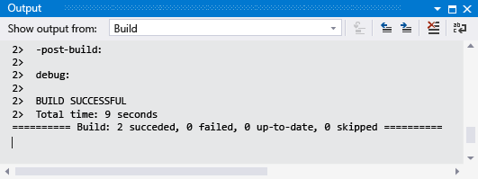
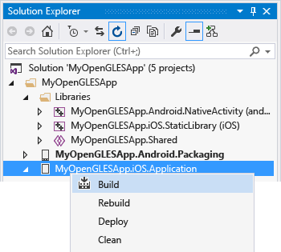

# Build an OpenGL ES Application on Android and iOS
當您安裝適用於跨平台行動裝置開發的 Visual C++ 選項時，您可以為 iOS 應用程式和 Android 應用程式，建立共用通用程式碼的 Visual Studio 方案和專案。 本主題引導您完成可建立一個簡單的 iOS 應用程式和一個 Android Native Activity 應用程式的方案範本。 這兩個應用程式有通用的 C++ 程式碼，該程式碼使用 OpenGL ES 在每個平台上顯示相同的動畫旋轉立方體。 OpenGL ES (適用於內嵌系統的 OpenGL 或 GLES) 是受到許多行動裝置支援的 2D 和 3D 圖形 API。  
  
 [需求](#req)   
 [建立新的 OpenGLES 應用程式專案](#Create)   
 [建置並執行 Android 應用程式](#BuildAndroid)   
 [建置並執行 iOS 應用程式](#BuildIOS)   
 [自訂您的應用程式](#Customize)  
  
##   需求  
 在您建立適用於 iOS 和 Android 的 OpenGL ES 應用程式之前，您必須確定符合所有系統需求。 您必須在 Visual Studio 2015 中，安裝適用於跨平台行動裝置開發的 Visual C++ 選項。 請確認安裝包含所需之協力廠商工具和 SDK，並已安裝 Visual Studio Emulator for Android。 如需詳細資訊和詳細指示，請參閱 [Install Visual C++ for Cross-Platform Mobile Development](../cross-platform/install-visual-cpp-for-cross-platform-mobile-development.md)。 若要建置及測試 iOS 應用程式，您需要一部已根據安裝指示設定的 Mac 電腦。 如需如何設定 iOS 開發環境的詳細資訊，請參閱 [Install And Configure Tools to Build using iOS](../cross-platform/install-and-configure-tools-to-build-using-ios.md)  
  
##   建立新的 OpenGLES 應用程式專案  
 在本教學課程中，您會先建立新的 OpenGL ES 應用程式專案，然後在 Visual Studio Emulator for Android 中建置並執行預設的應用程式。 接下來，您會建置 iOS 應用程式，然後在 iOS 模擬器中執行該應用程式。  
  
#### 建立新的專案  
  
1.  開啟 Visual Studio。 在功能表列上，依序選擇 檔案 、新增 和 專案 。  
  
2.  在 [新增專案]  對話方塊的 [範本] 底下，選擇 [Visual C++] 、[跨平台] ，然後選擇 [OpenGLES 應用程式 (Android、iOS)]  範本。  
  
3.  指定像是 `MyOpenGLESApp` 的應用程式名稱，然後選擇 [確定]。  
  
       
  
     Visual Studio 會建立新的方案，並開啟方案總管。  
  
     ![[方案總管] 中的 MyOpenGLESApp](../cross-platform/media/cppmdd_opengles_solexpl.PNG "CPPMDD_OpenGLES_SolExpl")  
  
 新的 OpenGL ES 應用程式方案包含三個程式庫專案和兩個應用程式專案。 [程式庫] 資料夾包含共用程式碼專案，以及參考共用程式碼的兩個平台專屬專案：  
  
-   **MyOpenGLESApp.Android.NativeActivity** 包含參考和黏附程式碼，可讓您的應用程式當作 Native Activity 在 Android 上實作。 黏附程式碼的進入點實作位於 main.cpp 中，其中包含 MyOpenGLESApp.Shared 中共用的通用程式碼。 先行編譯標頭檔位於 pch.h 中。 這個 Native Activity 應用程式專案會編譯至 MyOpenGLESApp.Android.Packaging 專案所挑選的共用程式庫 (.so) 檔案中。  
  
-   **MyOpenGLESApp.iOS.StaticLibrary** 會建立 iOS 靜態程式庫 (.a) 檔案，其中包含 MyOpenGLESApp.Shared 中的共用程式碼。 它會連結至 MyOpenGLESApp.iOS.Application 專案所建立的應用程式。  
  
-   **MyOpenGLESApp.Shared** 包含可跨平台運作的共用程式碼。 它使用前置處理器巨集來進行平台專屬程式碼的條件式編譯。 共用程式碼是由 MyOpenGLESApp.Android.NativeActivity 和 MyOpenGLESApp.iOS.StaticLibrary 中的專案參考所挑選。  
  
 該方案包含兩個專案，分別為 Android 和 iOS 平台建置應用程式：  
  
-   **MyOpenGLESApp.Android.Packaging** 會建立部署在 Android 裝置或模擬器上時所使用的 .apk 檔案。 其中包含資源以及您設有資訊清單屬性的 AndroidManifest.xml 檔案。 其中也包含用來控制建置流程的 build.xml 檔案。 根據預設，它會設定為啟始專案，以便直接從 Visual Studio 部署及執行。  
  
-   **MyOpenGLESApp.iOS.Application** 包含資源和 Objective-C 黏附程式碼，以建立連結至 MyOpenGLESApp.iOS.StaticLibrary 中 C++ 靜態程式庫程式碼的 iOS 應用程式。 這個專案會建立組建套件，並由 Visual Studio 和遠端代理程式傳輸到您的 Mac。 當您建置這個專案時，Visual Studio 會傳送檔案和命令，以在 Mac 上建置及部署應用程式。  
  
##   建置並執行 Android 應用程式  
 範本所建立的方案會將 Android 應用程式設定為預設專案。  您可以建置並執行這個應用程式，以確認您的安裝和設定。 針對初始測試，在 Visual Studio Emulator for Android 安裝的其中一個裝置設定檔上執行應用程式。 如果您想要在其他目標上測試您的應用程式，您可以載入目標模擬器，或將裝置連接至您的電腦。  
  
#### 建置並執行 Android Native Activity 應用程式  
  
1.  如果尚未選取，請從 [方案平台]  下拉式清單中選擇 [x86]  。  
  
       
  
     使用 x86 將目標設定為適用於 Windows 的 Android 模擬器。 如果您將目標設定為裝置，請根據裝置處理器來選擇方案平台。 如果未顯示 [方案平台] 清單，請從 [新增或移除按鈕] 清單中選擇 [方案平台]，然後選擇您的平台。  
  
2.  在方案總管 中，開啟 MyOpenGLESApp.Android.Packaging 專案的捷徑功能表，然後選擇 [建置] 。  
  
       
  
     [輸出] 視窗會顯示 Android 共用程式庫和 Android 應用程式的建置流程輸出。  
  
       
  
3.  選擇其中一個 VS Emulator Android Phone (x86) 做為部署目標。  
  
       
  
     如果您已經安裝其他模擬器或連接 Android 裝置，就可以在部署目標下拉式清單中加以選擇。 若要執行應用程式，所建置的方案平台必須符合目標裝置的平台。  
  
4.  按 F5 啟動偵錯，或按 Shift+F5 啟動但不偵錯。  
  
     Visual Studio 會啟動模擬器，這需要幾秒的時間來載入及部署您的程式碼。 以下是應用程式在 Visual Studio Emulator for Android 中的樣子。  
  
       
  
     在您的應用程式啟動之後，您可以設定中斷點，並使用偵錯工具，以逐步執行程式碼、檢查本機及監看值。  
  
5.  按 Shift + F5 停止偵錯。  
  
     模擬器是分開的程序，會繼續執行。 您可以將程式碼多次編輯、編譯及部署至相同的模擬器。 您的應用程式會出現在模擬器的應用程式集合中，並可由此直接啟動。  
  
 產生的 Android Native Activity 應用程式和程式庫專案會將 C++ 共用程式碼放在動態程式庫中，該程式庫包含「黏附」程式碼以與 Android 平台連接。 這表示大多數應用程式程式碼會位於程式庫中，而資訊清單、資源和建置指令則會位於封裝專案中。 共用程式碼會從 NativeActivity 專案中的 main.cpp 呼叫。 如需如何對 Android Native Activity 進行程式設計的詳細資訊，請參閱 Android 開發人員 NDK 的 [概念](https://developer.android.com/ndk/guides/concepts.html) 頁面。  
  
 Visual Studio 建置 Android Native Activity 專案的方式，是透過使用 Clang 做為平台工具組的 Android NDK。 Visual Studio 會將 NativeActivity 專案中的屬性對應至命令列參數和選項，以在目標平台上進行編譯、連結及偵錯。 如需詳細資料，請開啟 MyOpenGLESApp.Android.NativeActivity 專案的 [屬性頁]  對話方塊。 如需命令列參數的詳細資訊，請參閱 [Clang Compiler 使用者手冊](http://clang.llvm.org/docs/UsersManual.html)。  
  
##   建置並執行 iOS 應用程式  
 iOS 應用程式專案是在 Visual Studio 中建立及編輯，但由於授權限制，它必須從 Mac 建置及部署。 Visual Studio 會與 Mac 上所執行的遠端代理程式通訊，以傳輸專案檔，並執行建置、部署和偵錯命令。 您必須安裝及設定 Mac 和 Visual Studio 以進行通訊，才能建置 iOS 應用程式。 如需詳細指示，請參閱 [Install And Configure Tools to Build using iOS](../cross-platform/install-and-configure-tools-to-build-using-ios.md)。 一旦執行遠端代理程式且 Visual Studio 與 Mac 搭配使用，您便可以建置並執行 iOS 應用程式，以確認您的安裝和設定。  
  
#### 建置並執行 iOS 應用程式  
  
1.  確認遠端代理程式在 Mac 上執行，且 Visual Studio 已與遠端代理程式搭配使用。 若要啟動遠端代理程式，請開啟終端機應用程式視窗並輸入 `vcremote`。 如需詳細資訊，請參閱[在 Visual Studio 中設定遠端代理程式](../cross-platform/install-and-configure-tools-to-build-using-ios.md#ConfigureVS)。  
  
       
  
2.  如果尚未選取，請從 [方案平台]  下拉式清單中選擇 [x86]  。  
  
       
  
     使用 x86 將目標設定為 iOS 模擬器。 如果您將目標設定為 iOS 裝置，請根據裝置處理器 (通常是 ARM 處理器) 來選擇方案平台。 如果未顯示 [方案平台] 清單，請從 [新增或移除按鈕] 清單中選擇 [方案平台]，然後選擇您的平台。  
  
3.  在方案總管中，開啟 MyOpenGLESApp.iOS.Application 專案的捷徑功能表，然後選擇 [建置] 。  
  
       
  
     [輸出] 視窗會顯示 iOS 靜態程式庫和 iOS 應用程式的建置流程輸出。 在 Mac 上，執行遠端代理程式的終端機視窗會顯示命令和檔案傳輸活動。  
  
     在您的 Mac 電腦上，可能會提示您接受程式碼簽署要求。 選擇 [允許] 繼續進行。  
  
4.  選擇工具列上的 [iOS 模擬器]  ，以在 Mac 上的 iOS 模擬器中執行應用程式。 啟動模擬器可能需要一點時間。 您可能必須將 Mac 上的模擬器移至前景，以查看其輸出。  
  
       
  
     在您的應用程式啟動之後，您可以設定中斷點，並使用 Visual Studio 偵錯工具來檢查區域變數、查看呼叫堆疊及監看值。  
  
       
  
5.  按 Shift + F5 停止偵錯。  
  
     iOS 模擬器是分開的程序，會在 Mac 上繼續執行。 您可以將程式碼多次編輯、編譯及部署至相同的 iOS 模擬器執行個體。 您也可以在部署模擬器之後，直接在模擬器中執行程式碼。  
  
 產生的 iOS 應用程式和程式庫專案會將 C++ 程式碼放在只實作共用程式碼的靜態程式庫中。 大多數應用程式程式碼會位於應用程式專案中。 對這個範本專案中之共用程式庫程式碼的呼叫會在 GameViewController.m 檔案中進行。 為了建置您的 iOS 應用程式，Visual Studio 使用 Xcode 平台工具組，該工具組需要與 Mac 上所執行的遠端用戶端進行通訊。  
  
 Visual Studio 會將專案檔和命令傳送到遠端用戶端，以使用 Xcode 建置應用程式。 遠端用戶端會將組建狀態資訊傳回 Visual Studio。 在應用程式順利建置之後，您可以使用 Visual Studio 傳送命令，以執行並偵錯應用程式。 Visual Studio 中的偵錯工具可控制 Mac 或附加 iOS 裝置上所執行之 iOS 模擬器中正在執行的應用程式。 Visual Studio 會將 StaticLibrary 專案中的屬性對應至命令列參數和選項，以在目標 iOS 平台上進行建置、連結及偵錯。 如需編譯器命令列選項詳細資料，請開啟 MyOpenGLESApp.iOS.StaticLibrary 專案的 [屬性頁]  對話方塊。  
  
##   自訂您的應用程式  
 您可以修改共用的 C++ 程式碼，加入或變更一般常見功能。 您必須變更 MyOpenGLESApp.Android.NativeActivity 和 MyOpenGLESApp.iOS.Application 專案中的共用程式碼呼叫使其相符。 您可以使用前置處理器巨集，來指定通用程式碼中的平台專屬區段。 當您針對 Android 建置時，系統會預先定義前置處理器巨集 `__ANDROID__` 。 當您針對 iOS 建置時，系統會預先定義前置處理器巨集 `__APPLE__` 。  
  
 若要查看特定專案平台的 IntelliSense，請在編輯器視窗頂端的巡覽列中，選擇內容切換器下拉式清單中的專案。  
  
   
  
 目前專案中的 IntelliSense 問題會以紅色波浪線標示。 其他專案中的問題會以紫色波浪線標示。 根據預設，Visual Studio 不支援 Java 或 Objective-C 檔案的程式碼顏色標示或 IntelliSense。 不過，您仍然可以修改原始程式檔及變更資源，以設定您的應用程式名稱、圖示和其他實作詳細資料。
