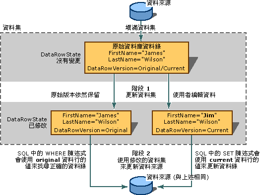

# <a name="save-data-back-to-the-database"></a>將資料儲存回資料庫
資料集是記憶體中資料的複本。 如果您修改該資料時，它會是最好的作法是將這些變更儲存回資料庫。 您可以執行這三種方式之一：  
  
-   呼叫 TableAdapter 的更新方法的其中一個  
  
-   呼叫 TableAdapter 的 DBDirect 方法的其中一個  
  
-   Visual Studio 為您資料集包含在資料集中的其他資料表相關的資料表時，所產生 TableAdapterManager 上呼叫 UpdateAll 方法  
  
當您的資料將資料集資料表繫結至 Windows Form 或 XAML 頁面上的控制項時，則在資料繫結架構會為您的所有工作。  
  
如果您已熟悉 TableAdapters，您可以直接跳到其中一個主題：  
  
|主題|說明|  
|-----------|-----------------|  
|[在資料庫中插入新的資料錄](../data-tools/insert-new-records-into-a-database.md)|如何執行更新，並將插入使用 Tableadapter 或命令的物件|  
|[使用 TableAdapter 更新資料](../data-tools/update-data-by-using-a-tableadapter.md)|如何執行更新，Tableadapter|  
|[階層式更新](../data-tools/hierarchical-update.md)|如何從兩個或多個相關資料表的資料集執行的更新|  
|[處理並行例外狀況](../data-tools/handle-a-concurrency-exception.md)|如何處理例外狀況，當兩個使用者嘗試同時變更資料庫中相同的資料|  
|[如何： 使用異動儲存資料](../data-tools/save-data-by-using-a-transaction.md)|如何使用 System.Transactions 命名空間和 TransactionScope 物件的交易中儲存資料|  
|[逐步解說： 在交易中儲存資料](../data-tools/save-data-in-a-transaction.md)|建立 Windows Form 應用程式示範儲存至資料庫在交易內資料的逐步解說|  
|[儲存資料至資料庫 (多個資料表)](../data-tools/save-data-to-a-database-multiple-tables.md)|如何編輯記錄，並將變更儲存回資料庫的多個資料表中|  
|[從物件中將資料儲存至資料庫](../data-tools/save-data-from-an-object-to-a-database.md)|如何將資料傳遞至資料庫的資料集內不是使用 TableAdapter DbDirect 方法的物件從|  
|[使用 TableAdapter DBDirect 方法儲存資料](../data-tools/save-data-with-the-tableadapter-dbdirect-methods.md)|如何使用 SQL 查詢直接傳送至資料庫的 TableAdapter|  
|[將資料集儲存為 XML](../data-tools/save-a-dataset-as-xml.md)|如何將資料集儲存至 XML 文件|  
  
## <a name="two-stage-updates"></a>兩階段更新  
 更新資料來源是兩個步驟的程序。 第一個步驟是更新資料集與新的記錄、 已變更的記錄或已刪除的記錄。 如果您的應用程式不會將這些變更傳送回資料來源，則您必須已完成更新。  
  
 如果您所做的變更傳送回資料庫，第二個步驟是必要的。 如果您不使用資料繫結控制項，您必須以手動方式呼叫的 Update 方法相同的 TableAdapter （或資料配接器），您用來填入資料集。 不過，您也可以使用不同的配接器，例如，將資料從一個資料來源移到另一個或多個資料來源。 如果您不使用資料繫結，並會儲存相關資料表的變更，您必須以手動方式具現化類別的變數自動產生 TableAdapterManager，然後呼叫其 UdpateAll 方法。  
  
   
兩階段更新程序和成功的更新中 DataRowVersion 的角色  
  
 資料集包含的資料表，其中包含資料列集合的集合。 如果您想要稍後更新為基礎的資料來源，您必須使用 DataTable.DataRowCollection 屬性時新增或移除資料列上的方法。 這些方法會執行已更新的資料來源所需的變更追蹤。 如果您的資料列的屬性上呼叫 RemoveAt 集合，刪除不會傳送回資料庫。  
  
## <a name="merge-datasets"></a>合併資料集  
 您可以更新的資料集內容*合併*它與另一個資料集。 這牽涉到的內容複製*來源*至呼叫端的資料集的資料集 (稱為*目標*資料集)。 當您合併資料集時，來源資料集中的新記錄會加入至目標資料集。 另外，在來源資料集中的額外資料行被加入至目標資料集。 合併資料集時，您有本機的資料集，且您的第二個資料集從另一個應用程式。 當您從 XML web 服務，例如元件取得第二個資料集，或當您需要將多個資料集的資料整合至還有很有用。  
  
 當合併資料集，您可以傳遞布林值的引數 (`preserveChanges`)，會告訴<xref:System.Data.DataSet.Merge%2A>方法是否要保留在目標資料集的現有進行修改。 由於資料集維護多個版本的記錄，務必記住正在合併多個版本的記錄。 下表顯示如何合併兩個資料集的記錄：  
  
|DataRowVersion|目標資料集|來源資料集|  
|--------------------|--------------------|--------------------|  
|原始|James Wilson|James C.Wilson|  
|目前|Jim Wilson|James C.Wilson|  
  
 呼叫<xref:System.Data.DataSet.Merge%2A>方法與上表`preserveChanges=false targetDataset.Merge(sourceDataset)`產生以下結果：  
  
|DataRowVersion|目標資料集|來源資料集|  
|--------------------|--------------------|--------------------|  
|原始|James C.Wilson|James C.Wilson|  
|目前|James C.Wilson|James C.Wilson|  
  
 呼叫<xref:System.Data.DataSet.Merge%2A>方法`preserveChanges = true targetDataset.Merge(sourceDataset, true)`產生以下結果：  
  
|DataRowVersion|目標資料集|來源資料集|  
|--------------------|--------------------|--------------------|  
|原始|James C.Wilson|James C.Wilson|  
|目前|Jim Wilson|James C.Wilson|  
  
> [!CAUTION]
>  在`preserveChanges = true`案例中，如果<xref:System.Data.DataSet.RejectChanges%2A>目標集中記錄上呼叫方法，則它會還原為原始的資料從*來源*資料集。 這表示，如果您嘗試更新原始資料來源與目標資料集，它可能找不到要更新的原始資料列。 您可以防止並行存取違規，另一個資料集填入來自資料來源更新的記錄，然後執行 合併以防止並行存取違規。 （並行違規進行另一位使用者已填入資料集之後，請修改資料來源中的記錄時）。  
  
## <a name="update-constraints"></a>更新條件約束  
 若要變更現有的資料列，新增或更新個別資料行中的資料。 如果資料集包含條件約束 （例如外部索引鍵或非 null 的條件約束），則記錄可以暫時會處於錯誤狀態時加以更新。 也就是說，它可能會處於錯誤狀態更新一個資料行完成之後但之前的下一個。  
  
 若要防止不當條件約束違規，您可以暫時暫停更新條件約束。 這有兩種用途：  
  
-   它會防止發生錯誤之後，您已完成更新一個資料行，但尚未開始更新另一個擲回。  
  
-   它可防止某些更新事件引發 （通常用於驗證的事件）。  
   
> [!NOTE]
>  在 Windows Form datagrid 內建的資料繫結架構暫止條件約束檢查直到焦點移出資料列，而且您不需要明確地呼叫<xref:System.Data.DataRow.BeginEdit%2A>， <xref:System.Data.DataRow.EndEdit%2A>，或<xref:System.Data.DataRow.CancelEdit%2A>方法。  
  
 條件約束會自動停用時<xref:System.Data.DataSet.Merge%2A>資料集上叫用方法。 合併完成時，如果有任何條件約束的資料集無法啟用<xref:System.Data.ConstraintException>就會擲回。 在此情況下，<xref:System.Data.DataSet.EnforceConstraints%2A>屬性設定為`false,`，必須解決所有條件約束違規，重設之前<xref:System.Data.DataSet.EnforceConstraints%2A>屬性`true`。  
  
 完成更新之後，您可以重新啟用條件約束檢查，這也會重新啟用更新事件，並引發。  
  
 如需暫停事件的詳細資訊，請參閱[填入 dataset 時關閉條件約束](../data-tools/turn-off-constraints-while-filling-a-dataset.md)。  
  
## <a name="dataset-update-errors"></a>資料集更新錯誤  
 當您更新資料集內的記錄時，沒有錯誤的可能性。 例如，您可能會不小心撰寫資料類型錯誤的資料行，或資料太長或具有其他完整性問題的資料。 或者，您可能可以在更新事件的任何階段期間引發自訂錯誤的特定應用程式的驗證檢查。 如需詳細資訊，請參閱[驗證資料在資料集中](../data-tools/validate-data-in-datasets.md)。  
  
## <a name="maintaining-information-about-changes"></a>維護變更的相關資訊  
 資料集內的變更相關資訊會保留兩種方式： 依表示已變更的資料列加上旗標 (<xref:System.Data.DataRow.RowState%2A>)，並會保留記錄的多個複本 (<xref:System.Data.DataRowVersion>)。 使用這項資訊，處理程序可以判斷資料集內已變更的內容，並將適當的更新傳送至資料來源。  
  
### <a name="rowstate-property"></a>RowState 屬性  
 <xref:System.Data.DataRow.RowState%2A>屬性<xref:System.Data.DataRow>物件是提供特定資料列狀態資訊的值。  
  
 下表詳細說明的可能值<xref:System.Data.DataRowState>列舉型別：  
  
|Getchanges 值|說明|  
|------------------------|-----------------|  
|<xref:System.Data.DataRowState.Added>|資料列都已經加入項目成為<xref:System.Data.DataRowCollection>。 (此狀態中的資料列並未安裝對應的原始版本，因為它不存在時，最後<xref:System.Data.DataRow.AcceptChanges%2A>方法呼叫)。|  
|<xref:System.Data.DataRowState.Deleted>|使用刪除資料列<xref:System.Data.DataRow.Delete%2A>的<xref:System.Data.DataRow>物件。|  
|<xref:System.Data.DataRowState.Detached>|資料列已建立但不屬於任何<xref:System.Data.DataRowCollection>。 A<xref:System.Data.DataRow>立即建立後，之前它已加入至集合，以及從集合移除後，物件是處於此狀態。|  
|<xref:System.Data.DataRowState.Modified>|在某些方面，已變更資料列中的資料行值。|  
|<xref:System.Data.DataRowState.Unchanged>|資料列後尚未變更<xref:System.Data.DataRow.AcceptChanges%2A>上次呼叫。|  
  
### <a name="datarowversion-enumeration"></a>DataRowVersion 列舉  
資料集維護多個版本的記錄。 <xref:System.Data.DataRowVersion>擷取的值中發現時，可以使用欄位<xref:System.Data.DataRow>使用<xref:System.Data.DataRow.Item%2A>屬性或<xref:System.Data.DataRow.GetChildRows%2A>方法<xref:System.Data.DataRow>物件。  
  
下表詳細說明的可能值<xref:System.Data.DataRowVersion>列舉型別：  
  
|DataRowVersion 值|說明|  
|--------------------------|-----------------|  
|<xref:System.Data.DataRowVersion.Current>|目前版本的記錄包含自從上次記錄執行的所有修改<xref:System.Data.DataRow.AcceptChanges%2A>呼叫。 如果已刪除資料列，則沒有目前的版本。|  
|<xref:System.Data.DataRowVersion.Default>|資料集結構描述或資料來源所定義的記錄預設值。|  
|<xref:System.Data.DataRowVersion.Original>|記錄的原始版本是一份記錄的資料集內的最後一個變更被認可。 實際上，這通常是某筆記錄的版本為已讀取從資料來源。|  
|<xref:System.Data.DataRowVersion.Proposed>|建議的版本時，可暫時您正在執行更新的記錄，您所呼叫的這段時間即<xref:System.Data.DataRow.BeginEdit%2A>方法和<xref:System.Data.DataRow.EndEdit%2A>方法。 您通常存取提議的版本中事件的處理常式的記錄這類<xref:System.Data.DataTable.RowChanging>。 叫用<xref:System.Data.DataRow.CancelEdit%2A>方法反轉所做的變更，並刪除資料列的建議的版本。|  
  
 更新資訊傳輸到資料來源時，原始和目前版本是很有用。 一般而言，當更新傳送至資料來源時，新資料庫的資訊是記錄的在目前版本中。 與原始版本的資訊用來找出記錄進行更新。  
  
 比方說，在已記錄的主索引鍵的情況下，您需要以更新所做的變更，資料來源中找出正確的資料錄的方式。 如果沒有原始的版本存在，然後記錄很可能被附加到資料來源，產生多餘的資料錄，不僅會不正確且過期的一筆記錄中。 兩個版本也可用於並行控制。 您可以比較針對資料來源，以判斷記錄是否已變更，因為它已載入資料集的記錄的原始版本。  
  
 建議的版本時，您必須執行驗證之前實際認可至資料集的變更。  
  
 即使已變更的記錄，總是會有不該資料列的原始或目前版本。 當您將新的資料列插入資料表時，沒有原始版本，只有目前的版本。 同樣地，如果您刪除資料列藉由呼叫 table`Delete`方法，就只有原始的版本，而沒有目前的版本。  
  
 您可以藉由查詢資料列是否存在特定版本的一筆記錄測試<xref:System.Data.DataRow.HasVersion%2A>方法。 您可以存取任一版本的一筆記錄，藉由傳遞<xref:System.Data.DataRowVersion>做為選擇性的引數時您要求的資料行值的列舉值。  
  
## <a name="getting-changed-records"></a>取得已變更的記錄  
 它是不是用來更新資料集內的每一筆記錄的常見作法。 例如，使用者可能會使用 Windows Form<xref:System.Windows.Forms.DataGridView>顯示許多記錄的控制項。 不過，使用者可能會更新少數的記錄、 刪除其中一個，並插入一個新。 資料集和資料的資料表提供的方法 (`GetChanges`) 傳回已修改的資料列。  
  
 您可以建立使用變更資料錄子集`GetChanges`資料資料表的方法 (<xref:System.Data.DataTable.GetChanges%2A>) 或資料集 (<xref:System.Data.DataSet.GetChanges%2A>) 本身。 如果您呼叫的方法資料表，它會傳回與已變更的記錄資料表的副本。 同樣地，如果您的資料集上呼叫方法，您就會取得已變更的記錄與新的資料集。  
  
 `GetChanges`單獨使用時傳回所有已變更的記錄。 相反地，藉由傳遞所需<xref:System.Data.DataRowState>當做參數`GetChanges`方法，您可以指定您想要變更資料錄的哪些子集： 新加入的記錄，記錄標示為刪除，卸離的記錄，或修改記錄。  
  
 取得已變更的記錄的子集時，您想要的記錄傳送到另一個元件進行處理。 而不是傳送整個資料集，您可以減少取得元件所需的記錄與其他元件通訊額外的負荷。   
  
## <a name="committing-changes-in-the-dataset"></a>認可資料集中的變更  
 在資料集中，進行變更，會<xref:System.Data.DataRow.RowState%2A>屬性變更的資料列的設定。 建立、 維護，以及您所記錄的原始和目前版本<xref:System.Data.DataRowView.RowVersion%2A>屬性。 必須將正確的更新傳送至資料來源會儲存這些變更的資料列的內容中的中繼資料。  
  
 如果所做的變更會反映資料來源的目前狀態，如果您不再需要維護這項資訊。 一般而言，有兩次資料集和它的來源時同步：  
  
-   之後您將資訊載入至資料集，例如當您從來源讀取資料。  
  
-   從資料集的變更傳送到資料來源之後 (但不是在之前，因為您會遺失變更資訊所需的變更傳送至資料庫)。  
  
您也可以呼叫至資料集認可暫止的變更<xref:System.Data.DataSet.AcceptChanges%2A>方法。 一般而言，<xref:System.Data.DataSet.AcceptChanges%2A>呼叫在下列時間：  
  
-   之後您載入資料集。 如果您透過呼叫 TableAdapter 的載入資料集`Fill`方法，則配接器會自動為您認可變更。 不過，如果您載入資料集合併另一個資料集，然後您必須以手動方式認可的變更。  
  
    > [!NOTE]
    >  您可以避免配接器會自動認可的變更，當您呼叫`Fill`方法藉由設定`AcceptChangesDuringFill`屬性的介面卡`false`。 如果設定為`false`，然後在<xref:System.Data.DataRow.RowState%2A>的填滿期間插入每個資料列設<xref:System.Data.DataRowState.Added>。  
  
-   之後您將資料集變更傳送至另一個處理序，例如 XML Web 服務。  
  
    > [!CAUTION]
    >  如此一來認可變更，會清除任何變更資訊。 沒有未認可後的變更直到您完成執行需要您的應用程式知道哪些已變更資料集內的作業。  
  
這個方法會產生下列結果：  
  
-   寫入<xref:System.Data.DataRowVersion.Current>版本的一筆記錄，到其<xref:System.Data.DataRowVersion.Original>版本並覆寫原始的版本。  
  
-   移除任何資料列位置<xref:System.Data.DataRow.RowState%2A>屬性設定為<xref:System.Data.DataRowState.Deleted>。  
  
-   設定<xref:System.Data.DataRow.RowState%2A>要記錄的屬性<xref:System.Data.DataRowState.Unchanged>。  
  
<xref:System.Data.DataSet.AcceptChanges%2A>方法有三個層級。 您可以對它呼叫<xref:System.Data.DataRow>認可至物件變更該資料列。 您也可以呼叫它在<xref:System.Data.DataTable>認可資料表中的所有資料列的物件。 最後，您可以對呼叫它<xref:System.Data.DataSet>認可的資料集的所有資料表的所有記錄中的所有暫止變更的物件。  
  
下表描述的變更會認可根據什麼物件上呼叫方法。  
  
|方法|結果|  
|------------|------------|  
|<xref:System.Data.DataRow.AcceptChanges%2A?displayProperty=fullName>|只在特定的資料列上認可的變更。|  
|<xref:System.Data.DataTable.AcceptChanges%2A?displayProperty=fullName>|認可特定資料表中的所有資料列上的變更。|  
|<xref:System.Data.DataSet.AcceptChanges%2A?displayProperty=fullName>|認可的資料集的所有資料表中的所有資料列上的變更。|  
  
> [!NOTE]
>  如果您透過呼叫 TableAdapter 的載入資料集`Fill`方法，您不需要明確地接受變更。 根據預設，`Fill`方法呼叫`AcceptChanges`完成填入資料表格之後的方法。  
  
 關聯的方法， <xref:System.Data.DataSet.RejectChanges%2A>，藉由複製復原變更的影響<xref:System.Data.DataRowVersion.Original>回版本<xref:System.Data.DataRowVersion.Current>記錄版本。 它也會設定<xref:System.Data.DataRow.RowState%2A>每一個記錄備份至<xref:System.Data.DataRowState.Unchanged>。  
  
## <a name="data-validation"></a>資料驗證  
 若要確認您的應用程式中的資料符合傳遞至處理序的需求，您通常需要加入驗證。 這可能需要檢查表單中的使用者輸入正確，驗證資料傳送到您的應用程式的另一個應用程式，或甚至檢查計算您的元件中的資訊，置於您的資料來源的條件約束與應用程式需求。  
  
 您可以驗證在數種方式中的資料：  
  
-   在商業層中，將程式碼加入至您的應用程式，以驗證資料。 資料集是一個位置執行這項操作。 資料集提供的某些後端驗證的優點，例如驗證變更，因為資料行和資料列的值變更的能力。 如需詳細資訊，請參閱[驗證資料在資料集中](../data-tools/validate-data-in-datasets.md)。  
  
-   將驗證加入至表單，展示層。 如需詳細資訊，請參閱[Windows Form 中的使用者輸入驗證](/dotnet/framework/winforms/user-input-validation-in-windows-forms)。  
  
-   資料中備份結束時，將資料傳送至資料來源 — 例如，資料庫，並讓它接受或拒絕資料。 如果您正在使用具有複雜的驗證資料，並提供錯誤資訊的機能的資料庫，這可能是相當實用的方法，因為您可以驗證的資料，不論其來自何處。 不過，這種方法可能無法符合特定應用程式驗證需求。 此外，由資料來源驗證資料可能會導致許多往返到資料來源，根據您的應用程式可解析後端所產生的驗證錯誤的協助。  
  
    > [!IMPORTANT]
    >  使用與資料命令時<xref:System.Data.SqlClient.SqlCommand.CommandType%2A>屬性設為<xref:System.Data.CommandType.Text>，仔細檢查之前將它傳遞給您的資料庫從用戶端傳送的資訊。 惡意使用者可能會嘗試傳送 （插入） 已修改或額外的 SQL 陳述式，來取得未經授權的存取，或資料庫損毀。 傳送至資料庫的使用者輸入之前，一定要驗證的資訊有效。 它是為一律使用參數化的查詢或預存程序會在可能的最佳作法。 如需詳細資訊，請參閱 [Script Exploits Overview](http://msdn.microsoft.com/Library/772c7312-211a-4eb3-8d6e-eec0aa1dcc07) (指令碼攻擊概觀)。  
  
## <a name="transmitting-updates-to-the-data-source"></a>傳輸至資料來源更新  
已變更資料集之後，您可以將變更傳送至資料來源。 大多數情況下，您可以呼叫`Update`TableAdapter （或資料配接器） 的方法。 方法會迴圈每一筆記錄資料表中的資料，判斷需要該類型的更新 （更新、 插入或刪除），若有的話，然後執行適當的命令。  

 為了示範如何進行更新，假設您的應用程式會使用包含單一資料表的資料集。 應用程式會從資料庫擷取兩個資料列。 在擷取之後，記憶體中資料表看起來像這樣：  
  
```  
(RowState)     CustomerID   Name             Status  
(Unchanged)    c200         Robert Lyon      Good  
(Unchanged)    c400         Nancy Buchanan    Pending  
```  
  
 您的應用程式將 Nancy 查爾斯狀態變更為 慣用。 」 因為此變更，而值<xref:System.Data.DataRow.RowState%2A>屬性，該資料列從變更<xref:System.Data.DataRowState.Unchanged>至<xref:System.Data.DataRowState.Modified>。 值<xref:System.Data.DataRow.RowState%2A>屬性的第一個資料列會保持<xref:System.Data.DataRowState.Unchanged>。 資料表現在看起來像這樣：  
  
```  
(RowState)     CustomerID   Name             Status  
(Unchanged)    c200         Robert Lyon      Good  
(Modified)     c400         Nancy Buchanan    Preferred  
```  
  
 現在您的應用程式會呼叫 `Update` 方法將資料集傳送至資料庫。 方法接著會檢查每個資料列。 第一個資料列，方法會傳輸沒有到資料庫的 SQL 陳述式，因為該資料列尚未變更，因為它原先從資料庫擷取。  
  
 第二個資料列，不過，`Update`方法自動叫用正確的資料命令，並將其傳送至資料庫。 SQL 陳述式的特定語法取決於基礎資料存放區所支援的 SQL 的方言。 但下列傳輸的 SQL 陳述式的一般特性值得注意：  
  
-   傳送的 SQL 陳述式是 UPDATE 陳述式。 配接器就會使用 UPDATE 陳述式，因為值<xref:System.Data.DataRow.RowState%2A>屬性是<xref:System.Data.DataRowState.Modified>。  
  
-   傳送的 SQL 陳述式包含 WHERE 子句的 UPDATE 陳述式的目標資料列，指出其中`CustomerID = 'c400'`。 SELECT 陳述式的這個部分會區別與所有其他目標資料列因為`CustomerID`目標資料表的主索引鍵。 WHERE 子句衍生自原始版本的記錄的資訊 (`DataRowVersion.Original`)、 識別資料列所需的值已變更。  
  
-   傳送的 SQL 陳述式包含的 SET 子句，來設定新的已修改的資料行的值。  
  
    > [!NOTE]
    >  如果 TableAdapter 的`UpdateCommand`屬性已設定的預存程序名稱，配接器將不會建構 SQL 陳述式。 相反地，它會叫用預存程序以適當的參數中傳遞。  
  
## <a name="passing-parameters"></a>傳遞參數  
 您通常會使用參數來傳遞所要更新資料庫中記錄的值。  當 TableAdapter 的`Update`方法會執行 UPDATE 陳述式，它必須將參數值的填滿。 它會取得這些值從`Parameters`適當資料命令的集合，在此情況下， `UpdateCommand` TableAdapter 中的物件。  
  
 如果您使用 Visual Studio 工具來產生資料配接器`UpdateCommand`物件包含對應至每個陳述式中的參數預留位置的參數集合。  
  
 <xref:System.Data.SqlClient.SqlParameter.SourceColumn%2A?displayProperty=fullName>每個參數的屬性會指向資料表中的資料行。 例如，`SourceColumn`屬性`au_id`和`Original_au_id`參數設定為資料表中的任何資料行包含作者 id。當配接器的`Update`方法執行時，它會讀取作者 id 資料行從正在進行更新，將值填入陳述式的記錄。  
  
 在 UPDATE 陳述式，您需要指定這兩個新的值 （其會將記錄寫入），以及舊值 （以便可以在資料庫中找到記錄）。 因此會為每個值的兩個參數： 一個用於 SET 子句，如 WHERE 子句的另一個。 這兩個參數更新時，記錄讀取資料，但他們取得的參數為基礎的資料行值的不同版本[SqlParameter.SourceVersion 屬性](https://msdn.microsoft.com/en-us/library/system.data.sqlclient.sqlparameter.sourceversion.aspx)。 SET 子句的參數取得最新版本，而 WHERE 子句的參數取得原始的版本。  
  
> [!NOTE]
>  您也可以設定值`Parameters`集合自行在程式碼中，您通常會執行中的資料配接器的事件處理常式<xref:System.Data.DataTable.RowChanging>事件。  
  
## <a name="see-also"></a>請參閱
[Visual Studio 中的資料集工具](../data-tools/dataset-tools-in-visual-studio.md)   
[建立及設定 TableAdapters](create-and-configure-tableadapters.md)  
[使用 TableAdapter 更新資料](../data-tools/update-data-by-using-a-tableadapter.md)   
[將控制項繫結至 Visual Studio 中的資料](../data-tools/bind-controls-to-data-in-visual-studio.md)   
[驗證資料](validate-data-in-datasets.md)   
[儲存資料](../data-tools/saving-data.md)