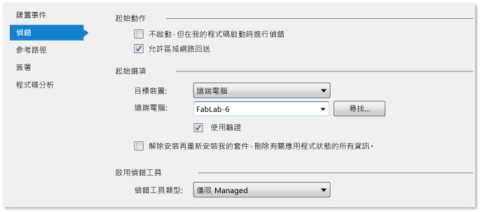

# 在 Visual Studio 中的遠端電腦上執行 UWP 應用程式
  
若要在遠端電腦上執行的 UWP 應用程式，您必須附加至使用 Visual studio 遠端工具。 遠端工具可讓您執行、 偵錯，設定檔，並測試 UWP 應用程式從執行 Visual Studio 的第二部電腦在一部裝置上執行。 在遠端裝置上執行時可能會特別有效的 Visual Studio 電腦不支援的 UWP 應用程式，如觸控、 地理位置和實體方向特定功能。 本主題說明設定和啟動遠端工作階段的程序。

在某些情況下，遠端工具會自動安裝部署至遠端裝置時。

- 執行建立者更新和更新版本的 Windows 10 電腦，將會自動安裝遠端工具。
- 對於 Windows 10 Xbox、 IOT 和 HoloLens 裝置，將會自動安裝遠端工具。
- Windows mobile 10，您必須實際連接到行動電話，您必須啟用[開發人員模式下](/windows/uwp/get-started/enable-your-device-for-development)而且您必須選取**裝置**做為偵錯目標。 不需要或支援遠端工具。

執行前的建立者的更新版 Windows 的 Windows 10 電腦，您必須安裝遠端工具在遠端電腦上手動之前您可以偵錯。 請遵循本主題中的指示。 
  
##   必要條件  
 若要在遠端裝置上偵錯：  
  
- 遠端裝置和 Visual Studio 電腦必須透過網路連接，或在直接透過 USB 或乙太網路纜線連接。 不支援透過網際網路偵錯。  

- 您必須啟用[開發人員模式下](/windows/uwp/get-started/enable-your-device-for-development)。 
  
- Windows 10 電腦執行 Windows 10 版本早於 Windows 10 建立者的更新，您必須[安裝並執行遠端偵錯元件](#BKMK_download)。
  
##   安全性  
根據預設， **Universal （未加密的通訊協定）**適用於 Windows 10。 這個通訊協定應該只用於受信任的網路。 偵錯連接容易受到惡意使用者便無法攔截及變更程式開發和遠端電腦之間傳遞資料。
  
> [!WARNING]
>  當您將驗證模式設定為有是不具網路安全性**Universal （未加密的通訊協定）**或**無**。 只有在確定網路沒有惡意傳輸的風險時，請選擇這些模式。  
  
##  如何直接使用 USB 纜線連接 

在 Windows 10 中，您可以部署到已連接 USB 裝置選擇**裝置**而不是**遠端機器**做為部署目標 (您可以**標準**工具列或在偵錯屬性頁）。

##  設定 Visual Studio 專案進行遠端偵錯  
 您可在專案的屬性中指定要連接的遠端裝置。 此程序會因程式語言而有所差異。 您可以輸入遠端裝置的網路名稱，或者您可以選取從**遠端連線** 對話方塊。  
  
   
  
 此對話方塊會列出 Visual Studio 電腦的區域子網路上的裝置，以及執行遠端偵錯工具的裝置。  
  
> [!TIP]
>  如果無法順利連接到遠端裝置，請嘗試輸入裝置的 IP 位址。 若要判斷裝置的 IP 位址，請開啟命令視窗，然後輸入 **ipconfig**。 IP 位址會列示為 **IPv4 Address**。  
  
###  選擇 C# 和 Visual Basic 專案的遠端裝置  
  
1.  在 [方案總管] 中選取專案名稱，然後從捷徑功能表選擇 [ **屬性** ]。  
  
2.  選取 [ **偵錯**]。  
  
3.  從 [ **目標裝置** ] 清單選擇 [ **遠端電腦** ]。  
  
4.  在 [ **遠端電腦** ] 方塊中輸入遠端裝置的網路名稱，或選擇 [ **尋找** ]，從 [ **選取遠端偵錯工具連接** ] 對話方塊選擇裝置。 

      
  
###  選擇 JavaScript 和 c + + 專案的遠端裝置  
  
1.  在 [方案總管] 中選取專案名稱，然後從捷徑功能表選擇 [ **屬性** ]。  
  
2.  展開 [ **組態屬性** ] 節點，然後選取 [ **偵錯**]。  
  
3.  從 [ **要啟動的偵錯工具** ] 清單選擇 [ **遠端偵錯工具** ]。  
  
4.  在 [ **電腦名稱** ] 方塊中輸入遠端裝置的網路名稱，或選擇方塊中的向下鍵，從 [ **選取遠端偵錯工具連接** ] 對話方塊選擇裝置。  

    
  
## 下載並安裝遠端工具 （更新前建立者）。

如果您使用預先建立者的更新版本的 Windows 10，然後遵循這些指示。 否則，您可以略過本節。

[!INCLUDE [remote-debugger-download](../debugger/includes/remote-debugger-download.md)]
  
### 設定遠端偵錯工具

[!INCLUDE [remote-debugger-configuration](../debugger/includes/remote-debugger-configuration.md)]  
  
##  啟動遠端偵錯工作階段  
 您啟動、停止及巡覽遠端偵錯工作階段的方式與您進行本機工作階段的方式相同。 在 Windows 10 的 pre-建立者的更新版本中，請確定遠端裝置上執行遠端偵錯監視。  
  
 然後在 [ **偵錯** ] 功能表上選擇 [ **開始偵錯** ] (鍵盤：F5)。 專案會重新編譯，然後部署到遠端裝置並且啟動。 偵錯工具會在中斷點暫停執行，而您可以逐步執行、跳過和跳離您的程式碼。 選擇 [ **停止偵錯** ] 即可結束偵錯工作階段，並關閉遠端應用程式。
  
## 請參閱  
 [進階遠端部署選項](/windows/uwp/debug-test-perf/deploying-and-debugging-uwp-apps#advanced-remote-deployment-options)  
 [使用 Visual Studio 測試 UWP 應用程式](../test/testing-store-apps-with-visual-studio.md)   
 [偵錯 Visual Studio 中的應用程式](../debugger/debug-store-apps-in-visual-studio.md)