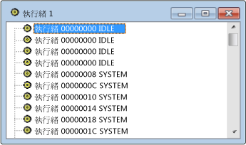

# Threads View
[!INCLUDE[vs2017banner](../code-quality/includes/vs2017banner.md)]

\[執行緒\] 檢視是一般清單，其中列出與您系統之視窗相關聯的所有執行緒，  並且列出每個執行緒的執行緒 ID 和模組名稱。  處理序未包含在內，但是您可以輕鬆地找到擁有所選取之執行緒的處理序。  
  
## 程序  
  
#### 若要開啟執行緒檢視  
  
1.  選擇 \[**Spy**\] 功能表中的 \[**執行緒**\]。  
  
   
Spy \+ \+ 執行緒檢視  
  
 上圖顯示執行緒檢視。  
  
## 本章節內容  
 [在執行緒檢視中搜尋執行緒](../debugger/how-to-search-for-a-thread-in-threads-view.md)  
 說明如何在 \[執行緒\] 檢視中尋找特定的執行緒。  
  
 [顯示執行緒屬性](../Topic/How%20to:%20Display%20Thread%20Properties.md)  
 說明如何顯示執行緒的詳細資訊。  
  
## 相關章節  
 [Spy\+\+ 檢視](../debugger/spy-increment-views.md)  
 說明視窗、訊息、處理序和執行緒的 Spy\+\+ 樹狀檢視。  
  
 [使用 Spy\+\+](../debugger/using-spy-increment.md)  
 介紹 Spy\+\+ 工具並說明如何使用此工具。  
  
 [執行緒搜尋對話方塊](../debugger/thread-search-dialog-box.md)  
 用來在 \[執行緒\] 檢視中尋找特定執行緒的節點。  
  
 [執行緒屬性對話方塊](../debugger/message-properties-dialog-box.md)  
 顯示 \[執行緒\] 檢視或 \[訊息\] 檢視中所選取執行緒的屬性。  
  
 [Spy\+\+ 參考](../debugger/spy-increment-reference.md)  
 包含描述每個 Spy\+\+ 功能表和對話方塊的章節。