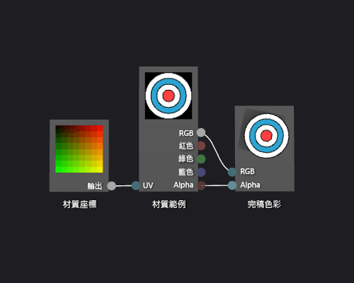

# 如何：建立基本材質著色器
[!INCLUDE[vs2017banner](../code-quality/includes/vs2017banner.md)]

本文件示範如何使用著色器設計工具和有向圖形著色器語言 \(DGSL\) 建立單一材質著色器。  這個著色器會將最終色彩直接設為從材質取樣的 RGB 和 Alpha 值。  
  
 本文件示範下列活動:  
  
-   從著色器圖表移除節點  
  
-   將節點加入至圖表  
  
-   設定著色器參數  
  
-   設定參數可視性  
  
-   連接節點  
  
## 建立基本材質著色器  
 您可以實作基本的單一材質著色器，方法是將材質範本的色彩和 Alpha 值直接寫入最終輸出色彩。  
  
 開始之前，請先確定已顯示 \[**屬性**\] 視窗和 \[**工具箱**\]。  
  
#### 建立基本材質著色器  
  
1.  建立要使用的 DGSL 著色器。  如需有關如何將 DGSL 著色器加到專案的詳細資訊，請參閱[著色器設計工具](../designers/shader-designer.md)中的「使用者入門」一節。  
  
2.  刪除 \[**點色彩**\] 節點。  在 \[**選取**\] 模式中，選取 \[**點色彩**\] 節點，然後在功能表列上，選擇 \[**編輯**\]、\[**刪除**\]。  這樣會替下一個步驟加入的節點留出空間。  
  
3.  將 \[**材質範例**\] 節點加入至圖形。  在 \[**材質**\] 下的 \[**工具箱**\] 中，選取 \[**材質範例**\] 並將其移至設計介面。  
  
4.  將 \[**材質座標**\] 節點加入至圖形。  在 \[**材質**\] 下的 \[**工具箱**\] 中，選取 \[**材質座標**\] 並將其移至設計介面。  
  
5.  選取要套用的材質  在 \[**選取**\] 模式中，選取 \[**結構範例**\] 節點，然後在 \[**屬性**\] 視窗中，您可以使用 \[**檔案名稱**\] 屬性指定您要使用的紋理。  
  
6.  讓材質可供公開存取。  選取 \[**材質範例**\] 節點，然後在 \[**屬性**\] 視窗中，將 \[**存取**\] 屬性設定為 \[**公用**\]。  現在您可以從另一個工具 \(例如 \[**模型編輯器**\]\) 設定材質。  
  
7.  將材質座標連接至材質範例。  在 \[**選取**\] 模式中，將 \[**材質座標**\] 節點的 \[**輸出**\] 終端移至 \[**材質範例**\] 節點的 \[**UV**\] 終端。  這個連接會在指定座標取樣材質。  
  
8.  將材質範例連接至完稿色彩。  將 \[**材質範例**\] 節點的 \[**RGB**\] 終端移到 \[**完稿色彩**\] 節點的 \[**RGB**\] 終端，然後將 \[**材質範例**\] 節點的 \[**Alpha**\] 終端移到 \[**完稿色彩**\] 節點的 \[**Alpha**\] 終端。  
  
 下圖顯示已完成的著色器圖形和套用至 Cube 的著色器預覽。  
  
> [!NOTE]
>  在圖中，平面當做預覽圖形，然後，指定紋理以得到較佳的著色器效果示範。  
  
   
  
 某些圖案可能對某些著色器提供更好的預覽。  如需如何在著色器設計工具中預覽著色器的詳細資訊，請參閱[著色器設計工具](../designers/shader-designer.md)。  
  
## 請參閱  
 [如何：將著色器套用至 3D 模型](../designers/how-to-apply-a-shader-to-a-3-d-model.md)   
 [影像編輯器](../designers/image-editor.md)   
 [著色器設計工具](../designers/shader-designer.md)   
 [著色器設計工具節點](../designers/shader-designer-nodes.md)