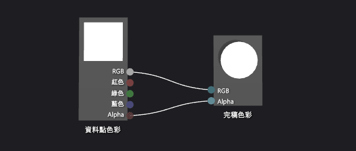
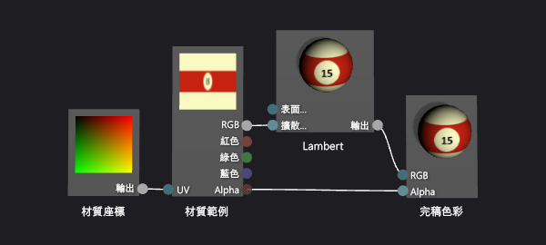
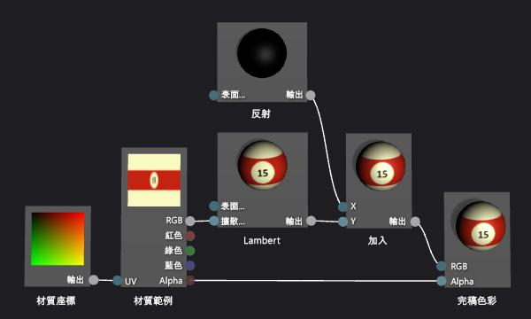
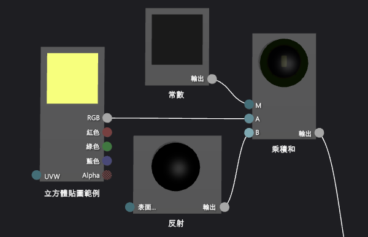
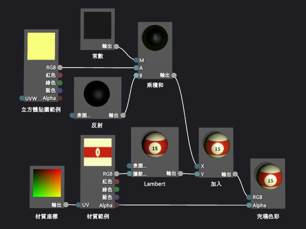

# 逐步解說：建立逼真的 3D 撞球
[!INCLUDE[vs2017banner](../code-quality/includes/vs2017banner.md)]

本逐步解說示範如何在 [!INCLUDE[vsprvs](../code-quality/includes/vsprvs_md.md)] 中使用著色器設計工具和影像編輯器建立逼真的 3D 撞球。  撞球的立體外觀是透過合併多個著色器技術與適當的紋理資源所達成的。  
  
 本文件示範下列活動:  
  
-   使用形狀和材質建立撞球的基本外觀。  
  
-   使用 Lambert 光源模型加入深度。  
  
-   使用反射反白顯示加強基本外觀。  
  
-   透過反映環境建立空間感。  
  
## 必要條件  
 您需要下列元件和技能來完成此逐步解說：  
  
-   用來將材質組合成立方體地圖的工具，例如包含在 2010 年 6 月 DirectX SDK 中的 DirectX 材質工具。  
  
-   熟悉 [!INCLUDE[vsprvs](../code-quality/includes/vsprvs_md.md)] 中的 \[影像編輯器\]。  
  
-   熟悉 [!INCLUDE[vsprvs](../code-quality/includes/vsprvs_md.md)] 中的 \[著色器設計工具\]。  
  
## 使用形狀和材質建立基本外觀。  
 在電腦圖形中，最基本的外觀元素是形狀和色彩。  在電腦模擬中，通常會使用立體模型表示真實物件的形狀。  然後會使用材質對應，將色彩詳細資料套用至模型的介面。  
  
 通常，您可能必須要求藝術家建立您可以使用的 3D 模型，但由於撞球是通用圖形 \(球體\)，因此著色器設計工具已經內建了合適的模型。  
  
 球體是著色設計工具中的預設預覽圖形；如果您目前使用不同的圖形預覽著色器，請切換回球體。  
  
#### 使用球體預覽著色器  
  
-   在 \[著色器設計工具\] 工具列上，選擇 \[**以圓球預覽**\]。  
  
 在下一個步驟中，您將建立套用材質到模型的著色器程式，但是必須先建立可以使用的材質。  本逐步解說示範如何使用 [!INCLUDE[vsprvs](../code-quality/includes/vsprvs_md.md)] 中的影像編輯器建立材質，不過，您可以使用能夠將材質儲存成適當格式的任何影像編輯器。  
  
 確定已顯示 \[**內容**\] 視窗和 \[**工具箱**\]。  
  
#### 使用影像編輯器建立撞球材質  
  
1.  建立要使用的紋理。  如需有關如何將材質加入至專案的詳細資訊，請參閱[影像編輯器](../designers/image-editor.md)中的＜使用者入門＞一節。  
  
2.  設定影像大小，使其寬度為其高度兩倍。這是必要的，因為材質對應到撞球球面的方式使然。  若要調整影像大小，在 \[**內容**\] 視窗中指定 \[**寬度**\] 和 \[**高度**\] 屬性的新值。  例如，將寬度設定為 512，將高度設定為 256。  
  
3.  繪製撞球的材質，記住材質如何對應至球體上。  
  
     材質應該看起來像這樣：  
  
       
  
4.  或者，您可能會想要減少這個材質的儲存需求。  您可以根據材質的高度減少其寬度，以達到這個目的。  這樣會沿著材質的寬度壓縮材質，但因為材質對應球體的方式，呈現撞球時，它會展開。  調整大小之後，材質看起來應該像這樣：  
  
       
  
 現在您可以建立將此材質套用至模型的著色器。  
  
#### 建立基本材質著色器  
  
1.  建立要使用的 DGSL 著色器。  如需有關如何將 DGSL 著色器加到專案的詳細資訊，請參閱[著色器設計工具](../designers/shader-designer.md)中的「使用者入門」一節。  
  
     根據預設，著色器圖形如下所示：  
  
       
  
2.  修改預設著色器，以便將材質範例的值套用至目前像素。  著色器圖形看起來應該如下所示：  
  
       
  
3.  設定材質屬性，以套用您在先前程序中所建立的材質。  將 \[**材質範例**\] 節點的 \[**材質**\] 屬性值設定為 \[**Texture1**\]，然後在相同屬性視窗中，使用 \[**Texture1**\] 屬性群組的 \[**檔名**\] 屬性指定材質檔案。  
  
 如需如何在著色器中套用材質的詳細資訊，請參閱 [如何：建立基本材質著色器](../designers/how-to-create-a-basic-texture-shader.md)。  
  
 您的撞球應該看起來如下：  
  
   
  
## 使用 Lambert 光源模型建立深度  
 到目前為止，您已經建立容易辨識的撞球。  不過，it appears flat and uninteresting—more like a cartoon picture of a billiard ball than a convincing replica.不過，這會顯得平淡無趣，比較像是撞球的卡通圖片，而不是看起來很真實的複製品。  簡單著色器的平面外觀就像在撞球表面的每一個像素一樣會接受相同數量的光源。  
  
 在真實世界中，光線會在直接面向光源的表面上呈現最大亮度，而與光源成斜角的表面就顯得比較不亮。  這是因為當表面直接面對光源時，光線中的能量會透過最小的表面區域散發。  當介面旋轉離開光源時，相同數量的能量會散佈在不斷擴大的表面積。  背向光源的介面無法接受任何光能，因此產生完全黑暗的外觀。  物件整個表面的這種亮度變化是重要的視覺提示，有助於指出物件的形狀，若沒有這種變化，物件看起來會是平坦的。  
  
 在電腦圖形中會使用「*光源模型*」\(Lighting Model\) 複製真實光源的樣貌，這個模型是複雜真實光源互動的簡化近似算法。  Lambert 光源模型會因物件表面的光源反射多寡而有不同，如何上一段所述。  您可以將 Lambert 光源模型加入到您的著色器，讓撞球呈現更逼真的 3D 外觀。  
  
#### 將 Lambert 光源加入至您的著色器  
  
-   修改您的著色器，依據 Lambert 光源值調整材質範例的值。  您的著色器圖形看起來應該如下所示：  
  
       
  
-   或者，設定著色器圖形的 \[**MaterialDiffuse**\] 屬性，以調整光源的表現方式。  若要存取著色器圖形的屬性，請選擇設計介面的空白區域，然後在 \[**屬性**\] 視窗中，找出您要存取的屬性。  
  
 如需如何在著色器中套用 Lambert 光源的詳細資訊，請參閱 [如何：建立基本 Lambert 著色器](../designers/how-to-create-a-basic-lambert-shader.md)。  
  
 套用 Lambert 光源時，您的撞球看起來應該像這樣:  
  
   
  
## 使用反射反白顯示加強基本外觀  
 Lambert 光源模型提供光模型提供形狀與維度的概念，此概念沒有用在紋理，只用在著色器中。  不過，撞球的外觀仍然有一點暗淡。  
  
 實際的撞球通常會有一層亮面抛光，反映燈光照到的部分。  這些反射光會導致反射光源，這將模擬表面上反映的屬性。  根據表面抛光的屬性，反白顯示可以局部或廣泛、強烈或暗淡。  這些反射是使用光元、表面方向及照相機位置之間的關係建模的，也就是說，當表面方向直接將光源反射到照相機時，亮度最密集，間接反射時的亮度則較不密集。  
  
 Phong 光源模型建罝在 Lambert 光源模型上，就能夠包含如前面段落中所述的反射光源。  您可以將 Phong 光源模型加入到著色器，讓撞球呈現模擬表面，產生更有趣的外觀。  
  
#### 將反射光源加入至著色器  
  
1.  修改您的著色器，藉由使用加法類混合來包含反射比重。  您的著色器圖形看起來應該如下所示：  
  
       
  
2.  或者，設定著色器圖形的反射屬性 \(\[**MaterialSpecular**\] 和 \[**MaterialSpecularPower**\]\)，以調整反射光源的表現方式。  若要存取著色器圖形的屬性，請選擇設計介面的空白區域，然後在 \[**屬性**\] 視窗中，找出您要存取的屬性。  
  
 如需如何在著色器中套用反射反白顯示的詳細資訊，請參閱 [如何：建立基本 Phong 著色器](../designers/how-to-create-a-basic-phong-shader.md)。  
  
 套用反射光源時，您的撞球看起來應該像這樣:  
  
   
  
## 透過反映環境建立空間感  
 套用反射光源時，您的撞球看起來非常逼真。  它具有正確的圖形、正確的繪製工作和正確的拋光。  不過，仍然還有一個技術會讓您的撞球看起來像環境的一部分。  
  
 如果您仔細檢查實際的撞球，就可以看到它亮澤的表面不只顯示反射光照，而且還朦朧地反映周遭世界的影像。  您可以使用環境影像作為材質，並將其與模型本身的材質結合，以判斷每個像素的最終色彩，進而模擬這種反射。  根據您想要的表面抛光類型，您可以或多或少將反射材質與其他著色器搭配合併。  例如，模擬如鏡面之高度反射介面的著色器可能只使用反射材質，但是模擬像在撞球上所見之較巧妙反射的著色器可能只是將小部分反射材質的值與其他著色器計算結合。  
  
 當然，您不能使用您套用模型材質地圖的同一方式，直接將反射影像套用至此模型。  如果您這樣做，世界的反射會隨著撞球移動，就好像反射黏在上面。  由於反映可能來自所有方向，您需要可提供任何角度之反映對應值的方法，以及可根據全球保持反映對應方向的方法。  若要滿足這些要求，可以使用一種特殊的材質地圖，稱為*立方體地圖*，可提供六種材質，排列形成一個立方體。  從這個立方體內部，您可以指向任何方向來尋找材質值。  如果立方體每一面的材質包含環境的影像，您可以透過取樣立方體介面上的正確位置來模擬所有反射。 location on the surface of the cube.  隨時保持立方體與全球的一致性，就會產生環境的正確反映。  若要判立方體取樣位置，只要計算照相機向量從物件表面的反射，然後將它當成 3D 材質座標即可。  以這種方式使用立方體地圖是稱為*環境對應*的常用技巧。  
  
 環境對應會提供有效率的實際反射近似值，前面段落中所述。  您可以將環境對應的反射混合到著色器中，讓撞球呈現模擬表面，使撞球在場景中更具體。  
  
 第一步是建立立方體地圖材質。  在許多類型的應用程式中，立方體地圖的內容不一定要完善才會有效，特別是當反射暗淡或是未顯著占用螢幕空間時。  例如，許多遊戲會使用預先計算的立方體地圖進行環境對應，而且只使用最接近每個反光物件的一個，儘管這意味著反射並不正確。  即使是粗略估算，通常都足以產生令人信服的效果。  
  
#### 使用影像編輯器建立環境對應的材質  
  
1.  建立要使用的紋理。  如需有關如何將材質加入至專案的詳細資訊，請參閱[影像編輯器](../designers/image-editor.md)中的＜使用者入門＞一節。  
  
2.  設定影像大小，使其寬度等於其高度，而且大小是二的次方；由於立方體地圖採用這個索引方式，因此這是必要的。  若要調整影像大小，在 \[**內容**\] 視窗中指定 \[**寬度**\] 和 \[**高度**\] 屬性的新值。  例如，將 \[**寬度**\] 和 \[**高度**\] 屬性設定為 256。  
  
3.  使用純色填滿材質。  這個材質將會是立體地圖的底部，對應撞球桌的桌面。  記住您所使用的色彩以備下一個材質使用。  
  
4.  建立大小與第一個紋理相同的第二個紋理。  這個材質會在立方體地圖的四邊重複，對應撞球桌的桌面和側邊，同時也對應撞球桌周圍的區域。  確定使用與底部材質相同的色彩，以這個材質製撞球台表面。  材質應該看起來像這樣：  
  
       
  
     請注意，反射對應不一定要像照片一樣逼真才算有效。例如，本文用來建立影像的立方體地圖只包含四個球袋而非六個。  
  
5.  建立大小與其他紋理相同的第三個紋理。  這個材質將會是立體地圖的頂部，對應撞球桌上方的天花板。  若要讓這個反映部分更有趣，您可以繪製天花板光線，以加強您在上一個步驟中加入到著色器中的反射光源。  材質應該看起來像這樣：  
  
       
  
 現在立方體地圖各邊的個別材質已經建立，您可以使用工具將其組合成可儲存在單一 .dds 材質中的立方體地圖。  您可以使用任何程式建立立方體地圖，只要可以將立方體地圖另存成 .dds 材質格式即可。  本逐步解說示範如何使用 2010 年 6 月 DirectX SDK 中的 DirectX 材質工具建立材質。  
  
#### 使用 DirectX 材質工具組合立方體地圖  
  
1.  在 DirectX 材質工具的主功能表上，選擇 \[**檔案**\]、\[**新增材質**\]。  \[**新增材質**\] 對話方塊隨即出現。  
  
2.  在 \[**材質類型**\] 群組中選擇 \[**立方體地圖材質**\]。  
  
3.  在 \[**維度**\] 群組中，輸入 \[**寬度**\] 和 \[**高度**\] 的正確值，然後選擇 \[**確定**\]。  新的材質文件隨即出現。  根據預設，在材質文件中第一次顯示的材質會對應至 \[**正 X**\] 立方體地圖。  
  
4.  將您為材質立方體邊緣建立的材質載入到立方體表面。  在主功能表中，選擇 \[**檔案**\]、\[**開啟到這個立方體地圖表面**\]，選取您為立方體地圖側邊建立的材質，然後選擇 \[**開啟**\]。  
  
5.  針對 \[**負 X**\]、\[**正 Z**\] 和 \[**負 Z**\] 立方體表面重複步驟 4。  若要這樣做，您必須檢視您要載入的表面。  若要檢視不同的立方體地圖，請在主功能表中選擇 \[**檢視**\]、\[**立方體地圖**\]，然後選取您想要檢視的表面。  
  
6.  如需 \[**正 Y**\] 立方體面，請載入您為材質立方體頂端建立的材質。  
  
7.  如需 \[**負 Y**\] 立方體面，請載入您為材質立方體底部建立的材質。  
  
8.  儲存材質。  
  
 您可以將立方體貼圖的配置想像成：  
  
   
  
 頂端的影像是正數 Y \(\+Y\) Cube 面，在中間是由左至右為 –X、\+Z、\+X，而在底端的 – Z Cube 面是– Y Cube 面。  
  
 您現在可以修改著色器，將立方體地圖範例混合到其餘的著色器中。  
  
#### 加入對應著色器的環境  
  
1.  修改您的著色器，藉由使用加法類混合來包含環境對應比重。  您的著色器圖形看起來應該如下所示：  
  
       
  
     請注意，您可以使用 \[**乘號加入**\] 節點來簡化著色器圖形。  
  
     以下是實作環境對應之著色器節點的更詳細檢視：  
  
       
  
2.  設定立方體地圖的材質屬性，以套用您在先前程序中所建立的材質。  將 \[**立方體地圖範例**\] 節點的 \[**材質**\] 屬性值設定為 \[**Texture2**\]，然後使用 \[**Texture2**\] 屬性群組的 \[**檔名**\] 屬性指定材質檔案。  
  
3.  或者，設定 \[**常數**\] 節點的 \[**輸出**\] 屬性，以調整撞球的反射率。  若要存取節點的屬性，請選取它，然後在 \[**屬性**\] 視窗中，找出您要存取的屬性。  
  
 套用環境對應時，您的撞球看起來應該像這樣:  
  
   
  
 在這個最後的影像中，注意您加入的效果如何結合一起，建立了極為逼真的撞球。  圖形、材質和光源建立 3\-D 物件的基本外觀，而反射反白顯示和反射則使撞球更有趣，看起來像環境的一部分。  
  
## 請參閱  
 [如何：匯出著色器](../designers/how-to-export-a-shader.md)   
 [如何：將著色器套用至 3D 模型](../designers/how-to-apply-a-shader-to-a-3-d-model.md)   
 [著色器設計工具](../designers/shader-designer.md)   
 [影像編輯器](../designers/image-editor.md)   
 [著色器設計工具節點](../designers/shader-designer-nodes.md)