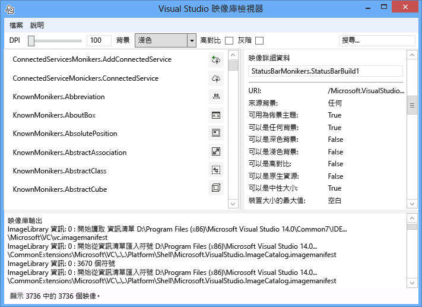
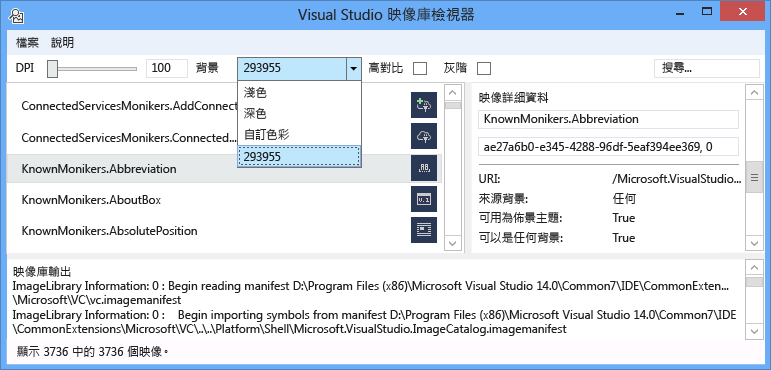
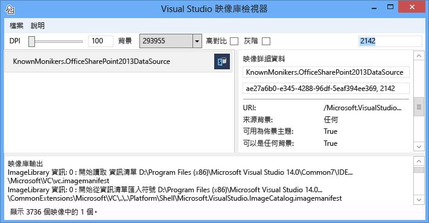

# <a name="image-library-viewer"></a>影像庫檢視器
Visual Studio 影像庫檢視器工具可以載入並搜尋映像資訊清單，讓操作它們的方式 Visual Studio 的使用者。 使用者可以改變背景、 大小、 DPI、 高對比，以及其他設定。 此工具也會顯示每個映像資訊清單的載入資訊，並顯示每個映像的來源資訊映像資訊清單中。 此工具可用於：  
  
1.  診斷錯誤  
  
2.  確保以下人員屬性已正確設定的自訂映像資訊清單中  
  
3.  搜尋 Visual Studio 映像目錄中的影像，讓 Visual Studio 擴充功能可以使用符合 Visual studio 樣式的映像  
  
   
  
 **影像 moniker**  
  
 影像 moniker （或簡稱 moniker） 是可唯一識別影像資產或映像庫中的影像清單資產的 guid: id 配對。  
  
 **映像資訊清單檔案**  
  
 影像資訊清單 (.imagemanifest) 檔案是 XML 檔案會定義一組的影像資產，表示這些資產，和實際的映像或代表每個資產的映像的 moniker。 映像資訊清單可以定義獨立映像，或影像清單的舊版的 UI 支援。 此外，也可以變更何時及如何顯示這些資產設定資產上或之後每個資產的個別映像上的屬性。  
  
 **映像資訊清單結構描述**  
  
 完成映像資訊清單看起來像這樣：  
  
```xml  
<ImageManifest>  
      <!-- zero or one Symbols elements -->  
      <Symbols>  
        <!-- zero or more Guid, ID, or String elements -->  
      </Symbols>  
      <!-- zero or one Images elements -->  
      <Images>  
        <!-- zero or more Image elements -->  
      </Images>  
      <!-- zero or one ImageLists elements -->  
      <ImageLists>  
        <!-- zero or more ImageList elements -->  
      </ImageLists>  
</ImageManifest>  
```  
  
 **符號**  
  
 可讀性和維護的協助，映像資訊清單可以使用符號的屬性值。 符號已定義如下：  
  
```xml  
<Symbols>  
      <Import Manifest="manifest" />  
      <Guid Name="ShellCommandGuid" Value="8ee4f65d-bab4-4cde-b8e7-ac412abbda8a" />  
      <ID Name="cmdidSaveAll" Value="1000" />  
      <String Name="AssemblyName" Value="Microsoft.VisualStudio.Shell.UI.Internal" />  
</Symbols>  
```  
  
|||  
|-|-|  
|**子元素**|**定義**|  
|匯入|匯入的目前資訊清單中使用的指定資訊清單檔案的符號。|  
|GUID|符號表示的 GUID，而且必須符合 GUID 格式。|  
|ID|符號代表識別碼，而且必須是非負值整數。|  
|字串|符號代表任意字串值。|  
  
 符號會區分大小寫，且參考使用 $(symbol-name) 語法：  
  
```xml  
<Image Guid="$(ShellCommandGuid)" ID="$(cmdidSaveAll)" >  
      <Source Uri="/$(AssemblyName);Component/Resources/image.xaml" />  
</Image>  
```  
  
 某些符號會預先定義的所有資訊清單。 這些可用的 Uri 屬性中\<來源 > 或\<匯入 >，在本機電腦上的參考路徑的項目。  
  
|||  
|-|-|  
|**符號**|**說明**|  
|CommonProgramFiles|%Commonprogramfiles%環境變數的值|  
|LocalAppData|%Localappdata%環境變數的值|  
|ManifestFolder|包含資訊清單檔案的資料夾|  
|MyDocuments|目前使用者的 [我的文件] 資料夾的完整路徑|  
|ProgramFiles|%Programfiles%環境變數的值|  
|系統|Windows\System32 資料夾|  
|WinDir|%Windir%環境變數的值|  
  
 **影像**  
  
 \<影像 > 項目會定義可以參考 moniker 的映像。 GUID 和 ID 聚集在一起會形成影像 moniker。 在整個影像程式庫，moniker 映像必須是唯一的。 如果多個映像具有給定的 moniker，建置程式庫時遇到的第一個是保留的一個。  
  
 它必須包含至少一個來源。 雖然中性大小來源會提供最佳結果，在廣泛的大小，但它們並非必要。 如果服務要求中未定義大小的影像\<影像 > 項目並沒有中性大小來源，服務將選擇最佳的特定大小的來源，並調整為要求的大小。  
  
```xml  
<Image Guid="guid" ID="int" AllowColorInversion="true/false">  
      <Source ... />  
      <!-- optional additional Source elements -->  
</Image>  
```  
  
|||  
|-|-|  
|**屬性**|**定義**|  
|GUID|[必要]影像 moniker GUID 部分|  
|ID|[必要]影像 moniker 識別碼部分|  
|AllowColorInversion|[選擇性的預設為 true]指出映像是否可以具有它以程式設計方式反轉使用深色背景的色彩。|  
  
 **來源**  
  
 \<來源 > 項目會定義單一映像來源資產 （XAML 和 PNG）。  
  
```xml  
<Source Uri="uri" Background="background">  
      <!-- optional NativeResource element -->  
 </Source>  
```  
  
|||  
|-|-|  
|**屬性**|**定義**|  
|URI|[必要]定義從何處可以載入影像的 URI。 它可以是下列其中一項：<br /><br /> -A [Pack URI](http://msdn.microsoft.com/en-US/library/aa970069\(v=vs.100\).aspx)使用應用程式: / / 授權單位<br /><br /> -絕對元件資源參考<br /><br /> -包含原生資源的檔案路徑|  
|背景|[選用]指出項目類型的來源要使用的背景。<br /><br /> 它可以是下列其中一項：<br /><br /> - *Light*： 淺色背景使用的來源。<br /><br /> - *深色*： 深色背景使用的來源。<br /><br /> - *高對比*: 來源可用於任何背景中高對比模式。<br /><br /> - *HighContrastLight*： 淺色背景高對比模式中使用的來源。<br /><br /> -*HighContrastDark*： 深色背景高對比模式中使用的來源。<br /><br /> 如果**背景**省略屬性中，於任何背景使用的來源。<br /><br /> 如果**背景**是*Light*，*深色*， *HighContrastLight*，或*HighContrastDark*，永遠不會反轉來源的色彩。 如果**背景**省略或設為*高對比*，反轉的來源色彩由映像的**AllowColorInversion**屬性。|  
  
 A\<來源 > 項目可以有一個下列選擇性子項目：  
  
||||  
|-|-|-|  
|**目**|**屬性 （全部所需）**|**定義**|  
|\<大小 >|值|來源將使用指定的大小 （以裝置為單位） 的映像。 將正方形映像。|  
|\<SizeRange >|MinSize MaxSize|來源將使用映像從 MinSize 成 MaxSize （以裝置為單位） （含） 之間。 將正方形映像。|  
|\<維度 >|寬度、 高度|來源將使用指定的寬度和高度 （以裝置單位） 的映像。|  
|\<DimensionRange >|MinWidth，MinHeight，<br /><br /> MaxWidth MaxHeight|來源將用於從最小寬度/高度的映像，以最大寬度/高度 （以裝置為單位） （含） 之間。|  
  
 A\<來源 > 項目也可以有選擇性\<NativeResource > 子元素，它會定義\<來源 > 從原生組件，而不是 managed 組件載入的。  
  
```xml  
<NativeResource Type="type" ID="int" />  
```  
  
|||  
|-|-|  
|**屬性**|**定義**|  
|類型|[必要]原生資源 PNG 或 XAML 的類型|  
|ID|[必要]原生資源的整數識別碼部分|  
  
 **ImageList**  
  
 \<ImageList > 項目會定義一個可傳回單一區域中影像的集合。 視需要視情況下，建置該區域。  
  
```xml  
<ImageList>  
      <ContainedImage Guid="guid" ID="int" External="true/false" />  
      <!-- optional additional ContainedImage elements -->  
 </ImageList>  
```  
  
|||  
|-|-|  
|**屬性**|**定義**|  
|GUID|[必要]影像 moniker GUID 部分|  
|ID|[必要]影像 moniker 識別碼部分|  
|外部|[選擇性的預設為 false]指出是否影像 moniker 參考目前的資訊清單中的映像。|  
  
 所含影像 moniker 沒有參考目前的清單中所定義的映像。 如果映像庫中找不到包含的影像，影像空白預留位置，將使用其所在位置。  
  
## <a name="how-to-use-the-tool"></a>如何使用工具  
 **驗證自訂映像資訊清單**  
  
 若要建立自訂的資訊清單，我們建議您使用 ManifestFromResources 工具以自動產生資訊清單。 若要驗證自訂資訊清單，請啟動影像庫檢視器並選取檔案 > 設定路徑] 以開啟 [搜尋目錄對話方塊。 此工具會使用搜尋目錄載入映像資訊清單，但它也會使用它以尋找包含在資訊清單中的映像的.dll 檔因此請務必包含在這個對話方塊中的資訊清單和 DLL 的目錄。  
  
   
  
 按一下**新增...**選取新的搜尋目錄，來搜尋程式資訊清單和其相對應的 Dll。 此工具會記住這些搜尋目錄，以及他們可以開啟或關閉勾選或取消選取目錄。  
  
 根據預設，此工具會嘗試尋找 Visual Studio 安裝目錄，並將這些目錄加入到搜尋目錄清單。 您可以手動新增找不到此工具的目錄。  
  
 一旦載入所有資訊清單時，此工具可以用來切換**背景**色彩**DPI**，**高對比**，或**grayscaling**的映像，讓使用者以視覺化方式可以檢查以確認它們呈現正確的各種設定的影像資產。  
  
   
  
 可以設定的背景色彩，燈、 暗色調，或自訂值。 選取 [自訂色彩] 會開啟色彩選取對話方塊，並將該自訂色彩加入至稍後輕鬆重新叫用的背景下拉式方塊的底部。  
  
   
  
 選取影像 moniker 右邊的 [映像詳細資料] 窗格中顯示該 moniker 後面的每個實際影像的資訊。 [] 窗格也可讓使用者複製 moniker，依名稱或未經處理的 guid: id 值。  
  
   
  
 顯示每個映像來源的資訊包含何種背景以顯示上，可以設定主題是否支援高對比，它是適用於何種大小或它是中性大小或影像是否來自原生組件。  
  
   
  
 當驗證映像資訊清單時，我們建議您部署資訊清單和映像 DLL 在真實世界的位置。 這會確認任何相對路徑會正常運作，以及映像庫可以尋找並載入資訊清單和映像 DLL。  
  
 **正在搜尋映像目錄 KnownMonikers**  
  
 若要更符合 Visual Studio 樣式，Visual Studio 擴充功能可以使用 Visual Studio 映像目錄而不是建立及使用它自己的映像。 這樣的優點不需要維護這些映像，因而可確保影像會有高 DPI 支援映像，讓它看起來應該在所有 Visual Studio 支援的 DPI 設定正確。  
  
 影像庫檢視器可讓資訊清單，以搜尋，讓使用者可以尋找 moniker，表示影像資產，並在程式碼中使用的 moniker。 若要搜尋映像，在 [搜尋] 方塊中輸入所需的搜尋詞彙然後按 Enter。 在底部的 [狀態] 列會顯示多少相符項目中找不到影像總數超出所有資訊清單。  
  
   
  
 搜尋的現有資訊清單中的影像 moniker 時，我們建議您搜尋，並使用只有 Visual Studio 映像的目錄 moniker、 其他刻意可公開存取的 moniker 或您自己自訂的 moniker。 如果您使用非公用的 moniker，自訂使用者介面可能會損毀或其映像中已經變更非預期的方式或如果變更或更新這些非公用的 moniker 和映像時。  
  
 此外，搜尋由 GUID 是可能的。 這種搜尋可用於篩選清單向下寫入單一資訊清單，或如果資訊清單的資訊清單的單一小節包含多個 Guid。  
  
   
  
 最後，搜尋由識別碼也會是可能。  
  
   
  
## <a name="notes"></a>注意  
  
-   根據預設，此工具會在數個 Visual Studio 安裝目錄中的影像資訊清單中提取。 只有一種具有公開您可以使用的 moniker 是**Microsoft.VisualStudio.ImageCatalog**資訊清單。 GUID: ae27a6b0-e345-4288-96df-5eaf394ee369 (請勿**不**覆寫此自訂資訊清單中的 GUID) 型別： KnownMonikers  
  
-   此工具會嘗試啟動載入發現，所有映像資訊清單，因此可能需要幾秒鐘的時間實際上會出現應用程式。 載入資訊清單時，它可能也會變慢或沒有回應。  
  
## <a name="sample-output"></a>範例輸出  
 此工具不會產生任何輸出。