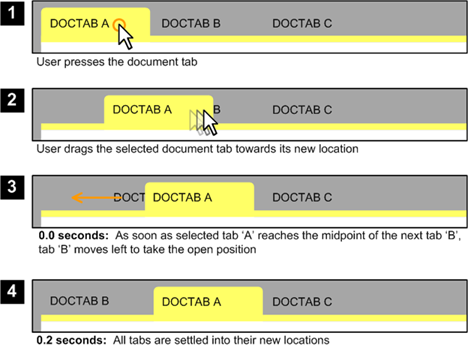
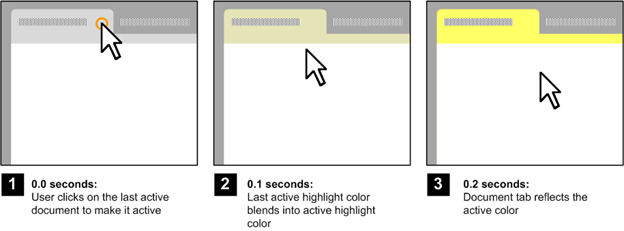

# Visual Studio 的動畫
[!INCLUDE[vs2017banner](../../code-quality/includes/vs2017banner.md)]

## 動畫的基本概念  
  
### 在 Visual Studio 中的動畫最佳作法  
 請遵循這些規則，以確保在 Visual Studio IDE 一致且方便使用的動畫樣式。  
  
-   **是選擇性的。**限制為特定用途的動畫。  
  
-   **計時和速度是非常重要** 以確保轉換覺得快速且自然:  
  
    -   完成動畫的轉換內一個半秒 \(500 毫秒為單位\)。  
  
    -   必須快速它們不會中斷使用者的工作流程會經常發生的動畫。  
  
    -   動畫不應該如此快或太突兀，很難了解，但不是這麼慢，它會使一個耐心不足以完成轉換。  
  
    -   使用變數計時強調重要性。 比方說，當瀏覽類別圖表上的項目序列，加快項目之間的轉換，然後專注於重要的項目變慢。  
  
-   **使用漸進式非線性簡化** 到另一個狀態，讓平靜和自然的  
  
-   如果可能的話， **停留使用精巧的動畫** 指出在滑鼠互動項目。  
  
-   如果您依賴動畫功能，您再 **能用來將它們關閉** 本機 \(適用於所有的功能\) 中的選項為 **工具 \> 選項** \] 對話方塊。  
  
-   **一次應該只有一個動畫** 傳達出一段資訊。  
  
-   **請務必微妙的地方。**在大部分情況下動畫不必要求使用者的注意力其用途。 在計時、 排序和行為稍有變更可能會大幅影響的觀感，而且可以有效和無效的動畫之間的差異。  
  
-   當使用動畫來吸引某樣東西， **確定值得中斷使用者**的一。  
  
-   **時顯示進度或狀態** 透過動畫:  
  
    -   停止程序不會逐步引導時顯示進度移動。  
  
    -   不確定處理序區別確定處理序。  
  
    -   請確定動畫具有可識別完成與失敗的狀態。  
  
    -   最小化效果的動畫，顯示狀態，並確定它們有真正的價值的實際使用的其他資訊提供使用。 範例包括暫時性的狀態變更和緊急狀況  
  
#### 不這麼做:  
  
-   使用小型移動 \(移動中佔空間很小\)、 偏好淡和變動移動物件。  
  
-   使用透過螢幕畫面的大型區域的動畫。 不論大小，這種動畫是轉移給使用者。  
  
-   使用不與使用者目前致力於物件或互動的動畫。  
  
-   使用需要使用者介入即可重設狀態，例如強制使用者回應閃爍的通知，以使其停止閃爍的動畫。 與其進行互動，以任何方式應該足以關閉它們。  
  
 如需有關這些最佳作法的應用程式的詳細資訊，請參閱 [動畫模式](../../extensibility/ux-guidelines/animations-for-visual-studio.md#BKMK_AnimationPatterns)。  
  
### 動畫度量  
  
-   系統應該明顯地回應使用者手勢在小於 10 毫秒。  
  
-   動畫的轉換不應該超過 500 毫秒，才能完成。  
  
-   補償需要較長時間的轉換方法之一是要分成兩個部分。例如，動畫的第一個部分可能是空白內容的容器 \(最多 500 毫秒\) 後面內容淡出效果加入至容器 \(最多 500 毫秒為單位\)。  
  
-   可計算的載入時間，是慣用行列式進度指示器 \(%完成進度指標\)。  
  
-   無法計算的載入時間，例如資料指標或內嵌的旋轉動畫 \(載入或使用指標\) 的忙碌指標是合適的。  
  
### 為 communicator 的動畫  
 在 Visual Studio UI 中，動畫只會當做通訊工具。  它用來進行通訊的各種不同的資訊，例如在 UI 中，結構化變更例如，當功能表開啟或關閉。 動畫可協助您視覺化複雜的系統，例如安裝進度的視覺效果的時間相關的行為，或用來吸引注意力警示和通知。  
  
 UI 動畫通常函式以四種方式: 視覺化，引起注意、 模擬，以及指出回應時間\/進度。  
  
#### 以視覺化方式檢視  
 動畫可以強調 3d 物件的本質，方便使用者以視覺化方式檢視其空間的結構。 若要達到此目的，動畫可能需要轉動完整圓形中的物件速度很慢，來回開啟或使物件更接近並稍微增加其大小，以強調變換或焦點。  
  
 雖然三維物件可能會以移動使用者控制項 \(以程式設計方式或手動\) 設計工具應該事先判斷如何以最佳動畫提供最佳的了解物件的移動。 這個動畫可以程式化則會啟用使用者將游標放到物件，而使用者控制移動需要使用者了解如何管理物件。 限制單一軸或一次; 方向移動您可以調整、 旋轉，或翻譯，但不要同時執行多個。  
  
 視覺化類別包含的部分資料、 關聯性、 狀態、 結構、 序列和時間。  
  
##### 資料  
 說明複雜和變數的資訊:  
  
-   資訊視覺效果，例如圖表和圖形間移動  
  
-   序列中逐步執行、 導覽，且分頁  
  
-   呼叫詳細資料、 指標，並反白顯示的特定資訊  
  
-   覆疊詳細資料和焦點的項目之上的其他資訊  
  
-   從一種結構化或組織表示變形到另一個  
  
-   代表一段時間使用時間滑桿、 分疊快速導覽和傳輸控制項 \(播放、 停止和暫停\) 的變更。  
  
##### 關聯性  
  
-   說明如何項目相互關聯，或指定的項目與相關的項目。  
  
-   顯示階層和父系\-子系或同層級關聯性  
  
-   一個項目會產生另一個  
  
-   一個項目最小化，另一個項目  
  
-   有行動網卡到另一個項目  
  
##### 狀態  
  
-   更新內容。  
  
-   使用者焦點和選取範圍  
  
-   進度  
  
-   錯誤  
  
##### 結構  
  
-   樞紐分析一個節點上的結構  
  
-   Reorienting  
  
-   最小化和最大化，或展開和摺疊  
  
##### 序列  
  
-   投影片放映順序  
  
-   翻閱圖片  
  
##### 時間  
  
-   顯示一段時間，時間間隔和螢幕錄製影片的變更  
  
-   移至資源回收筒、 移除和取消復原  
  
-   還原歷程記錄的狀態  
  
#### 引起注意  
 如果目標是要繪製單一項目從數個使用者的注意力，或提醒使用者的更新資訊，動畫可能適合。 例如，您的應用程式的起始頁可能採用投影片入定位在頁面載入之後開始使用\] 按鈕。  
  
 一般而言，在螢幕上最後一個移動的項目會吸引使用者注意。  在一系列的動畫元素中，使用者的注意力將遵循的最後一個移動的物件。  
  
##### 警示  
  
-   警告使用者，我們強調顯示進度  
  
-   顯示的項目進行正確或不正確，或顯示進度或進行變更  
  
-   工作，例如尋找線上的詳細資訊，或了解目前工作期間提示使用者  
  
##### 通知  
  
-   警示的錯誤狀況的相關使用者  
  
-   中斷使用者查看他們想要處理其他事情  
  
-   輕輕通知使用者處理序已完成或變更，例如當下載完成時。  
  
#### 模擬  
 這個類別涵蓋了 physicality 和維度。  
  
-   說明物件均來自或它們移至的位置  
  
-   展開和摺疊或開啟和關閉  
  
-   移動瀏覽、 捲動和頁面會開啟  
  
-   堆疊和 z 順序  
  
-   旋轉木馬和 accordion 設定  
  
-   翻轉和旋轉 UI  
  
#### 回應與進度指標  
 進度指標有幾個值得注意的優點:  
  
-   這兩個確定及不確定的進度指示器 reassure 的使用者，系統已不會當機，並在問題上運作。  
  
-   確定指標給予的使用者了解程度沿著動作的進度，以及了解取得接近完成。  
  
##   動畫模式  
  
### 概觀  
 在 Visual Studio 中的動畫的用意在於提供特定的函式，且不會妨礙使用者產能。 包含符合一般動畫特性:  
  
-   小又不礙眼  
  
-   自然且真實方式呈現  
  
-   微妙和同胞  
  
-   快速又有效率地  
  
-   鬆散、 不 hurried  
  
 下圖顯示使用 Visual Studio 中的建議動畫樣式。 沒有動畫和精巧的動畫例如淡入\/淡出最常使用。 移動動畫例如擴大和縮減的有限的應用程式，X 和 Y 位置變更及旋轉。  
  
   
  
 **Visual Studio 的建議動畫樣式**  
  
#### 會出現與消失  
 使用此模式時，項目從切換可見到外的檢視而不會轉換動畫:  
  
   
  
##### 正確使用方式  
 全新的 UI 項目，必須立即出現或消失，讓使用者不會分心或受到阻擋。 此外，緩慢移動的動畫可能會認為效能拖曳，就不會出現與消失的樣式。  
  
##### 使用方式不正確  
 案例中即會出現 UI 因此突然使用者根本不知道發生了什麼事，並將動畫加入有助於了解內容。  
  
##### 動畫屬性  
 延遲時間通常是零秒。  
  
##### 範例  
  
-   自動隱藏工具視窗  
  
-   鍵盤啟動編輯器 UI，例如 IntelliSense 和參數說明  
  
-   展開\-和\-摺疊程式碼區域  
  
#### 淡入與淡  
 使用此模式時，UI 項目從看不到 \(0%不透明\) 的轉換或可見 \(100%不透明\):  
  
   
  
##### 正確使用方式  
 這是最常建議 UI 動畫。 它是將感興趣，而不會中斷流程微妙效果。 在某些情況下，使用者甚至不知道有動畫，而且只要認定平滑的流動 UI 系統。  
  
##### 動畫屬性  
  
-   啟動不透明度: 淡的 0%、 100%，淡  
  
-   結束不透明度: 100%，淡入、 淡的 0%  
  
-   持續時間: 200 毫秒獨立 100 毫秒時做為組合動畫順序的一部分  
  
-   加\/減速樣式: 正弦 InOut  
  
##### 範例  
  
-   自動隱藏工具視窗  
  
-   開啟和關閉功能表  
  
-   背景和前景\] 索引標籤的轉換  
  
#### 從 A 到 B 的色彩混合  
 使用此模式時，UI 項目用來變更色彩的色彩 b:  
  
   
  
##### 正確使用方式  
 與當 UI 項目從一個內容或狀態色彩變更成另一個動畫轉換。  
  
##### 動畫屬性  
  
-   開始色彩: 特定的 UI  
  
-   結束色彩: 特定的 UI  
  
-   持續時間: 200 毫秒獨立 100 毫秒時做為組合動畫順序的一部分  
  
-   加\/減速樣式: 正弦 InOut  
  
##### 範例  
  
-   文件視窗狀態轉換 \(作用中，最後一個作用中與非作用中\)  
  
-   工具視窗狀態轉換 \(專注於目標和未取得焦點\)  
  
#### 擴大和縮減  
 使用此模式時，X、 Y，或兩個方向擴展 UI 項目:  
  
   
  
##### 正確使用方式  
 與當 UI 項目從一個內容大小變更為另一個動畫轉換。  
  
##### 動畫屬性  
  
-   X 小數位數: %或特定維度 \(以像素為單位\)  
  
-   Y 比例: %或特定維度 \(以像素為單位\)  
  
-   錨定位置: 通常左上角 \(適用於由左到右的語言\) 或 \(適用於由右至左語言\) 的右上方  
  
-   持續時間: 200 毫秒獨立 100 毫秒時做為組合動畫順序的一部分  
  
##### 範例  
  
-   架構總管面板展開和摺疊  
  
-   起始的頁的項目展開和摺疊  
  
#### X Y 位置變更  
 使用此模式時，UI 項目變更其 X 或 Y 位置，或兩者:  
  
   
  
##### 正確使用方式  
 與動畫的轉換時的 UI 項目從一個內容位置變更為另一個。  
  
##### 動畫屬性  
  
-   啟動 X 和 Y 位置: 特定的 UI  
  
-   結束 X 和 Y 位置: 特定的 UI  
  
-   移動路徑: 無  
  
-   持續時間: 200 毫秒獨立 100 毫秒時做為組合動畫順序的一部分  
  
-   加\/減速樣式: 正弦 InOut  
  
##### 範例  
 重新排列索引標籤  
  
#### 旋轉  
 使用此模式時，會旋轉的 UI 項目:  
  
   
  
##### 正確使用方式  
 僅適用於不確定微調進度列指示器。  
  
##### 動畫屬性  
  
-   旋轉的角度: 360  
  
-   旋轉中心: 中間的物件  
  
-   持續時間: 連續  
  
##### 範例  
 不確定的進度指示器 \(旋轉\)  
  
### 一般的殼層 UI 動作和建議的動畫  
  
#### 索引標籤上開啟  
  
-   樣式: 顯示  
  
-   零秒的持續時間:  
  
   
  
#### 關閉索引標籤  
  
-   變更的樣式: X 位置  
  
-   200 毫秒的持續時間:  
  
   
  
#### 索引標籤重新排序  
  
-   變更的樣式: X 位置  
  
-   200 毫秒的持續時間:  
  
   
  
#### 關閉浮動文件  
  
-   樣式: 顯示  
  
-   200 毫秒的持續時間:  
  
   
  
#### 視窗狀態轉換  
  
-   樣式: 若要與其他 windows 一致，讓目前的作業系統文件關閉動畫的定義。  
  
-   200 毫秒的持續時間:  
  
   
  
#### 開啟功能表  
  
-   樣式: 淡入  
  
-   200 毫秒的持續時間:  
  
   
  
#### 關閉功能表  
  
-   樣式: 淡  
  
-   200 毫秒的持續時間:  
  
   
  
#### 自動隱藏工具視窗中顯示  
  
-   樣式: 顯示  
  
-   零秒的持續時間:  
  
 