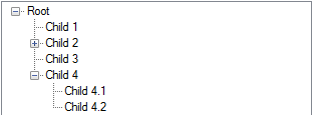

# 適用於 Visual Studio 的通用控制項模式
##  通用控制項  
  
### 概觀  
通用控制項便會產生大部分的 Visual Studio 中的使用者介面。 在 Visual Studio 介面中使用的最常見的控制項應該遵循[Windows 桌面互動的指導方針](https://msdn.microsoft.com/library/windows/desktop/dn742399.aspx)。 本主題旨在說明 Visual Studio，並涵蓋了特殊的情況或加強這些 Windows 指導方針的詳細資料。  
  
#### 本主題中的通用控制項  
  
-   [捲軸](../../extensibility/ux-guidelines/common-control-patterns-for-visual-studio.md#BKMK_Scrollbars)  
  
-   [輸入的欄位](../../extensibility/ux-guidelines/common-control-patterns-for-visual-studio.md#BKMK_InputFields)  
  
-   [下拉式方塊和下拉式清單](../../extensibility/ux-guidelines/common-control-patterns-for-visual-studio.md#BKMK_ComboBoxesAndDropDowns)  
  
-   [核取方塊](../../extensibility/ux-guidelines/common-control-patterns-for-visual-studio.md#BKMK_CheckBoxes)  
  
-   [選項按鈕](../../extensibility/ux-guidelines/common-control-patterns-for-visual-studio.md#BKMK_RadioButtons)  
  
-   [群組框架](../../extensibility/ux-guidelines/common-control-patterns-for-visual-studio.md#BKMK_GroupFrames)  
  
-   [文字控制項](../../extensibility/ux-guidelines/common-control-patterns-for-visual-studio.md#BKMK_TextControls)  
  
-   [按鈕和超連結](../../extensibility/ux-guidelines/common-control-patterns-for-visual-studio.md#BKMK_ButtonsAndHyperlinks)  
  
-   [樹狀檢視](../../extensibility/ux-guidelines/common-control-patterns-for-visual-studio.md#BKMK_TreeViews)  
  
#### 視覺化樣式  
首先要設定控制項的樣式時，請考慮為佈景主題 UI 中是否將使用的控制項。 為非佈景主題 UI 中的標準 UI 控制項，且必須遵照[樣式的 Windows 桌面](https://msdn.microsoft.com/en-us/library/windows/desktop/dn742399\(v=vs.85\).aspx)，也就是說，它們不 re 樣板化，而且應該會出現在其預設控制項外觀。  
  
-   **標準 （公用程式） 對話方塊︰**不佈景主題。 不重新範本。 使用基本控制項樣式預設值。  
  
-   **工具視窗、 文件編輯器，設計介面和佈景主題對話方塊︰**使用特殊佈景主題的外觀，使用色彩服務。  
  
###  捲軸  
 捲軸應該遵循[常見的互動模式適用於 Windows 捲軸](https://msdn.microsoft.com/en-us/library/windows/desktop/bb787527\(v=vs.85\).aspx)除非它們夾帶內容資訊時，要在程式碼編輯器。  
  
###  輸入的欄位  
 典型的互動行為，請遵循[文字方塊中的 Windows 桌面方針](https://msdn.microsoft.com/en-us/library/windows/desktop/dn742442\(v=vs.85\).aspx)。  
  
#### 視覺化樣式  
  
-   輸入的欄位不應該樣式公用程式 對話方塊中。 使用基本的內建控制項的樣式。  
  
-   佈景主題的輸入的欄位應該只用在已設定佈景主題對話方塊和工具視窗。  
  
#### 特製化的互動  
  
-   唯讀欄位會顯示有但 （使用中） 的預設前景灰色 （停用） 背景。  
  
-   需要欄位應該有**\<需要 >**做為其中的標準。 您不應該變更罕見的情況下除外的背景的色彩。  
  
-   驗證錯誤︰ 請參閱[通知和 Visual Studio 的進度](../../extensibility/ux-guidelines/notifications-and-progress-for-visual-studio.md)  
  
-   輸入的欄位應該要調整大小以容納內容，不符合在其中，它們會顯示，視窗的寬度也任意長的欄位，例如路徑的長度相符。 長度可能會向使用者表示的欄位中允許多少個字元的限制。  
  
      不正確的輸入的欄位長度︰ 不太可能將成為此長的名稱。
  
      更正的輸入的欄位長度︰ 輸入的欄位是合理預期的內容的寬度。
  
###  下拉式方塊和下拉式清單  
典型的互動行為，請遵循[下拉式清單和下拉式方塊的 Windows 桌面方針](https://msdn.microsoft.com/en-us/library/windows/desktop/dn742404\(v=vs.85\).aspx)。  
  
#### 視覺化樣式  
  
-   公用程式對話方塊中，不會重新範本控制項中。 使用基本的內建控制項的樣式。  
  
-   在已設定佈景主題 UI 中，下拉式方塊和下拉式清單，請遵循標準的佈景主題的控制項。  
  
#### 配置  
下拉式方塊和下拉式清單應該調整大小以容納內容，不符合在其中，它們會顯示，視窗的寬度也任意長的欄位，例如路徑的長度相符。  
  
 不正確︰ 下拉式清單寬度是將顯示的內容太長。
  
 正確︰ 在下拉式清單會調整成允許轉譯成長，但不是必要的長度。 
  
###  核取方塊  
典型的互動行為，請遵循[核取方塊的 Windows 桌面方針](https://msdn.microsoft.com/en-us/library/windows/desktop/dn742401\(v=vs.85\).aspx)。  
  
#### 視覺化樣式  
  
-   公用程式對話方塊中，不會重新範本控制項中。 使用基本的內建控制項的樣式。  
  
-   在已設定佈景主題 UI 中，核取方塊會遵循標準的佈景主題的控制項。  
  
#### 特製化的互動  
  
-   核取方塊的互動必須永遠不會快顯對話方塊，或瀏覽至另一個區域。  
  
-   對齊文字的第一行的基準線的核取方塊。  
  
      不正確︰ 核取方塊會置中的文字。
  
      正確︰ 核取方塊對齊文字的第一行。
  
###  選項按鈕  
典型的互動行為，請遵循[選項按鈕的 Windows 桌面方針](https://msdn.microsoft.com/en-us/library/windows/desktop/dn742436\(v=vs.85\).aspx)。  
  
#### 視覺化樣式  
公用程式 對話方塊中沒有樣式選項按鈕。 使用基本的內建控制項的樣式。  
  
#### 特製化的互動  
您不需要使用群組框括住選項的選擇，除非您需要維護群組區分緊密配置中。  
  
###  群組框架  
典型的互動行為，請遵循[Windows 桌面的指導方針群組框架](https://msdn.microsoft.com/en-us/library/windows/desktop/dn742405\(v=vs.85\).aspx)。  
  
#### 視覺化樣式  
公用程式 對話方塊中沒有樣式群組框架。 使用基本的內建控制項的樣式。  
  
#### 配置  
  
-   您不需要使用群組框括住選項的選擇，除非您需要維護群組區分緊密配置中。  
  
-   永遠不會使用單一控制項群組框架。  
  
-   有時候是使用水平規則而不是群組框架容器可接受的。  
  
##  文字控制項

### 靜態文字欄位

靜態文字欄位不能選取使用者，與顯示唯讀資訊。 請避免使用之任何使用者可能會想要複製到剪貼簿的文字。 不過，可以變更唯讀的靜態文字，以反映在狀態變更。 在下列範例中，以反映其上方的 [根命名空間] 文字方塊中所做的變更資訊群組變更下方的輸出名稱靜態文字。

有兩種方式，以顯示靜態文字的資訊。

可以是靜態文字，在它自己在對話方塊中，沒有任何內含項目時，沒有群組衝突。 決定是否真的需要額外的行方塊。 範例是顯示的群組列，所建立的區段底下的目錄路徑，如下所示︰  

 文字控制項中的靜態文字資訊

在對話方塊中，存在其他群組的區域，內含項目資訊的這樣有助於增加可讀性，和區段時可以隱藏或顯示 (像是**屬性 視窗**描述窗格) 或您想要與類似的 UI 一致，將靜態文字的方塊內。 此群組方塊應該是單一規則，而且以著色`ButtonShadow`:

![在 [屬性] 視窗中的靜態文字](~/extensibility/ux-guidelines/media/PropertiesWindow.png "PropertiesWindow.png") 在 [屬性] 視窗中的靜態文字

### 唯讀文字方塊

這可讓使用者選取的欄位內的文字，但無法再進行編輯。 這些文字方塊由一般 3d 字 （平頭） 與起`ButtonShadow`填滿。

文字方塊可以變成作用中 （可編輯） 當使用者變更相關聯的控制項，例如檢查/取消選取核取方塊，或選取或取消選取選項按鈕。 例如，在**工具&gt;選項**頁面，如下所示**首頁**文字方塊將會變成作用中時**使用預設值**未選取核取方塊。

 唯讀文字方塊中，顯示非現用和現用狀態

### 使用對話方塊中的文字

在對話方塊中的文字索引鍵的指導方針︰

-   文字方塊、 清單方塊和 unthemed 對話方塊中的畫面格的標籤具有動詞命令，在第一個字組僅有的初始資本以開頭和結尾冒號。

    > 佈景主題對話方塊中的文字控制項遵循[Windows 桌面 UX 指導方針](https://msdn.microsoft.com/library/windows/desktop/dn742479.aspx)，而且不接受結尾的標點符號，說明連結中的問號除外。

-   核取方塊和選項按鈕標籤啟動具有動詞命令，而在第一個字組僅初始資本，並在沒有結束標點符號。

-   按鈕、 功能表、 功能表項目和索引標籤的標籤會對每個單字 （字首大寫） 中的字首大寫。

-   標籤術語應該與其他對話方塊中的類似標籤一致。

-   可能的話，有撰寫或文字的核准，才會向開發人員實作一個寫入器/編輯器。

-   所有控制項都應該在特殊情況下都有除了標籤在哪一個定位停駐即已足夠。
使用在適當時的協助程式文字。

### Helper 文字

包含在對話方塊中，以協助使用者了解對話方塊的用途，或表示採取的動作。 Helper 文字應在需要時才以避免想堆簡單對話方塊。 協助程式文字的兩個變化為對話方塊和浮水印。

遵循一般協助程式文字的位置，而且是選擇性中導入新的區域。 協助程式文字的常見情況包括︰

-   協助程式對話方塊，來提供有關如何與複雜對話方塊互動的其他方向中的文字。

-   中的空白的工具視窗或對話方塊，以說明為何沒有內容會顯示的浮水印文字。

-   描述窗格底部的喜歡**屬性 視窗**。

-   浮水印文字空白編輯器，以說明使用者應開始執行的動作。
  
### 對話方塊 Helper 文字

使用者經驗的設計工具可以幫助判斷 helper 文字的適用時機。 在設計工具可以定義其一般的內容以及 helper 文字出現的位置。 使用者協助可以寫入/編輯的實際文字。

### 浮水印

對話受益於稍有不同的浮水印指導方針。 因為對話，會出現忙著處理多個 UI 項目 （標籤、 提示文字、 按鈕和其他容器控制項中的文字），特別是浮水印時這些顯示在黑色，非常明顯暗灰色 (VSColor: `ButtonShadow`)。 浮水印通常會出現在例如以白色背影清單方塊控制項 (VSColor: `Window`)。

-   文字會出現在深灰色 (VSColor: `ButtonShadow`)。 不過，如果浮水印出現在中度的灰色或其他顏色 (VSColor: `ButtonFace`) 背景並沒有其可讀性考量相關資訊，請以黑色文字 (VSColor: `WindowText`)。

-   浮水印可以置中或靠左對齊。 對齊方式的決策時，請套用標準設計規則。 浮水印不能選取背景上。

 浮水印文字範例

### 內容專用 （動態） 的文字

動態文字可以是使用的其中一個對話方塊或非強制回應的 UI 中的兩種方式︰ 做為動態的標籤或動態內容。

-   動態標籤︰ 動態文字的常見用法是描述性的面板，例如提供選取的項目，如需詳細資訊，在對話方塊中包含的元素和屬性在右邊方格中顯示這些項目清單中。 屬性方格的標籤可能是動態的以便在左側選取項目時，在右邊方格中顯示該特定項目的資訊。

-   動態文字︰ 可用於執行個體，其中您要顯示的特定資訊並不是一般資訊，如此一來，但應該小心過度使用。

如果您想要使用者能夠複製資訊的能力，動態文字應該是唯讀的文字欄位中。
  
##  按鈕和超連結  
  
### 概觀  
按鈕和連結控制項 （超連結） 應該遵循[超連結的基本 Windows 桌面指引](https://msdn.microsoft.com/en-us/library/windows/desktop/dn742406\(v=vs.85\).aspx)使用量、 字詞、 調整大小，和間距。  
  
### 選擇按鈕和連結  
傳統上，按鈕都已使用的動作，而且已為瀏覽保留的超連結。 按鈕可用於所有情況下，但連結的角色已經擴充 Visual Studio 中，讓按鈕和連結都在某些情況下，更可互換。  
  
何時使用命令按鈕︰  
  
-   主要的命令  
  
-   顯示用來收集輸入的 windows 或進行的選擇，即使它們為次要命令  
  
-   破壞型或無法回復的動作  
  
-   精靈和網頁流程中的承諾按鈕  
  
避免命令按鈕的工具視窗，或如果您需要兩個以上的文字標籤。 連結可以有標籤比較長。  
  
 何時使用連結︰  
  
-   瀏覽至另一個視窗、 文件或 web 網頁  
  
-   需要較長的標籤或簡短描述動作的意圖句子的情況  
  
-   按鈕會不勝負荷 UI 緊密的空格提供動作不會破壞型或無法回復  
  
-   取消強調情況中的第二個命令有許多命令  
  
#### 範例  
 下一個狀態訊息的資訊列中所使用的命令連結
  
 CodeLens 快顯視窗中所使用的連結
  
 第二個命令使用其中按鈕將會吸引注意太多連結
  
### 常見的按鈕  
  
#### Text  
請依照下列中的撰寫指導方針[UI 文字和術語](../../extensibility/ux-guidelines/ui-text-and-help-for-visual-studio.md#BKMK_UITextAndTerminology)。  
  
#### 視覺化樣式  
  
##### 標準 (unthemed)  
Visual Studio 中的大部分按鈕會出現在公用程式的對話方塊，而且不應該有樣式。 如作業系統所指定，而應該反映出按鈕的標準外觀。  
  
##### 佈景主題  
在某些情況下，按鈕可能會使用已設定樣式使用者介面內，這些按鈕必須有適當的樣式。 請參閱[對話方塊](../../extensibility/ux-guidelines/application-patterns-for-visual-studio.md#BKMK_Dialogs)佈景主題的控制項上的資訊。  
  
### 特殊按鈕  
  
#### 瀏覽 按鈕  
**[瀏覽...]**使用按鈕在方格、 對話方塊和工具視窗和其他非強制回應的 UI 項目。 它們會顯示在控制項填入值，來協助使用者選擇器。 有兩種變化，此按鈕，完整和簡短。  
  
![長的 [瀏覽...] 按鈕](../../extensibility/ux-guidelines/media/070703-04_browselong.gif "070703-04_BrowseLong") 長的 [瀏覽...] 按鈕
  
![僅限省略符號簡短 […] 按鈕](../../extensibility/ux-guidelines/media/070703-05_browseshort.gif "070703-05_BrowseShort") 僅限省略符號簡短 […] 按鈕
  
何時使用僅限省略符號簡短按鈕︰  
  
-   如果有一個以上長**[瀏覽...]**在對話方塊中，例如當數個欄位允許瀏覽 按鈕。 使用 短期**[…]**若要避免這種情況下所建立令人混淆的便捷鍵的每一個按鈕 (**（& s) 瀏覽**和**B &**在相同對話方塊)。  
  
-   在嚴格的對話方塊中，或沒有合理的地方，將長的按鈕。  
  
-   如果按鈕會出現在方格控制項。  
  
使用按鈕的指導方針︰  
  
-   請勿使用存取金鑰。 若要存取使用鍵盤，使用者必須定位從相鄰的控制項。 請確定定位順序，這類欄位將會填滿之後，立即落任何瀏覽 按鈕。 永遠不會使用底線下方的第一個週期。  
  
-   設定 Microsoft Active Accessibility (MSAA)**名稱**屬性**瀏覽...** （包括省略符號），畫面上，因此讀取器會讀取為 [瀏覽] 和未"點-點-點 」 或 「 期間週期。 」 Managed 控制項，這表示設定**AccessibleName**屬性。  
  
-   絕對不要使用省略符號**[…]**按鈕瀏覽動作以外的項目。 例如，如果您需要**[新增...]**按鈕，但沒有足夠的空間文字、，然後需要重新設計的對話方塊。  
  
##### 調整大小和間距  
![調整 [瀏覽...] 按鈕︰ standard 版本是 75 x 23 像素為單位，簡短版本是 26 x 23 像素為單位](../../extensibility/ux-guidelines/media/070703-06_browsesizing.png "070703-06_BrowseSizing") 調整 [瀏覽...] 按鈕的大小
  
![間距 [瀏覽...] 按鈕︰ 相關的控制項與標準瀏覽按鈕 7 像素為單位之間的間距，間距相關的控制項，並簡短的瀏覽按鈕 5 像素](../../extensibility/ux-guidelines/media/070703-07_browsespacing.png "070703-07_BrowseSpacing") 調整 [瀏覽...] 按鈕的間距
  
#### 圖形按鈕  
某些按鈕應該一律使用圖形化的映像，也絕對不要包含文字，以節省空間，以避免當地語系化的問題。 這些通常用於欄位選擇器和其他可排序清單。  
  
> **注意︰**使用者需要這些 （沒有存取機碼） 的按鈕索引標籤上，因此將它們放在合理的順序。 地圖`name`花費，讓螢幕助讀程式正確解譯按鈕動作的動作按鈕的屬性。  
  
| 函式 | 按鈕 |  
| --- | --- |  
| 新增 | ![圖形的 [新增] 按鈕](../../extensibility/ux-guidelines/media/070703-08_buttonadd.png "070703 08_ButtonAdd") |
| 移除 | ![圖形的 [移除] 按鈕](~/extensibility/ux-guidelines/media/070703-09_buttonremove.png "070703 09_ButtonRemove") |
| 全部加入 | ![圖形 [全部加入] 按鈕](../../extensibility/ux-guidelines/media/070703-10_buttonaddall.png "070703 10_ButtonAddAll") |
| 全部移除 | ![圖形 [全部移除] 按鈕](../../extensibility/ux-guidelines/media/070703-11_buttonremoveall.png "070703 11_ButtonRemoveAll") |
| 上移 | ![圖形 [上移] 按鈕](../../extensibility/ux-guidelines/media/070703-12_buttonmoveup.png "070703 12_ButtonMoveUp") |
| 下移 | ![圖形 [下移] 按鈕](~/extensibility/ux-guidelines/media/070703-13_buttonmovedown.png "070703 13_ButtonMoveDown") |
| 刪除 | ![圖形 [刪除] 按鈕](~/extensibility/ux-guidelines/media/070703-14_buttondelete.png "070703 14_ButtonDelete") |
  
##### 調整大小和間距  
縮放圖形按鈕一樣的簡短版本**[瀏覽...]**按鈕 （26 x 23 像素為單位）︰  
  
 圖形上顯示和不顯示透明色彩的按鈕影像的外觀
  
### 超連結  
超連結是很適合瀏覽基礎之類的動作，開啟 [說明] 主題、 強制回應對話方塊或精靈。 如果命令使用超連結，則應該永遠顯示可見及明顯變更 ui 中。 一般情況下，認可動作 （例如儲存，請 [取消]，並刪除） 的動作會更好，用以表示使用按鈕。  
  
#### 書寫風格  
請遵循[Windows 桌面使用者介面文字指導](https://msdn.microsoft.com/en-us/library/windows/desktop/dn742478\(v=vs.85\).aspx)。 請勿使用 「 深入了解更多關於，」 「 告訴我更多關於，」 或 「 取得說明與此"片語。 相反地，片語主要說明內容所回答的問題方面的說明連結文字。 例如，"**如何新增伺服器至伺服器總管？**"  
  
#### 視覺化樣式  
  
-   超連結應該一律使用[VSColor 服務](../../extensibility/ux-guidelines/colors-and-styling-for-visual-studio.md#BKMK_TheVSColorService)。 超連結的樣式不正確，如果它閃爍紅色現用時或之後所造訪顯示不同的色彩。  
  
-   不包含底線上來狀態，除非連結就像是在浮水印句子片段為完整的句子內的控制項。  
  
-   底線不應該出現在 hover 上。 相反地，連結是作用中使用者的意見反應也有些微的色彩變更適當的連結資料指標。  
  
##  樹狀檢視  
  
樹狀結構檢視會提供一種方式組織複雜列出成父系-子系群組。 使用者可以展開或摺疊來顯示或隱藏基礎的子系項目的父群組。 可以選取樹狀檢視中的每個項目，以提供進一步的動作。  
  
###  樹狀結構檢視的視覺化樣式  
  
#### 展開器  
Windows 和 Visual Studio 所使用之 expander 設計應該符合樹狀檢視控制項。 每個節點都使用 expander 控制項來顯示或隱藏基礎項目。 使用展開器控制項可能會遇到 Windows 和 Visual Studio 中的不同的樹狀結構檢視的使用者提供一致的。  
  
 使用展開器控制項的樹狀檢視節點的正確︰ 適當的樣式
  
 不正確︰ 的樹狀檢視節點不當的樣式
  
#### 選取範圍  
在樹狀檢視中選取節點時，反白顯示的應該展開整個樹狀檢閱控制項的寬度。 這有助於使用者清楚識別所選的項目。 選取範圍色彩應該會反映目前的 Visual Studio 佈景主題。  
  
 正確︰ 反白顯示選取之節點的符合整個樹狀檢視控制項的寬度。
  
 不正確︰ 反白顯示選取之節點的容納不下整個樹狀檢視控制項的寬度。
  
#### 圖示  
圖示應該只用在樹狀檢視控制項中如果它們協助以視覺化方式識別項目之間的差異。 一般情況下，圖示應該只能用於異質性清單中的圖示將資訊傳送至區分項目的類型。 同質的清單中使用圖示經常被視為雜訊，應該予以避免。 在此情況下 （父系） 中的 [群組] 圖示可以傳遞項目的類型。 如果圖示是動態的且用來指示狀態，將此規則的例外狀況。  
  
#### 捲軸  
如果內容可以放入樹狀檢視控制項中，應該永遠隱藏捲軸。 可接受的捲軸是可捲動視窗中會隱藏或半透明和包含樹狀檢視中的視窗具有焦點時，會出現或樹狀結構的滑鼠停留在檢視本身。  
  
 因為內容已經超過限制的樹狀檢視控制項，則會顯示這兩個垂直和水平捲軸。
  
###  樹狀結構檢視互動  
  
#### 操作功能表  
在樹狀檢視節點可以顯示內容功能表中的子功能表選項。 一般而言，這就會發生當使用者以滑鼠右鍵按一下項目，或在與所選取項目的 Windows 鍵盤上按下功能表鍵。 請務必取得焦點節點，並已選取。 這可協助使用者識別哪一個項目所屬的子功能表。  
  
 尚未選取該項目已產生的項目內容功能表提升焦點，通知使用者。
  
#### 鍵盤  
樹狀檢視應提供選取項目，然後展開/摺疊節點使用鍵盤的能力。 這可確保瀏覽符合我們的協助工具需求。  
  
##### 樹狀檢視控制項  
Visual Studio 樹狀目錄控制項應該遵循一般的鍵盤巡覽︰  
  
-   **向上箭號︰**樹狀結構向上移動選取的項目  
  
-   **向下箭號︰**的樹狀結構下移動選取的項目  
  
-   **向右箭號︰**展開樹狀結構中的節點  
  
-   **向左箭號︰**摺疊樹狀結構中的節點  
  
-   **輸入金鑰︰**起始，載入、 執行選取的項目  
  
##### Trid （樹狀結構檢視和格線檢視）  
Trid 控制項是包含格線中的樹狀檢視的複雜控制項。 展開、 摺疊，並巡覽樹狀結構時應該採用相同的鍵盤命令，以樹狀檢視，具有下列功能︰  
  
-   **向右箭號︰**展開節點。 節點已展開之後，則應繼續瀏覽至右側最接近的資料行。 瀏覽應該停止的資料列結尾。  
  
-   **索引標籤︰** Navigates 到最接近的儲存格右邊。  在資料列的結束時，瀏覽會繼續下一個資料列。  
  
-   **Shift + Tab:** Navigates 到最接近的資料格左邊。  資料列的開頭時，瀏覽會繼續在先前的資料列中最右邊的儲存格。  
  
 在 Visual Studio 中的 trid 控制項
