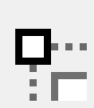
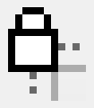
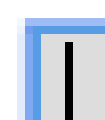

# Visual Studio 的複合模式
[!INCLUDE[vs2017banner](../../code-quality/includes/vs2017banner.md)]

複合模式結合不同組態中的互動和設計項目。 在 Visual Studio 中關於一致性的最重要複合模式包括︰  
  
-   [資料視覺效果](../../extensibility/ux-guidelines/composite-patterns-for-visual-studio.md#BKMK_DataVisualization)  
  
-   [在物件 UI 和查看](../../extensibility/ux-guidelines/composite-patterns-for-visual-studio.md#BKMK_OnObjectUI)  
  
-   [選擇模型](../../extensibility/ux-guidelines/composite-patterns-for-visual-studio.md#BKMK_SelectionModels)  
  
-   [持續性和儲存設定](../../extensibility/ux-guidelines/composite-patterns-for-visual-studio.md#BKMK_PersistenceAndSavingSettings)  
  
-   [觸控輸入](../../extensibility/ux-guidelines/composite-patterns-for-visual-studio.md#BKMK_TouchInput)  
  
##   資料視覺效果  
  
### 概觀  
 圖表會視覺化方式來彙總，並將資料視覺化加強決策。 它們可以協助使用者面臨具有大量資料，但小表示什麼值得注意，以及可能需要的動作，請參閱。  
  
 如果下列任一條件成立，使用者將受益圖表︰  
  
-   圖表有助於使用者識別可針對的工作嗎？  
  
-   將圖表可讓使用者來預測可能變更的結果？  
  
-   將圖表協助使用者找出趨勢及識別模式嗎？  
  
-   圖表可讓使用者做出明智的決策？  
  
-   可協助回答特定問題，使用者可能必須指定內容中的圖表嗎？  
  
#### 圖表的一般規則  
  
-   清楚標示資料。 圖例說明不只是很圖片。  
  
-   開始在零，以避免扭曲比例的座標軸。 行的長度和列的大小是重要的視覺提示，以了解資料點之間的關聯性。  
  
-   建立圖表，不資訊圖。 資訊圖是藝術的表示法的資料，以及其主要目標是視覺化 storytelling。 圖表可以 （而且也應該） 是視覺效果、 但讓資料自己會說話。  
  
-   避免 skeumorphism、 圖片長條圖、 對比 hashmarks 和其他資訊圖修飾。  
  
-   請勿使用 3D 效果成裝飾項目。 使用它們，只有當他們真正使用者的能力，使其僅包含資訊的整數。  
  
-   請避免使用多個線條和填滿，因為兩個以上的色彩可以使這個圖表類型難以閱讀及正確解譯。  
  
-   請勿使用圖表 （或任何圖） 的方法，以了解概念，或與資料互動的唯一方式。 這會造成問題的使用者視力。  
  
-   請勿使用圖表做為必要或裝飾項目] 頁面上。 換句話說，如果圖表並不會加入任何值或協助使用者解決問題，請勿使用它。  
  
### 圖表類型  
 在 Visual Studio 中使用的圖表類型包括橫條圖、 折線圖、 已修改的圓形圖稱為環圖表或 「 甜甜圈圖，「 時間軸，散佈圖 （也稱為 「 叢集圖表 」），以及甘特圖。 每個類型的圖表可用於通訊的不同類型的資訊。  
  
### 其他圖表的考量  
  
#### 色彩  
 沒有特定的圖表定義為 Visual Studio 中使用的色彩調色盤。 調色盤色盲、 主要類型的存取，並可以區別色彩，即使是做為很小的配量的色彩。 您可以使用這些色彩的任意組合任何類型的圖表或圖形使用者介面中。 您不需要使用所有七個色彩，如果您不需要這麼多不同的色彩。 這些色彩過去並非設計來搭配任何前景項目，因此不會將文字或這些色彩之上的圖像 （glyph）。 這些色調應該硬式編碼，並向下的使用者自訂 **工具 > 選項** (請參閱 [一般使用者公開色彩](../../extensibility/ux-guidelines/colors-and-styling-for-visual-studio.md#BKMK_ExposingColorsForEndUsers))。  
  
|樣本|十六進位|RGB|  
|------------|---------|---------|  
||#71B252|113,178,82|  
||#BF3F00|191,63,0|  
||#FCB714|252,183,20|  
||#903F8B|144,63,139|  
||#117AD1|17,122,209|  
||#79D7F2|121,215,242|  
||#B5B5B5|181,181,181|  
  
##   在物件 UI 和查看  
 本節提供一種 Visual Studio 特有的物件上 UI，也就是程式碼查看檢視，查看內容。  
  
### 概觀  
  
-   物件上的 UI 應能提供使用者更多的資訊或互動功能沒有 detracting 從其主要工作。  
  
-   在 Visual Studio 中的物件上 UI 的主要模式也稱為 「 資訊在注意 」。  
  
-   Visual Studio 中的物件上 UI 是內嵌或浮點數和是永久性或暫時性。  
  
    -   程式碼查看檢視的物件上 UI，在 Visual Studio 中的型別是內嵌和持久性。  
  
    -   CodeLens，在 Visual Studio 中的物件上 UI 的型別是浮點數和暫時性  
  
 了解一段程式碼的運作方式，或找出相關的程式碼的詳細資料通常開發人員進行內容切換，並移至其他內容或另一個視窗。 這些內容移位可能干擾性，因為使用者可能會遺失專注於其原始的工作，將其主視窗。 此外，取得原始內容回復可能很困難，特別是如果切換視窗造成其原來的程式碼會遮蔽其他 UI。  
  
 物件上的 UI 遵循模式，稱為 「 資訊在注意 」。 這些訊息、 快顯視窗和對話方塊提供其他的相關資訊，而不會遺失其主要工作的重點將釐清或互動使用者。 物件上的使用者介面的範例包括使用者停留在通知區域中的圖示、 拼錯的字和在 Visual Studio 2013 導入查看檢視底下的紅色不規則曲線的指標時，會出現的快顯視窗。  
  
### 決策點  
 在 Visual Studio 中，有幾種方式使用的資訊，注意在這個模式。 選擇正確的機制，並實作一致、 可預測的方式是很重要的整體體驗。 否則，使用者可能會看到混淆或不一致的經驗，會將焦點從本身的內容。  
  
#### 主要和詳細內容之間的關聯性  
 注意在資訊用來顯示關聯性內容之間的使用者是專注於 （「 主要 」 內容） 和其他相關內容 （「 詳細 」 內容）。 在此模式中，詳細內容顯然與使用者正在使用，而且可接近主要內容的內容。 補充資訊或無法彙總，但不過度主要內容的資訊應該遵循另一種模式，例如工具視窗。  
  
-   **一律** 顯示詳細資料內容的主要內容非常接近。  
  
-   **一律** 確保詳細內容仍可讓使用者專注於主要內容。 通常，若要達到此目的，最好是呈現主要內容盡可能接近形式的詳細內容。 這可由呈現主要內容中，旁邊的快顯視窗中的詳細資料內容或呈現主要內容下方內容內嵌的詳細資料以完成。  
  
-   **永遠不會** 使用在處理可讓使用者從主要內容的資訊。 如果使用者需要分開檢視詳細資料內容，會公開明確的動作可讓使用者執行這項操作。  
  
#### 設計詳細資料  
 一旦您決定物件上的 UI 是正確選擇，有四個主要的設計考量︰  
  
1.  **持續性︰** 內容必須是永久性或暫時性嗎？   
    使用者會想要讓資訊保持可見參考或互動？ 還是會想要快速瀏覽資訊，然後繼續執行其主要工作的使用者？  
  
2.  **內容類型︰** 內容會告知性、 可採取動作，或瀏覽？   
    使用者需要的主要內容相關的其他詳細資料嗎？ 使用者需要完成的工作，會影響主要內容嗎？ 或者，使用者需要被導向至另一個資源？  
  
3.  **指標類型︰** 環境的指標就很重要？   
    可以資訊彙總以實用的形式和顯示，而不讓主要內容嗎？  
  
4.  **筆勢︰** 什麼筆勢將用來叫用，並關閉 [UI 嗎？   
    如何將使用者帶出 [詳細資料內容和將它傳送給？ 加入手勢，例如固定暫時性和永久性狀態之間切換是否有值？  
  
 每一個這些四個決策點將會影響在物件上的 UI 的主要元件。  
  
### 物件上的 UI 元件  
  
1.  容器 (內容 presenter) 類型  
  
    -   浮動  
  
    -   內嵌  
  
2.  內容類型  
  
    -   可能是靜態或動態的參考︰ 資料  
  
    -   可採取動作︰ 變更主要內容的命令  
  
    -   瀏覽︰ 將使用者帶到另一個視窗或應用程式，例如 MSDN 的連結  
  
3.  軌跡  
  
    -   引動過程  
  
    -   Dismissal  
  
    -   釘選  
  
    -   其他的互動  
  
4.  持續性和認可模型  
  
    -   暫時性  
  
    -   Durable  
  
    -   自動  
  
    -   隨選  
  
5.  （選擇性） 環境的指標  
  
    -   曲線的底線  
  
    -   智慧標籤圖示  
  
    -   其他環境的指標  
  
#### 容器 (內容 presenter) 類型  
 有兩個主要選項可呈現在注意點的內容︰  
  
1.  **內嵌︰** 內嵌展示者，例如查看檢視導入在 Visual Studio 2013 的程式碼編輯器中，可讓新內容的空間轉換現有內容。  
  
    -   **偏好** 呈現內嵌主持人，如果您預期使用者會想要花很長一段時間的參考，或與內容互動。  
  
    -   **避免** 內嵌主持人，如果您預期使用者會想要瀏覽您存在，然後繼續執行其主要工作最少干擾的資訊。  
  
2.  **浮點數︰** 浮動主持人置於選取的內容，盡可能接近，但是不會改變現有內容的配置。 各種策略也可以運用，例如浮動的 [內容] 面板顯示一段最接近可用的泛空白字元所選的符號。  
  
    -   **偏好** 浮點主持人，如果您預期使用者會想要瀏覽您存在，然後繼續執行其主要工作最少干擾的資訊。  
  
    -   **避免** 浮點主持人，如果您預期使用者會想要花很長一段時間的參考，或與內容互動簡報。  
  
#### 內容類型  
 有三種主要的類型，可以在任何物件上的 UI 容器內顯示的內容。 您可以顯示這些類型的資訊的任何組合。 三種類型包括︰  
  
1.  **參考︰** 大部分物件 UI 容器將會顯示某種類型的參考內容。 內容可以代表環境的目前狀態的相關資訊，或者它可能表示潛在的未來狀態環境的相關資訊。 比方說，它可以用來顯示特定的命令，例如重構現有的程式碼的效果。  
  
    -   **一律** 使用標準的表示法，將其顯示的資訊。 例如，程式碼看起來應該像程式碼中，完整的語法反白顯示，並應該遵守任何字型和其他使用者設定的環境設定。  
  
    -   **一律** 考慮透過參考內容，如果相同的資訊呈現主要內容可能支援的任何動作。 例如，如果呈現的物件上的 UI 容器內的現有程式碼，強烈考慮支援瀏覽並修改該程式碼的能力。  
  
    -   **一律** 如果考慮使用不同的背景色彩呈現資訊的內容，表示可能的未來狀態。  
  
2.  可採取動作︰ 某些物件上的 UI 容器會提供主要內容，例如執行重整作業上執行某些動作的能力。  
  
    -   **一律** 位置分開的資訊內容可採取動作的命令。  
  
    -   **一律** 啟用和停用時適當的動作。  
  
    -   **一律** 請參閱標準的指導方針，針對代表對話方塊內的命令。  
  
    -   **一律** 保持在絕對 UI 容器物件上公開的動作數目最小。 物件上的 UI 與互動，應該是輕量型、 快速的經驗。 使用者不應該兼顧上管理物件上的 UI 容器本身的能源。  
  
    -   **一律** 考慮如何及何時將會關閉或解除物件上 UI 容器。 最佳做法，任何動作，將結束之間的主要和詳細內容] 對話方塊也應該關閉物件上的 UI 容器時叫用該動作。  
  
3.  **巡覽︰** 某些物件 UI 容器包含了可以連線到另一個視窗或應用程式，例如使用者的網頁瀏覽器中開啟 MSDN 文章的連結。  
  
    -   **一律** 在前面加上 「 開啟 」 的任何導覽連結，讓使用者將不會很訝異巡覽至其他的內容。  
  
    -   **一律** 導覽連結分開可採取動作的連結。  
  
#### （選擇性） 環境的指標  
 環境的指標可以是難以察覺，包括對比的色彩與其餘的程式碼，以呈現的文字或明顯，包括 tickler 符號，例如曲線的底線和智慧標籤圖示。 環境的指標進行通訊的其他相關資訊的可用性。 在理想情況下，它們提供有用的資訊，甚至不需要使用者互動。  
  
-   **一律** 調整環境的指標，使它不會干擾或使用者會拖垮。 如果無法將環境的指標放在這種方式，請考慮其他方案。  
  
-   **一律** 盡可能與相關的內容位置環境的指示器。  
  
-   **一律** 嘗試建立摘要說明可用的資訊的指標。 請考慮提供的計數資料的可用項目 （例如，「 3 項參考 」 而非只是 「 參考 」），或者認為的其他方法的資料摘要。  
  
    -   在指標的資料不一定會計算和顯示位置的情況下，立即考慮提供漸進式的意見反應，因為計算的值。 比方說，請考慮建立動畫反映可用的資料，類似於在 Windows Phone 上的電子郵件動態磚重新整理成未閱讀的電子郵件會增加數的方式更新的變更。  
  
-   **永遠不會** 新增標記，不讓使用者於合理範圍內可特定的內容。 而不需要任何使用者互動，環境的指標也很有用的。 如果需要溢位，以及其他管理控制項，以使其符合檢視，指標就會遺失其環境。  
  
#### 軌跡  
 讓使用者能夠將重點放在主要內容上的一個關鍵層面是藉由支援正確的筆勢來開啟和關閉的其他詳細資料內容。  
  
-   **一律** 需要使用者執行一些明確的動作來開啟其他內容。 常見的開啟動作包括︰  
  
    -   **暫留︰** 工具提示或非互動式的參考內容  
  
    -   **明確的命令︰** 內嵌主講人  
  
    -   **連按兩下環境標記︰** CodeLens 快顯視窗  
  
-   **一律** 使用者按下 Esc 鍵關閉詳細內容。  
  
-   **一律** 考慮物件上的 UI 的內容。 允許在容器內互動的內容主持人，仔細考慮是否要顯示的其他資訊的動態顯示，而這可能會干擾使用者的工作流程是。  
  
-   **永遠不會** 似乎是可編輯或邀請使用者互動的動態顯示中顯示的內容。 此行為可以讓使用者不耐煩，如果使用者嘗試將游標移詳細內容，因為標準的工具提示的行為是，立即關閉資料指標時不會再透過主要產生它的內容。  
  
##   選擇模型  
  
### 概觀  
 選取模型是用來表示，並確認使用者介面中感興趣的一或多個物件執行作業的機制。 本主題將討論 Visual Studio 的文件編輯器內的選取項目互動模式︰ 在文字編輯器、 設計介面和模型化介面。  
  
 使用者必須有一種 Visual studio，指出它們在執行什麼工作，和 Visual Studio 必須回應如預期般意見反應與使用者有關它作業系統。 在使用者和使用者介面之間的心力或差異可能會導致使用者無法意識到動作，可以有非預期的結果。 通常，錯誤會發現，直到使用者所看到的內容有所遺漏或已變更。 選取模型因此是最關鍵的使用者介面設計的其中一個。 雖然 Visual Studio 中的選取項目模型是與 Windows 一致，有會有些微差異。  
  
 在 Visual Studio 中，在視窗中，選取模型而有所不同互動發生的內容。 選取項目可能在四種類型的物件︰  
  
-   Text  
  
-   圖形物件  
  
-   清單和樹狀目錄  
  
-   格線  
  
 這些物件內有三種類型的選取項目︰  
  
-   連續  
  
-   脫離  
  
-   Region  
  
#### 範圍  
 選取範圍的最重要的元件要確保使用者知道他們在哪一個視窗中工作 （啟動） 和焦點所在位置 （選項）。 Visual Studio 延伸視窗管理功能，在 Windows 中，但啟用配置都一樣︰ 互動] 視窗將焦點移至視窗。 Visual Studio 有啟用的兩個指標︰ 一個用於文件視窗，其中一個工具視窗。  
  
 文件視窗為使用中視窗會以文件視窗索引標籤的最上層，並且變更其背景色彩︰  
  
   
  
 **作用中索引標籤選取項目**  
  
 工具視窗的使用中視窗會以 [工具] 視窗的標題列區域的色彩中的變更︰  
  
   
  
 **顯示主要選取項目節點的作用中工具視窗**  
  
   
  
 **非作用中工具視窗中，顯示節點的潛在的選取範圍**  
  
 當視窗為作用中時，其焦點會指出根據選取項目模型的指導方針這一節中所述。  
  
#### 內容  
 Visual Studio 被設計成保留強式的內容中，概念追蹤使用者工作的位置。 無論是工具或文件視窗，只有一個視窗是作用中。 不過，最上層的文件視窗一律會保留潛伏的選取項目。 雖然焦點的工具視窗中，上次作用的文件視窗會顯示選取項目，即使在非現用狀態。 這是為了保留這些編輯，顯示 Visual Studio 已保留其狀態，使他們可以傳回和工具視窗與文件視窗之間順暢地轉移文件中的使用者內容。  
  
### 文字選取範圍  
 Visual Studio 編輯器會嚴格文字，例如內建的文字編輯器中，使用相同的文字選取範圍模型，且外觀述 [滑鼠和指標](https://msdn.microsoft.com/en-us/library/dn742466.aspx) 的 Windows 使用者經驗互動指導方針，MSDN 上的頁面。 在文字編輯器中的輸入的焦點是由稱為插入點的垂直線表示。 插入點位於單一像素寬，彩色做任何出現在它後面的反向。 它會閃爍的速率來設定根據 **游標閃爍頻率** 中設定 **速度** ] 索引標籤的 **鍵盤** 控制台小程式。  
  
#### 連續且不相鄰的選取範圍  
 只有在文字編輯器中的選取範圍有連續的。 斷續的文字選取項目不允許，但應該在物件圖形化編輯器中處理。 使用者的滑鼠指標停留文字區域上時，游標會變成 i 字形狀。 只要按一下在文字編輯器中按一下位置放置插入點。 按住滑鼠按鈕啟動的選取項目反白顯示，並放開滑鼠按鈕結束反白顯示的選取項目。  
  
#### 地區選取項目 （方塊選取項目）  
 Visual Studio 在文字編輯器中，支援地區選取項目，這稱為方塊選取項目。 方塊選取項目可讓使用者選取不符合規則的文字資料流的文字區域。 如同標準文字選取範圍中，選取項目必須是連續的。 在拖曳滑鼠時按住 Alt 鍵起始方塊選取項目。 方塊選取項目也可起始的按住 alt 鍵和 Shift 鍵並同時使用方向鍵，表示選取範圍的區域。 方塊選取項目會使用一般的選取範圍反白顯示，並顯示插入點游標閃爍的選取範圍的結尾。  
  
   
  
 **Visual Studio 中的區域 （方塊） 選取**  
  
#### 文字選取項目外觀  
 您可以自訂在編輯器中的作用與非作用中選取所使用的色彩。 若要自訂編輯器的視覺外觀，使用者可以前往 **工具 > 選項**, ，然後查看 **環境 > 字型和色彩 > 文字編輯器**。  
  
### 圖形的選取範圍  
  
#### 互動  
 圖形物件選取項目可能很複雜，而且許多因素而定︰  
  
-   **編輯器] 的主要選取項目模型。** 包含圖形化物件的編輯器也可用來編輯文字或方格。 例如，編輯器] 中可能也支援如 Visual Studio 的 XAML 設計工具的圖形物件位置的文字編輯器。 支援多個物件類型，可能會影響使用者如何選取不同類型的物件所組成的群組。  
  
-   **支援主要和次要選取範圍的狀態。** 編輯器可以提供狀態，以一起工作，可以編輯物件彼此對齊，在一起，依此類推，調整大小的主要和次要選取範圍。  
  
-   **就地編輯支援。** 編輯器也可以允許編輯其圖形物件的內容。 例如，一個矩形圖案也可能包含內部使用者可以變更的文字。 此外，無法置中或左右對齊文字。 就地編輯牽涉到更詳細的使用者互動，因此需要一組適合的視覺提示來顯示狀態資訊給使用者。  
  
#### 滑鼠互動  
  
|輸入|結果|  
|-----------|------------|  
|按一下 [未選取的物件|選取的物件，並會顯示為虛線和選取控點，如果物件是可調整大小。|  
|按一下 [選取的物件|啟動就地編輯，如果物件支援它。 按一下物件之外，會停用就地編輯模式。|  
|連按兩下物件|開啟物件進行編輯，背後的程式碼，並可能會插入預設事件處理常式中，如果適用的話。|  
|指向的物件|變更滑鼠指標移動游標。 物件的外觀，例如它的亮度或色彩，可能會變更。|  
|指向選取控點|將指標變更為調整大小游標。 對於支援旋轉的物件，某些控點可能會變更指標旋轉資料指標因為指標位於不同 （例如，移動遠處） 方面的選取控點。|  
|拖曳|即使先前未選取的物件，將指標移動游標變更，然後移動物件。|  
|編輯器失去焦點|雖然該物件會保留的內容和外觀有最新的作業/選取狀態時，就會停用就地編輯模式、。|  
|物件選取項目|表示框線、 點線或其他以視覺化方式不同的處理方式，來反白顯示物件的界限。|  
|調整選取的物件的大小|以選取控點。   可調整大小的物件有八個控點，代表在其中調整每個方向。 如果物件只某些方向中調整大小，可能會使用較少的控制代碼。 當使用者調整向其中八個控點不是互動式的物件時，可能使用四個控制代碼。 控點大小應該繫結使用的視窗框線和邊緣度量 **GetSystemMetrics** API 函式來與顯示器解析度成比例的大小。   |  
|旋轉選取的物件||  
  
#### 鍵盤互動  
  
|輸入|結果|  
|-----------|------------|  
|索引標籤|在編輯器中移動焦點指標在物件的邏輯順序。 這可能是由左到右或上到下取決於 **TabIndex** （或同等權限） 屬性值、 物件建立的順序和編輯器的整體目的。 Shift + Tab 鍵會反轉焦點指標的方向。|  
|空格鍵|啟動移動模式，而按鍵輸入維護。 需要額外的滑鼠輸入取景位置調整檢視區位置。|  
|Ctrl+空格鍵|啟用縮放模式，而按鍵輸入維護。 其他的滑鼠輸入需要增加或減少縮放因數。|  
|Ctrl + Alt + 減號|減少一級的縮放因數。|  
|Ctrl + Alt + 加號|增加一級的縮放因數。|  
|Shift 或 ctrl 鍵|將物件加入至選取的群組。 Ctrl 也可讓您分別從選取項目群組中移除物件。|  
|Enter 鍵|執行物件的預設命令 （通常會開啟或編輯）。|  
|F2|啟動就地編輯的物件。|  
|方向鍵|微調 （例如，1 個像素一次） 中按下方向鍵的方向移動選取的物件|  
|Ctrl + 方向鍵|開頭 （例如，一次的 10 個像素） 按下方向鍵的方向移動選取的物件|  
|Shift + 方向鍵金鑰|調整個別的方向，微調 （例如，1 個像素一次） 中所選的物件的大小|  
|Ctrl + Shift + 方向鍵|調整個別方向的開頭 （例如，一次的 10 個像素） 的所選的物件的大小|  
  
 當使用者編輯控制項中的位置時，是合理的自動調整大小與使用者輸入的物件。 例如，如果使用者編輯 label 控制項，標籤應該增加到顯示使用者輸入的文字。 如果不這麼做，使用者必須調整控制項大小以手動方式編輯文字之後。 如果使用者有很多控制項，這會變得 rote 且無效率的工作。  
  
#### 圖形容器  
 在某些情況下，圖形化編輯器會提供其他圖形化的物件，例如 Windows Form Panel 控制項或 HTML 設計工具中的格線版面配置控制項的容器。 如果您的編輯器提供其他圖形物件的容器，則應該使用下列的選取項目模型的容器 （容器後續上面所述的標準模型內的物件）︰  
  
|輸入|結果|  
|-----------|------------|  
|在容器上按一下|選取 [容器物件，而不直接選取任何包含的物件。 容器可能移動或調整大小時使用標準的滑鼠和鍵盤輸入 （如上面所述）。 包含的物件關聯性中移動到容器，但除非也會直接被選取，則無法調整包含的物件。|  
|將滑鼠停留在容器的邊界區域|移動游標，表示，就可以移動容器會變成滑鼠。|  
|將容器的邊界區域拖曳|變更滑鼠移動游標並將移動的容器 （和內包含的物件）。 無法移動容器，且不需先按一下被選取。|  
|按一下在容器內的物件|（如果已選取），會取消選取容器，並選取 [按下的物件。|  
|Shift + 按一下或 Ctrl + 按一下包含的物件及 （或） 容器|將被按一下的物件加入至現有的選取範圍或選取的群組。 如果按下的物件已選取項目群組的成員，它會從 [選取群組中移除。|  
  
 包含的物件應遵守基本選取模型，如上一節中所述。 可用性測試的 Windows Form 設計工具，從預期使用者順暢地存取所包含的物件而不需要中介 （內含項目物件所加諸） 的步驟。  
  
#### 斷續和區域選取範圍  
 物件圖形化編輯器應該支援不相鄰的選取項目。 請注意此圖不會顯示 Visual Studio 的控制項外觀。 請參閱 [圖形物件選取項目外觀](../../extensibility/ux-guidelines/composite-patterns-for-visual-studio.md#BKMK_GraphicalObjectSelectionAppearance) 詳細 visual 規格。  
  
   
  
 **選取不相鄰的項目**  
  
 圖形化編輯器也應該提供使用跑馬燈類型選取項目指標的區域選取項目。 如果圖形化編輯器支援其他的物件類型 （例如文字），然後地區選取項目可能無法根據那些物件類型的條件約束。  
  
   
  
 **點線框選取**  
  
#### 主要和次要選取範圍  
 某些物件的圖形化編輯器可讓使用者編輯或對齊群組中的物件。 在此情況下，主要和次要選取範圍的概念需要。 主要選取項目是回應作業群組的所有其他物件的物件。 使用者第一次選取的物件會成為主要的控制項，以及後續選取範圍會變成次要的選取項目。 主要選取項目有不同的視覺處理從次要表示哪些物件是主要的選擇，然後︰  
  
   
  
 **使用兩個次要選取範圍主要選取範圍**  
  
####   圖形物件選取項目外觀  
 選取控點是以矩形模式物件的週框方塊周圍繪製的平方。 下圖顯示各種狀態的圖形化的物件可以有控制代碼、 調整大小，與就地編輯外觀的範例。 控點大小應該繫結至視窗框線和邊緣度量使用 **GetSystemMetrics** API。  
  
|狀態|外觀|Visual 詳細資料|  
|-----------|----------------|--------------------|  
|**未選取**|預設|||  
|**主要選取項目**|Resizable|||  
|**主要選取項目**|不能調整大小|||  
|**主要選取項目**|鎖定|||  
|**次要選取範圍**|Resizable|||  
|**次要選取範圍**|不能調整大小|||  
|**次要選取範圍**|鎖定|||  
|**使用中的 UI**|預設|||  
  
### 檢視選取項目模型  
  
#### 樹狀檢視  
 樹狀檢視中的選取範圍會顯示有簡單的反白顯示。 如果使用者按一下節點名稱或節點圖示上時，會選取的節點。 左邊節點的三角形圖像 （glyph） 展開或收合樹狀目錄控制項，但不是會影響使用者的選取項目，但有一個例外︰ 在該節點的子系上選取項目時，摺疊父節點，選取範圍移至父代。  
  
   
  
 **在 Visual Studio 中的一般樹狀檢視**  
  
 樹狀檢視可支援連續且脫離選取項目，即使是跨多個樹狀層級。 連續或脫離多個選取項目必須成為可見的樹狀節點上。 如果已摺疊節點，不相鄰的選取範圍會遺失，而且已摺疊的節點會取得選取範圍。 如此一來，使用者可以看到，將作業所影響的節點。 當節點會摺疊時，變得不清楚哪些節點可能會受到影響。  
  
 選取父節點時，作業應套用至父代，雖然可能派得上用場，要套用至父和子系的所有作業的情況。 作業期間，例如核取方塊或確認對話方塊，可讓使用者明確的 「 將套用至所有子系 」 選項，在此情況下，提供額外的 UI。  
  
##### 重新命名  
 如果節點在樹狀目錄中會支援重新命名，請重新命名應該在的位置。 就地作業在整個 Visual Studio 中的所有樹狀目錄控制項，應該是標準。 提供可立即啟動就地編輯模式，與文字選取範圍涵蓋整個節點，準備好接受使用者輸入的名稱重新命名] 命令。 如果節點代表一個檔案，檔案名稱應包含延伸模組。 反白顯示的選取項目應該包含檔案名稱而非副檔名的主體。  
  
|輸入|結果|  
|-----------|------------|  
|ENTER 鍵|認可重新命名作業|  
|Esc 鍵|取消重新命名作業|  
|按一下 [就地編輯區域以外的位置|認可重新命名作業|  
|復原|提供取消重新命名作業的簡單復原|  
  
#### 選取範圍內的清單和方格控制項  
 清單選取項目中的重要概念是，它是資料列為基礎，進行任何選取整個資料列時，表示當做一個單位。 相較之下，格可允許特定的資料格，而不會影響任何其他層面的資料列選取。 格線也可能包含巢狀資料列 （例如 TreeGrid） 可讓整個階層分支的選取和取消選取與父資料列互動的階層架構。 清單中的選取項目會以整列資料中的簡單醒目提示色彩顯示。 焦點會以單一像素虛線框線周圍的可編輯的目前資料列或資料格 （如果所有資料格都是唯讀資料列） 顯示。  
  
> [!NOTE]
>  **焦點** 和 **選取** 是不同的概念。 *焦點* 的 UI 項目為目標表示接收輸入未明確導向至另一個物件，而 *選取* 參考的物件包含在一組物件的後續作業就可能發生的狀態。  
  
 清單中的選取項目可能是連續的不相鄰，或地區。 當多個選取項目所允許的連續和不相鄰的選取項目應該永遠受到支援，同時支援區域 （方塊） 選取項目是選擇性的。 藉由拖曳清單內文的泛空白字元起始地區選取項目。  
  
|物件|選取範圍|  
|------------|---------------|  
|清單|連續|一律支援 （當允許多重選取）。|  
|清單|脫離|一律支援 （當允許多重選取）。|  
|清單|Region|選擇性的支援。 啟始拖曳滑鼠，在清單內文的泛空白字元。|  
  
 按一下清單中選取發生按一下資料列。 如果使用者按一下清單中的儲存格支援就地編輯，也會立即啟動就地編輯儲存格。 否則，整個資料列會立即選取，而且顯示反白顯示。  
  
 拖曳清單內會執行三個項目的其中一個動作︰  
  
-   如果清單支援它，而且滑鼠向下位於泛空白字元會起始地區選取項目  
  
-   如果清單儲存格或資料列支援正在拖曳來源，啟始拖放作業  
  
-   選取目前的資料列  
  
##### 就地編輯  
 當允許就地編輯時，有兩種基本模式︰ 簡單的編輯控制項和屬性選取器。 使用簡單的編輯控制項，內容是反白顯示並準備接受使用者輸入，儘速就地編輯已啟動。 情況下實作內容選擇器時，會叫用內容選擇器] 按鈕會顯示一旦就地編輯模式已啟用，而且目前的選取項目不反白顯示。 選擇器] 按鈕應為靠右對齊儲存格。 就地編輯的範例，請參閱 **屬性] 視窗** 和 **工作清單** Visual Studio 中。  
  
##### 鍵盤支援  
 鍵盤支援清單和方格中選取會遵照標準的 Windows 慣例︰  
  
-   方向鍵來瀏覽清單中，選取每個資料列/資料格，移動焦點時。  
  
-   Shift + 箭頭會連續執行方向鍵的方向。  
  
-   Ctrl + 空格鍵切換後面接著加入及移除選取範圍，建立不相鄰的選取清單項目之間的箭號。  
  
-   方格包含巢狀的階層，向右箭號展開父資料列，並向左箭號摺疊一個。  
  
-   Tab 鍵將焦點移之間目前資料列中的資料格，如果可以編輯儲存格。  
  
-   Enter 鍵清單中的項目上執行預設的命令 (通常 **開啟**)。  
  
-   F2 鍵啟動就地編輯目前所選取的儲存格。  
  
##   持續性和儲存設定  
  
### 概觀  
 在 Visual Studio 中的每個軟體元件，通常負責它自己的狀態和持續性的雖然 Visual Studio 將自動儲存設定，在某些情況下，例如與視窗大小和位置。 下表會自動儲存的設定和設定的需要明確的使用者，或者要採取動作的組合。  
  
|物件|要儲存的項目|若要儲存的時機|儲存的位置|  
|------------|------------------|------------------|-------------------|  
|可選取物件 （例如，程式碼行）|中斷點的程式碼行   下一行程式碼相關聯的使用者捷徑|當儲存專案| **使用者選項 (.suo)** 專案檔|  
|對話方塊|對話方塊中，如果有已移動的位置   使用者上次使用對話方塊中的檢視|關閉對話方塊時   Visual Studio 工作階段結束時|在記憶體中   登錄中的 **HKEY_Current_User**|  
|視窗|大小和視窗的位置|在視窗關閉時   Visual Studio 模式變更時   Visual Studio 工作階段結束時| **使用者選項 (.suo)** 專案檔   自訂選項視窗的 [設定檔|  
|文件|文件中目前的選取範圍   文件檢視   使用者瀏覽過去幾個地方|當儲存文件| **使用者選項 (.suo)** 專案檔|  
|專案|檔案的參考   參考磁碟上的目錄   其他軟體的參考   元件   專案本身的狀態資訊|當儲存專案|專案檔|  
|方案|專案的參考   檔案的參考|當儲存專案或方案| **方案 (.sln)** 檔案|  
|在設定 **工具 > 選項**|鍵盤自訂   自訂工具列   色彩配置|當 **工具 > 選項** 對話方塊關閉   Visual Studio 工作階段結束時|登錄中的 **HKEY_Current_User**|  
  
 使用者作業，以及當他們做得，指出設定是否正在儲存在記憶體中 （在工作階段）、 儲存至磁碟 （在工作階段之間是以登錄設定），做為專案或方案檔本身，一部份的一部分 **方案 (.suo)] 選項** 檔案，或自訂設定檔案，只有該軟體元件所知。 上表顯示數個設定可以儲存的事件。 不過，還有其他您可能想要儲存狀態的時間︰  
  
-   當使用者變更對話方塊或視窗內的位置  
  
-   當使用者將焦點轉移到另一個視窗  
  
-   當使用者切換從設計到偵錯模式  
  
-   當使用者登出其帳戶  
  
-   當電腦進入休眠或關機  
  
-   當電腦/硬碟是重新格式化並重新設定  
  
### 視窗組態  
 視窗組態是在開發環境的基本簡報一樣，它是配置，其中包含出現的工具視窗的清單和它們的排列的方式。 適用於 windows 由 IDE （IDE 視窗），配置資訊會保存每位使用者，因此當使用者啟動 IDE 時，視窗配置會出現相同持續時結束 Visual Studio。 XML 格式的自訂選項檔案中保存的狀態和 IDE 視窗的位置。 工具視窗所建立的封裝載入至 IDE 保存在登錄中的其狀態資訊和可能或可能不是每位使用者。  
  
#### 設定檔特定版面配置  
 每個設定檔包含的工具視窗配置、 特定的開發人員人物代表所熟悉的方式組織 (Visual c + + 開發人員可以預期會看見 **方案總管] 中** IDE，而 C# 開發人員可以預期會看見左邊 **方案總管] 中** 右邊)。 在使用者選擇的設定檔，在啟動後，會載入特定的設定檔視窗配置。 封裝作者應該判斷最適合他們的客戶經驗的視窗配置了解使用者對視窗組態變更，然後將保存。  
  
##   觸控輸入  
 使用者越來越觸控式裝置上使用 Microsoft 開發產品。 不過，有一些障礙，使它難以使用觸控式裝置上的開發工具。 使用者會預期我們的產品，提供可靠且精準的觸控體驗。 這些指導方針的目的是要告知的觸控功能，以併入並鼓勵一致的觸控體驗跨 Visual Studio 和相關的產品。  
  
### 層級的經驗  
 下列層級是經驗的做為指引，協助小組決定哪一個觸控功能，以提供根據其所需的層級聯絡投資感興趣。  
  
-    **基本經驗** 是小組想要提供觸控功能，使整個工作沒有寄不出信件結束。  
  
-    **最佳化體驗** 適用於當小組想要提供最常見的觸控功能 （例如，通常可用的網際網路瀏覽器應用程式中）。  
  
-    **特殊權限的經驗** 是做為小組想要新增這類功能的筆勢或其他選擇性功能，可以讓使用者自己的應用程式觸控優先易記。  
  
||基本的經驗|最佳化的體驗|提高權限的經驗|  
|-|----------------------|--------------------------|-------------------------|  
|可讓使用者...|修正程式碼和方案/專案層級讀取而不需要寄不出信件結束|執行維護、 重構清單，以及瀏覽工作|有信心地操作一致、 直覺，以及順暢的經驗|  
|編輯器|觸控式移動瀏覽和選取範圍   捲軸觸控即跳和按 + 拖曳|縮小放大   快速的捲軸   選取範圍   方便使用的內容功能表||  
|最上層的工具視窗|移動瀏覽清單   項目選取   捲軸觸控即跳和按 + 拖曳|簡單的項目捲動和選取範圍||  
|視窗化||調整視窗大小   快速存取||  
|完善的文件||開啟的檔案之間的輕鬆巡覽||  
|軌跡||確保整個 IDE 中處理常用的筆勢|筆勢動作   支援拖放和設計工具|  
|其他考量|||自訂螢幕小鍵盤|  
  
#### 軌跡  
 筆勢提供給使用者的捷徑命令，可能需要更複雜的互動。 請參閱有關 Windows 指導方針 [桌面應用程式的常見的觸控筆勢](http://msdn.microsoft.com/en-us/library/windows/desktop/dd940543\(v=vs.85\).aspx), ，並遵循本指南的大部分筆勢，包括簡單的手勢，例如移動瀏覽和縮放。