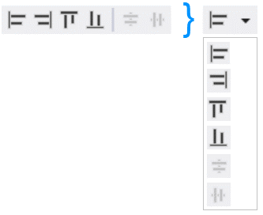

# 功能表和 Visual Studio 的命令
[!INCLUDE[vs2017banner](../../code-quality/includes/vs2017banner.md)]

## 命令使用方式  
  
### 概觀  
 與 Microsoft Office，這是一套可包含許多不同的產品，不同的是 Visual Studio 包含許多產品，每個會造成全域的 Visual Studio ide 其命令集。 IDE 會篩選功能，內容為基礎的使用者可以使用管理數千個命令的複雜性。  
  
 當使用者的內容變更\-例如從 \[設計\] 視窗切換到編輯視窗的程式碼 – 功能無關的新內容就會消失。 在此同時，新的功能介面，以及相關的動態資訊，例如屬性和 \[工具箱\] 的選項。 使用者應該不會注意到可用的命令集的交換。 如果使用者是濫用或混淆命令時，出現或消失，UI 設計需要調整。 使用者的目前內容會一律在表示一或多個方法，例如 IDE 標題列、 \[屬性\] 視窗或 \[屬性頁\] 對話方塊中。  
  
 命令列，讓 UI 中的彈性。 只有命令結構到 Visual Studio 環境會在主功能表和主要的命令列，可以同時自訂並甚至隱藏繼承的。 其他命令列會出現，而且消失了根據應用程式的狀態。 工具視窗和文件編輯器也可以包含內嵌在其視窗邊緣的工具列。  
  
#### 基本指導方針  
  
##### 使用現有的共用的命令、 命令群組和功能表可能的話。  
 因為命令通常會顯示根據內容，使用現有的共用的功能表和命令群組可確保命令結構保持相當穩定之間內容中的變更。 重複使用共用的命令，並將新的命令，接近相關的共用指令也減少 IDE 複雜度，並建立更易於使用的經驗。 如果您必須定義新的命令，嘗試將它放在現有的共用的命令群組中。 如果您必須定義新的群組，放在接近相關的命令群組現有的共用功能表建立新的最上層功能表之前。  
  
##### 請勿建立每個命令的圖示。  
 建立命令圖示之前請仔細考慮。 圖示應該只會針對命令建立的:  
  
-   出現在預設工具列。  
  
-   可能由使用者加入至工具列，以透過 **自訂...** \] 對話方塊。  
  
-   有另一個 Microsoft 產品中相同的動作相關聯的圖示。  
  
##### 限制的鍵盤快速鍵  
 大多數使用者採用極少數的所有可用的快速鍵。 有疑問，未繫結功能鍵盤快速鍵。 使用您的使用者體驗小組之前加入新的快速鍵。  
  
##### 提供命令的預設功能表位置。  
 請注意您的命令會由其他自訂，並據此將它們設計。 沒有這類的隱藏的命令。 所有 Visual Studio 命令出現在 **工具 \> 自訂** \] 對話方塊中，命令視窗中，自動完成 **工具 \> 選項 \> 鍵盤** \] 對話方塊中，與開發工具環境 \(DTE\)。 請確定您的命令名稱和指定給.ctc 檔案中的工具提示，讓使用者可以輕鬆地找到。  
  
##### 不會重複內嵌的工具列上的共用的命令。  
 最好將命令放在接近使用者的焦點區域。 方法之一是在您的工具視窗或文件頂端編輯器建立內嵌的工具列。 放在工具列上的命令應該是特定視窗內的內容區域。 不會重複這些工具列上的共用的命令。 例如，永遠不會將內嵌的工具列中的 \[儲存\] 圖示。  
  
### 內容和命令的可見性  
 命令位於下列範圍: **環境**, ，**階層**, ，和 **文件**。 若要命令位置中有信心知道每個範圍。  
  
 中的命令 **環境** 範圍建立主要內容和多個內容間共用。 這些變更的可見性或文件和工具視窗的排列方式。 在環境中的命令範圍，其中包括 **新的專案**, ，**連接到伺服器**, ，**附加處理序**, ，**剪下**, ，**複製**, ，**貼上**, ，**尋找**, ，**選項**, ，**自訂**, ，**新視窗**, ，和 **檢視說明**。  
  
 中的命令 **階層** 範圍管理包括 Visual Studio 中的階層 **專案**, ，**小組**, ，和 **資料**。 比方說，關聯到專案的子內容 – **偵錯**, ，**建置**, ，**測試**, ，**架構**, ，或 **分析**。 在階層中的命令範圍，其中包括 **加入新項目**, ，**新查詢**, ，**專案設定**, ，**加入新資料來源**, ，**啟動效能精靈**, ，和 **新圖表**。  
  
 中的命令 **文件** 內容的文件，例如程式碼、 設計或工作項目查詢 \(WIQ\) 範圍處理。 它們也會作用於工具視窗的檢視或否則專屬於該工具視窗。 文件範圍命令也處理其本身階層特有的例如檔案物件 **從專案移除**。 文件中的命令範圍，其中包括 **重構 \> 重新命名**, ，**建立工作項目的複本**, ，**全部展開**, ，**全部摺疊**, ，和 **建立使用者工作**。  
  
### 命令位置決策  
 當您決定建立命令時，您必須判斷它的適當位置，以及是否要建立鍵盤快速鍵。 遵循此決策路徑來建立放置命令的位置:  
  
   
  
 **在 Visual Studio 中的命令位置決策路徑**  
  
### 命令功能表中的位置  
  
#### 主功能表列  
 主功能表列應該是任何特定的內容功能表封裝構成 UI 的命令的標準位置。 主功能表列的不同於其他命令結構中環境會使用它來控制哪些命令會顯示。 所有其他的命令列只需要停用命令的內容，不會在放在功能表或工具列上。  
  
 環境定義一組內建在主功能表列的命令都通用的整個 IDE 和多個工作網域。 這些命令會永遠顯示無論如何都 VSPackages 會載入到環境。 雖然 VSPackages 可擴充這組命令，從每個產品以及其命令的位置來設定此命令會為每個小組的責任。  
  
 Visual Studio 主功能表結構可以區分為下列功能表類別:  
  
##### 核心功能表  
  
-   檔案  
  
-   Edit  
  
-   檢視  
  
-   工具  
  
-   視窗  
  
-   說明  
  
##### 專案特定功能表  
  
-   專案  
  
-   組建  
  
-   偵錯  
  
##### 特定的內容功能表  
  
-   小組  
  
-   資料  
  
-   測試  
  
-   架構  
  
-   分析  
  
##### 文件特有的功能表  
  
-   格式  
  
-   資料表  
  
##### 在設計主功能表時，請遵循這些規則:  
  
-   不會超過 25 個最上層的項目中指定的內容  
  
-   功能表應該永遠不會超過 600 像素的高度。  
  
-   評估主功能表中多個內容，例如 Ultimate SKU 和一般設定檔。  
  
-   可接受的延伸顯示功能表。  
  
-   延伸顯示功能表應該包含至少三個項目和不超過七個。  
  
-   延伸顯示功能表應該只有一個層級深度 – 有些 Visual Studio 的功能表項目具有階層式的子功能表，但不是建議這種模式。  
  
-   使用不超過六個分隔符號字元。 群組應該遵守下圖:  
  
       
  
-   雖然不需要在圖中的每個群組，將其他群組加入會受到限制。  
  
-   每個群組應該擁有來自兩個至七個功能表項目。  
  
#### 主功能表中的順序  
 在之前加入新的最上層項目，請考慮將命令放入現有的最上層功能表。 時加入新的最上層功能表，請務必將它放在正確位置。 決定是否特別針對專案、 內容或文件\] 功能表。 保持簡潔的最上層功能表的名稱，並使用只有一個字。  
  
 核心功能表應該書夾其餘的命令。 檔案、 編輯和檢視應該永遠是向左及工具\] 視窗中，並說明應該永遠是右邊。  
  
#### 內容功能表  
 放置太多的快顯功能表中的功能會導致不容易學習的介面。 所有重大的功能應該可以透過主功能表列。 命令的位置應該與現有的命令，以避免重複命令相結合。 快顯功能表，殼層定義應該根據方案、 專案節點，或專案項目內容功能表是否納入標準功能表群組。  
  
 設計時的內容功能表，遵循相同的規則與主功能表中，除了:  
  
-   不會超過 25 個最上層功能表項目。  
  
-   延伸顯示功能表，是可接受，但必須不超過兩層 – 永遠不會使用階層式的延伸顯示。  
  
-   使用不超過六個分隔符號字元。  
  
### 在工具列中的命令位置  
  
#### 一般工具列  
 在設計和排列工具列，請遵循這些標準:  
  
-   請勿使用一個以上的動詞命令，每個按鈕。 一個按鈕 \= 一個動作。  
  
-   它必須加強的標籤時，才使用圖示旁的文字。  
  
-   專用的屬性，將會切換工作階段中多次使用下拉式方塊。 否則，公開其他位置的屬性。  
  
-   下拉式方塊的寬度應該等於最長的項目內的方塊 \+ 30%的寬度。 比方說，如果 200 像素的最長的項目，則下拉式方塊應該 260 個像素寬。  
  
-   限制使用分隔符號。 旁邊的下拉式清單中的分隔符號使用是反向的模式，因為本身下拉式清單中的圖形做為視覺分隔符號。  
  
-   圖示群組應該包含至少三到六個圖示。  
  
-   如果限定詞產生多個有用的命令，使用 \[分割\] 按鈕儲存最後的設定:  
  
       
  
     **分割按鈕的範例。 在左側的六個命令而可以納入單一按鈕。**  
  
#### 針對特定產品的工具列  
 每項產品可以提供包含常用的預設工具列和重要命令，以及每個產品的預設工具列應該會出現在已安裝產品啟動 Visual Studio 的第一次。  
  
 共用的命令群組和功能表提供 ide，也應該利用產品。 每個共用的命令群組會放在共用的功能表是要讓使用者有意義的方式組織相關的命令。 請務必利用此共用的命令結構以降低複雜度。  
  
#### 通用工具列  
 需要容納一個資料列右現成的全域工具列。 在建立新的全域工具列時，遵循該工具列的類型。  
  
 **一般工具列指導方針:**  
  
-   每個工具列通用控制項 \(移駐夾，溢位\) 中有 24 個像素。  
  
-   每個工具列按鈕是 22 個像素寬包括填補。 建立分割按鈕的圖示新增另一個 11 個像素的寬度。  
  
-   允許重複的工具列上的命令。  
  
 **特定文件的工具列** 作用中的特定檔案類型時，會出現，而且不同的檔案類型會變成作用中時會消失。  
  
-   文件特定的工具列不能有超過 12 個按鈕。  
  
-   在工具列的總寬度不能超過 300 像素。  
  
-   每個檔案類型可以有多個內嵌的工具列或一個特定文件的全域工具列上，但非兩者。  
  
 **特定內容的工具列** 顯示特定內容是設定以及傾向於長時間保持使用中。  
  
-   所有的特定內容的工具列按鈕限制為 18。  
  
-   如果使用內容時，大部分使用者不會一致地採用這個工具列命令，將不產生關聯此工具列與內容。  
  
-   請確定工具列在結束內容時就會消失。 無這些工具列應該會出現在啟動。  
  
 **無內容工具列** 永遠不會自動出現。 這些顯示只有當使用者啟動它們。 保持低於 200 像素的最大寬度。  
  
### 一般的組織和介面定義的群組  
 使用現有的共用的命令、 命令群組和功能表。 如果您必須定義新的命令，嘗試將它放在現有的共用的命令群組中。 如果必須定義新的群組，請將它放在接近相關的命令群組現有的共用\] 功能表中，建立新的最上層功能表之前。 這可降低命令複雜度，同時確保一致的命令放置在 IDE 中。  
  
 共用 **格式** 下圖說明\] 功能表上，通常會顯示設計工具樣式的文件視窗的內容:  
  
   
  
 **Visual Studio 中的功能表群組**  
  
### 減少與重複使用的命令  
 命令是通常顯示根據內容，以便減少使用者會看到在任何指定時間的命令數目。 不過，也要重複使用現有的共用的功能表和命令群組，以確保命令結構保持相當穩定之間內容中的變更。  
  
 重複使用共用的命令，並將放置新命令相關的共用指令接近減少 IDE 複雜度，並建立更易於使用的經驗。  
  
## 命名的命令  
  
### 命名規範  
 一致的命令命名至關重要，讓使用者可以尋找並執行命令，藉由使用命令列或繫結至鍵盤快速鍵。 命令名稱也會協助使用者了解哪些命令做時它會顯示在工具列上，或在階層式或內容功能表中的用途。  
  
#### 當命名的命令:  
  
-   建構文字很方便進行當地語系化。 如需詳細資訊當地語系化文字，請參閱 [Visual Studio 的全球完備](http://msdn.microsoft.com/zh-tw/1cc35051-8126-441f-bea9-059245a47b1d)。  
  
-   很簡潔。 命令應該會使用不超過三個單字。  
  
-   使用字首大寫的大小寫: 每個單字的第一個字母都必須大寫。 如需在 Visual Studio 中格式化文字的詳細資訊，請參閱 [Text style](../../extensibility/ux-guidelines/fonts-and-formatting-for-visual-studio.md#BKMK_TextStyle)。  
  
-   請考量命令放置的位置。 它是否在最上層的功能表或延伸顯示? 例如，當群組設定延伸顯示，最上層命令中的對齊命令應該是 「 對齊 」 和延伸顯示命令應該是 「 左 」 「 右 」、 「 中心 」，「 對齊 」，等等。 它將會是多餘命名的延伸顯示命令 「 靠左對齊 」 或 「 對齊權限 」。  
  
       
  
### 使用命令的圖示  
 謹慎地圖示配對命令的使用中。 雖然將唯一的映像與命令相關聯，則識別該命令的使用者的能力，視覺干擾和效率會出現影像過度使用。 當您決定是否要建立命令圖示時，幫助下列規則。  
  
#### 使用命令才圖示:  
  
-   在同一個命令有與其相關聯的其他顯著 Microsoft 產品，例如 Microsoft Office 應用程式的其中一個圖示。  
  
-   此命令將置於預設工具列。  
  
-   命令是特殊命令，使用者可能會加入至工具列，使用 **\[自訂\]** \] 對話方塊。  
  
## 便捷鍵和快速鍵  
  
### 概觀  
 有兩種類型的鍵盤按鍵:  
  
-   **存取金鑰** \(也稱為加速器\) 允許在對話方塊 UI 中使用鍵盤存取透過功能表命令以及每個標籤。 便捷鍵大部分是供協助工具、 指派給所有的功能表和大部分對話方塊控制項，不應被背，影響只有目前的視窗，而且會當地語系化。  
  
-   **快速鍵** 大部分是使用控制項 \(Ctrl\) 和功能 \(Fn\) 索引鍵的順序。 它們都具有設計更進階的使用者，並且有助於提升產能。 它們只能指派給最常使用的命令，並允許快速存取，同時略過主功能表。 快捷鍵用於背，，因此必須指派與設定檔結構描述一致。 快速鍵金鑰配置可能會不同的設定檔。 使用者可以自訂快捷鍵透過 **工具 \> 選項 \> 鍵盤**。  
  
### 指定便捷鍵  
 便捷鍵 Alt 加上英數字元的索引鍵所組成。 將便捷鍵指派給每個功能表項目，而沒有例外狀況。 請遵循 Windows 和指定便捷鍵的常見慣例。 比方說的便捷鍵 **檔案 \> 新增** 應該永遠是 **Alt，F，N**。  
  
 請勿使用單一像素寬度 \(以大寫或小寫\)，' i' 或 'l'，小寫字母，並且避免使用高度 \(g、 j、 p、 q 和 y\) 的字元，因為這些是難以區別。  
  
 請避免使用可能重複的索引鍵。 避免重複的情況下，功能表系統會處理衝突以輪流使用金鑰的所有命令。 例如，假設 「 號碼 」 命令複製 「 N 」 的存取金鑰，\[檔案\] 功能表底下的 **Alt，F，N** 會建立新的檔案，和 **Alt、 F、 N、 N** 會執行 「 數字 」 命令。  
  
### 指派快速鍵  
 請避免將新的快速鍵，因為它們不需要為每個命令中，如果過度使用而使稅系統 \(和使用者記憶體\)。 資料從客戶經驗改進計畫 \(CEIP\) 會指出 Visual Studio 使用者使用一小部分的整合式的捷徑。  
  
 在定義的捷徑，請遵循下列規則:  
  
-   **使用控制項 \(Ctrl\) 和功能 \(Fn\) 的按鍵組合。**  
  
-   **保留經常使用的快速鍵。**維護最受歡迎的快速鍵。  
  
-   **讓您輕鬆地輸入編輯器快速鍵。**將簡單類型捷徑繫結至開發人員必須撰寫程式碼時的大部分的命令。 例如， **Edit.InvokeSmartTag** 必須要有快速捷徑金鑰，例如 Ctrl \+ 並沒有 Alt \+ Shift \+ F10。  
  
-   **盡可能一致地佈景主題的快速鍵。**  
  
-   **遵循 Windows 指導方針來判斷哪些修飾詞的按鍵來使用。**使用 Ctrl 組合之命令的大規模的效果，例如，套用至整份文件的命令。 擴充或補充的標準捷徑按鍵動作的命令，請使用 Shift 鍵組合。 請勿使用 Ctrl \+ Alt 組合。  
  
-   **移除多餘的捷徑。**如果您有舊版的功能，請考慮移除便捷鍵可快速存取相同的命令時，與極端 infrequency \(少於 10 次從 CEIP 資料\) 或中度 infrequency \(少於 100 次 CEIP 資料從\) 所使用的快速鍵。 例如: Alt、 H、 C 會開啟說明\/內容。  
  
 不是簡單的方式來檢查快顯的可用性。 如果您想要新增的捷徑，請依照下列步驟執行:  
  
1.  檢查清單 [Visual Studio 2013 捷徑](http://visualstudioshortcuts.com/2013/) 來判斷是否有類似的命令，將您使用。  
  
2.  移至 **工具 \> 選項 \> 環境 \> 鍵盤** 和測試您的捷徑。 檢查每個鍵盤對應配置底下列出 「 將套用下列其他鍵盤對應配置 」。 檢查一般、 C\#、 VB 和 c \+ \+ 設定檔，因為這些共用唯一的快速鍵。 如果它不對應任何這些位置中使用您的捷徑。