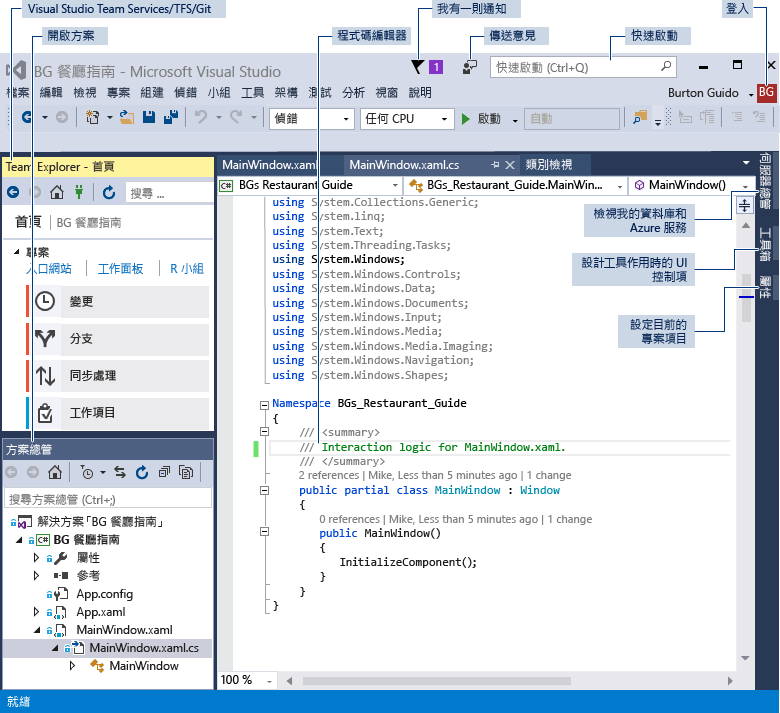
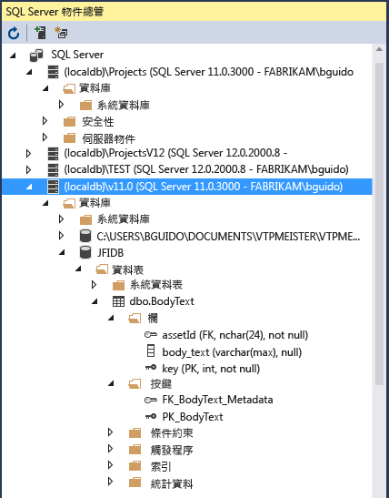

# Visual Studio IDE 功能導覽
本主題將為您介紹 Visual Studio IDE 的功能。 Visual Studio IDE 是一個互動式開發環境 (IDE)；這是一個有創意的啟動控制板，可供您用來檢視和編輯幾乎任何類型的程式碼，然後偵錯、建置及發佈適用於 Android、iOS、Windows、Web 和雲端的應用程式。 針對 Mac 和 Windows 都有適用的版本。 我們將逐步解說您可以運用 Visual Studio 來進行的一些操作及如何安裝和使用它、逐步引導您建立簡單的專案、取得進行程式碼偵錯和部署時的指標，以及介紹各種工具視窗。

## 您可以運用 Visual Studio IDE 來做什麼？
您是否想要建立適用於 Android 手機的應用程式？ 您可以辦得到。 使用 C++ 來建立最頂尖的遊戲，如何？ 您也可以辦得到，而且還能做得更多。 Visual Studio 可提供範本來協助您建立網站、遊戲、傳統型應用程式、行動應用程式、適用於 Office 的應用程式等等。

或者，您可以直接開啟從幾乎任何來源取得的幾乎任何程式碼並開始工作。 在 GitHub 上看到您喜歡的專案嗎？ 只要直接複製該儲存機制、在 Visual Studio 中開啟它，然後開始撰寫程式碼即可！

### 建立行動應用程式
您可以使用 Visual C# 和 Xamarin 或 Visual C++ 為不同的平台建立原生行動應用程式，或是使用 JavaScript 搭配 Apache Cordova 來建立混合式應用程式。 您可以為 Unity、Unreal、DirectX、Cocos 等撰寫行動裝置遊戲。 Visual Studio 包含一個 Android 模擬器，可協助您執行 Android 應用程式及針對這些應用程式進行偵錯。

您可以藉由建立 Azure 應用程式服務，將雲端的強大功能運用在您的行動應用程式上。 Azure 應用程式服務可讓您的應用程式將資料儲存在雲端、安全地驗證使用者，以及自動相應增加或減少其資源以配合您應用程式和業務的需求。 若要深入了解，請參閱[行動應用程式開發](https://www.visualstudio.com/vs/mobile-app-development/)。

### 建立適用於 Azure 的雲端應用程式
Visual Studio 提供一套工具，可讓您輕鬆建立由 Microsoft Azure 提供技術之支援雲端的應用程式。 您可以直接從 IDE，在 Microsoft Azure 上設定、建置、偵錯、封裝及部署應用程式和服務。 請使用「已連接服務」來將 Azure 服務運用在您的應用程式上。 若要取得「適用於 .NET 的 Azure 工具」，請在安裝 Visual Studio 時，選取 [Azure 開發] 工作負載。 如需詳細資訊，請參閱 [Visual Studio Tools for Azure](https://www.visualstudio.com/vs/azure-tools/)。

### 建立適用於 Web 的應用程式
Web 推動我們的現代化世界，而 Visual Studio 則可協助您撰寫適用於 Web 的應用程式。 您可以使用 ASP.NET、Node.js、Python、JavaScript 及 TypeScript 來建立 Web 應用程式。 Visual Studio 了解 Angular、jQuery、Express 等 Web 架構。 ASP.NET Core 和 .NET Core 可在 Windows、Mac 及 Linux 作業系統上執行。 如需詳細資訊，請參閱[新式 Web 工具](https://www.visualstudio.com/vs/modern-web-tooling/)。

### 在世界級的編輯環境中撰寫程式碼
Visual Studio 可透過語法色彩標示、陳述式完成、IntelliSense (所選程式碼元素的快顯描述)、程式碼大綱、設定偵錯中斷點等功能，協助您快速且輕鬆地撰寫程式碼。

若要深入了解，請參閱[在程式碼和文字編輯器中撰寫程式碼](https://docs.microsoft.com/visualstudio/ide/writing-code-in-the-code-and-text-editor)。

Visual Studio 還可協助您進行更多的工作。 如需更完整的清單，請參閱 [Visual Studio IDE](https://www.visualstudio.com/vs/)。

## 安裝 Visual Studio IDE
若要開始，請下載 Visual Studio 並將它安裝在您的系統上。 您可以從 [Visual Studio 2017](https://www.visualstudio.com/vs/visual-studio-2017/) 下載它。

Visual Studio 現在比以往更輕巧！ 新模組安裝程式可讓您選擇並安裝「工作負載」，這些通常是您慣用的程式設計語言或平台所需的幾組功能。 此策略有助於將 Visual Studio 安裝項的資源使用量降到比以往低，這意謂著它的安裝和更新速度也更快。

除了提升安裝效能之外，Visual Studio 2017 中也做了許多改進來改善整體 IDE 啟動和解決方案載入時間。 例如，選取新的 [輕量型解決方案載入] 功能 (位於主功能表的 [工具] > [選項] > [專案和方案] 底下) 可讓較大型的方案更快載入。 若要深入了解如何在您的系統上設定 Visual Studio，請參閱 [Install Visual Studio 2017](https://docs.microsoft.com/visualstudio/install/install-visual-studio)。

## 登入
當您第一次啟動 Visual Studio 時，可以視需要使用您的 Microsoft 帳戶或是工作或學校帳戶來登入。 登入可讓您跨多個裝置同步 Visual Studio 設定，例如視窗配置。 此外，還可自動將您連接到您可能需要的服務，例如 Azure 訂用帳戶和 Visual Studio Team Services。

## 建立程式

有一個了解東西的好方法，就是去使用它！ 讓我們來深入探討並建立一個新的簡單程式。

1. 開啟 Visual Studio。 在功能表上，依序選擇 [檔案]、[新增]、[專案]。 (使用預設的專案值)。

  

  或者，您可以使用起始頁來建立新的專案。 如需詳細資訊，請參閱 [Harness the Power of the Redesigned Start Page](https://blogs.msdn.microsoft.com/visualstudio/2016/11/29/harness-the-power-of-the-redesigned-start-page/) (利用重新設計之起始頁的強大功能) (部落格)。

1. [新增專案] 對話方塊會顯示數個專案範本。 請依序選擇 [Visual C#] 底下的 [Windows 通用] 分類、[空白應用程式 (通用 Windows)] 範本，然後選擇 [確定] 按鈕。

  

  這會使用 Visual C# 和 XAML 作為程式設計語言，來建立新的空白通用 Windows 應用程式專案。 請在 Visual Studio 為您設定專案時稍候一下。 如果提示您輸入任何資訊，目前請先接受預設值。

1. 不久之後，您應該就會看到類似以下的螢幕擷取畫面。 您的專案檔會列在右邊一個名為 [方案總管] 的視窗中。

  

1. 在 [方案總管] 中，選擇 MainPage.xaml 檔案旁邊的黑色小三角形來展開它，然後您應該會看到底下有一個 MainPage.xaml.cs 檔案。 請選擇此檔案 (當中包含 C# 程式碼) 來開啟它。

  MainPage.xaml.cs 中的 C# 程式碼會顯示在畫面左邊的程式碼編輯器中。 請注意，程式碼語法會自動標示色彩來表示不同類型的程式碼，例如陳述式或註解。 此外，程式碼中的垂直小虛線會指出那些大括號彼此成對，而行號則可協助您稍後找出程式碼。 您可以選擇帶方框的小負號來摺疊或展開程式碼。 此程式碼大綱功能可讓您隱藏您不需要的程式碼，有助於讓畫面變得較為簡潔。

  

  還有其他可用的功能表和工具視窗，但讓我們目前先繼續進行操作。

1. 為 XAML 表單新增一個按鈕，來為使用者提供一個與您應用程式互動的方式。 若要這麼做，請開啟 MainPage.xaml 檔案。 這會顯示一個分割檢視：上面是設計工具，可讓您以視覺方式放置控制項，下面是程式碼檢視，會顯示設計工具背後的 XAML 程式碼。 當您稍後執行程式時，您在設計工具中所看到的內容會變成使用者將會看到的視窗 (一個「表單」)，而基礎 XAML 會決定表單上顯示的內容。

1. 在畫面的左邊，選擇 [工具箱] 索引標籤來開啟 [工具箱]。 [工具箱] 包含一些您可以新增到表單中的視覺控制項。 目前，我們將只新增一個按鈕控制項。

1. 展開 [通用 XAML 控制項] 區段，然後將 [按鈕] 控制項拖曳到表單的大致中間位置。 (確切的位置並無關緊要)。

  

  當您完成時，應該會看到類似以下的畫面。

  

  該按鈕在設計工具上，而其基礎程式碼 (已醒目提示) 則會自動新增到設計工具的 XAML 程式碼中。

1. 讓我們來變更部分 XAML 程式碼。 請將按鈕程式碼中的文字從 `Button` 重新命名為 `Hello!`。

  

1. 現在，啟動應用程式。 您可以透過選擇工具列上的 [開始] (![[開始] 按鈕](~/docs/ide/media/VSIDE_StartButton.png)) 按鈕，或是選擇 F5 鍵或在功能表上選擇 [偵錯] > [開始偵錯]，來執行這項操作。

  

  應用程式會開始其建置程序，而狀態訊息則會顯示在 [輸出] 視窗中。 不久之後，您應該就會看到包含您按鈕的表單出現。 您現在已有一個執行中的應用程式！

  

  當然，它目前還執行不了太多工作，但您稍後可以視需要為它新增更多功能。

1. 當您執行完程式時，請選擇工具列上的 [停止] (![[停止] 按鈕](~/docs/ide/media/VSIDE_StopButton.png)) 按鈕來停止它。

讓我們來摘要重述一下您到目前為止已完成的部分：您已在 Visual Studio 中建立新的 C# Windows 通用專案、檢視其程式碼、將控制項新增到設計工具中、變更部分 XAML 程式碼，然後執行該專案。 雖然此範例的程序已簡化，但仍展示了 Visual Studio IDE 的一些常用組件，這些是您在開發自己的應用程式時將使用的組件。 如果您想要此範例的進一步詳細資料，請參閱[建立 "Hello, world" 應用程式 (XAML)](https://docs.microsoft.com/windows/uwp/get-started/create-a-hello-world-app-xaml-universal)。

## 偵錯、測試及改善您的程式碼
沒有任何程式碼會始終以完美狀態執行。 當您撰寫程式碼時，必須執行它並測試它，以找出錯誤 (bug) 及改善效能。 Visual Studio 的先進偵錯系統可讓您針對在本機專案、遠端裝置或模擬器 (例如 Android 或 Windows Phone 裝置的模擬器) 上執行的程式碼進行偵錯。 您可以一次一個逐步執行程式碼陳述式，並隨時檢查變數，也可以逐步執行多執行緒應用程式，您也可以設定當指定的條件為真時才會叫用的中斷點。 您可以在程式碼執行時，監視變數的值等等。 這些全部都可以在程式碼編輯器本身中管理，如此您就不需要離開您的程式碼。

在測試方面，Visual Studio 提供單元測試、IntelliTest、負載和效能測試等。 若要取得有關 Visual Studio 偵錯程序的更多詳細資料，請參閱[偵錯工具功能導覽](../debugger/debugger-feature-tour.md)。 若要深入了解測試，請參閱[測試工具](https://www.visualstudio.com/vs/testing-tools/)。 若要深入了解如何改善您應用程式的效能，請參閱[分析功能導覽](../profiling/profiling-feature-tour.md)。

## 部署已完成的應用程式  
當您的應用程式已準備就緒而可部署到使用者或客戶時，Visual Studio 會提供工具來執行部署，不論您是要部署到 Windows 市集、SharePoint 網站，還是透過 InstallShield 或 Windows Installer 技術來部署，都可以。 全部都可透過 IDE 來存取。 如需詳細資訊，請參閱[部署應用程式、服務和元件](../deployment/deploying-applications-services-and-components.md)。

## IDE 快速導覽
為了提供您一個概要的 Visual Studio 視覺總覽，下圖顯示已開啟一個專案及數個您最可能使用之重要工具視窗的 Visual Studio。
 - [方案總管](../ide/solutions-and-projects-in-visual-studio.md)可讓您檢視、瀏覽及管理您的程式碼檔案。
 - [編輯器](../ide/writing-code-in-the-code-and-text-editor.md)視窗會顯示程式碼，並可讓您編輯原始程式碼和設計工具資料。
 - [輸出](../ide/reference/output-window.md)視窗會顯示來自編譯、執行、偵錯等作業的輸出訊息。
 - [Team Explorer](https://www.visualstudio.com/docs/connect/work-team-explorer) 可讓您追蹤工作項目，並使用版本控制技術 (例如 [Git](https://git-scm.com/) 和 [Team Foundation 版本控制 (TFVC)](https://www.visualstudio.com/docs/tfvc/overview)) 與其他人共用程式碼。
 - [Cloud Explorer](https://azure.microsoft.com/documentation/articles/vs-azure-tools-resources-managing-with-cloud-explorer/) 可讓您檢視和管理 Azure 資源，例如虛擬機器、資料表、SQL 資料庫等。

  

以下是 Visual Studio 中一些其他常見的生產力功能。  

- [快速啟動](https://docs.microsoft.com/en-us/visualstudio/ide/reference/quick-launch-environment-options-dialog-box)搜尋方塊是一個可讓您在 Visual Studio 中快速找到所需項目的絕佳方式。 只要開始輸入您要尋找的任何項目的名稱，Visual Studio 就會提供選項來將您引導至您確實想要去的地方。 [快速啟動] 也會顯示連結，這些連結可啟動任何「工作負載」或「個別元件」的「Visual Studio 安裝程式」。

  ![[快速啟動] 搜尋方塊](~/docs/ide/media/VSIDE_Tour_QuickLaunch.png)

-  [重構](../ide/refactoring-in-visual-studio.md)包含一些作業，例如智慧型的變數重新命名、將選取的多行程式碼移動到個別函式、將程式碼移到其他位置、重新排序函式參數等等。

   

-  **IntelliSense** 為一種涵蓋一組常用功能的概括性詞彙，會直接在編輯器中顯示有關您程式碼的類型資訊，而在某些情況下會為您撰寫一些程式碼。 就像內嵌在編輯器中的基本文件，讓您無需在個別的 [說明] 視窗中查閱類型資訊。 IntelliSense 功能會因語言而異。 如需詳細資訊，請參閱 [Visual C# IntelliSense](../ide/visual-csharp-intellisense.md)、[Visual C++ Intellisense](../ide/visual-cpp-intellisense.md)、[JavaScript IntelliSense](../ide/javascript-intellisense.md)、[Visual Basic 特定的 IntelliSense](../ide/visual-basic-specific-intellisense.md)。 下圖顯示一些可用的 IntelliSense 功能：  

    

-  「波浪線」是紅色的波浪底線，可在您輸入程式碼時，針對錯誤或潛在的問題即時提出警示。 這可讓您立即修正它們，而不需等到編譯或執行階段才發現錯誤。 如果您將滑鼠停留在波浪線，則您會看到有關此錯誤的其他資訊。 左邊界也可能會出現燈泡與修正錯誤的建議。 如需詳細資訊，請參閱[執行燈泡提示的快速動作](../ide/perform-quick-actions-with-light-bulbs.md)。  

   

-  您可以在文字編輯器操作功能表上開啟[呼叫階層](../ide/reference/call-hierarchy.md)視窗，以顯示呼叫插入點 (caret) 底下方法及被該方法呼叫的方法。

 

-  [CodeLens](../ide/find-code-changes-and-other-history-with-codelens.md) 可讓您尋找程式碼、已連結的 Bug、工作項目、程式碼檢閱和單元測試的參考和變更，而不需離開編輯器。

 

-  [查看定義]  視窗會顯示方法或類型的定義內嵌，而不用離開您目前的內容。  

 

-  [移至定義]  內容功能表選項會讓您直接進入定義函式或物件的位置。 以滑鼠右鍵在編輯器中按一下，還有其他巡覽命令可供使用。

 

- [物件瀏覽器](http://msdn.microsoft.com/f89acfc5-1152-413d-9f56-3dc16e3f0470)這個相關工具可讓您檢查系統上的 .NET 或「Windows 執行階段」組件，以查看它們所包含的型別，以及這些型別所包含的成員 (屬性、方法、事件)。

  ![顯示 System.Timer 的 [物件瀏覽器]](../ide/media/objectbrowser.png)  

## 管理您的原始程式碼並與其他人共同作業
您可以在任何提供者所裝載的 Git 儲存機制 (包括 GitHub) 中管理您的原始程式碼。 或是使用 [Visual Studio Team Services (VSTS)](https://www.visualstudio.com/team-services/) 來一邊管理整個專案的程式碼，一邊管理錯誤 (bug) 與工作項目。 若要深入了解如何在 Visual Studio 中使用 Team Explorer 來管理 Git 存放庫，請參閱 [Get Started with Git and Team Services](https://www.visualstudio.com/en-us/docs/git/gitquickstart-vs2017) (開始使用 Git 和 Team Services)。  Visual Studio 也有其他內建原始檔控制功能。 如需詳細資訊，請參閱 [New Git Features in Visual Studio 2017](https://blogs.msdn.microsoft.com/visualstudioalm/2017/03/06/new-git-features-in-visual-studio-2017/) (Visual Studio 2017 的新 Git 功能) (部落格)。

Visual Studio Team Services 是一項雲端式服務，可用來裝載軟體專案及允許以小組進行共同作業。 VSTS 支援 Git 和 Team Foundation 原始檔控制系統，以及 Scrum、CMMI 和 Agile 開發方法。 Team Foundation 版本控制 (TFVC) 使用單一且集中式伺服器儲存機制來追蹤和版本化檔案。 在其他開發人員取得最新變更的地方，一律將本機變更簽入中央伺服器。

Team Foundation Server (TFS) 是 Visual Studio 的應用程式生命週期管理中樞。 其可讓所有人使用單一方案參與開發流程。 TFS 也適合用來管理異質小組和專案

如果您在網路上有 Visual Studio Team Services 帳戶或 Team Foundation Server，您便可以透過 Visual Studio 中的 [Team Explorer] 視窗與其連接。 在這個視窗中，您可以在原始檔控制簽入或簽出程式碼、管理工作項目、啟動建置和存取小組聊天室及工作區。 您可以從 [快速啟動] 方塊開啟 [Team Explorer]，也可以從主功能表的 [檢視] > [Team Explorer] 或從 [小組] > [管理連接] 來開啟它。
下圖顯示裝載於 VSTS 中之方案的 Team Explorer 視窗。

  

如需有關 Visual Studio Team Services 的詳細資訊，請參閱 [Visual Studio Team Services](https://www.visualstudio.com/team-services/)。 如需 Team Foundation Server 的詳細資訊，請參閱 [Team Foundation Server](https://www.visualstudio.com/products/tfs-overview-vs)。

## 連接至服務、資料庫及雲端式資源
雲端對現今的線上世界至關重要，而 Visual Studio 則提供您運用雲端的方法。 例如，「已連接服務」功能可讓您將應用程式連接至服務。 此外，您的應用程式還可以使用它來將其資料儲存在 Azure 儲存體上。

選擇 [已連接服務] 頁面上的服務會啟動「已連接服務精靈」，此精靈會設定您的專案並下載必要的 NuGet 套件，以協助您開始編寫服務的程式碼。

您可以在 Visual Studio 內使用 [Cloud Explorer](https://azure.microsoft.com/documentation/articles/vs-azure-tools-resources-managing-with-cloud-explorer/) 來檢視和管理 Azure 型雲端資源。 Cloud Explorer 會顯示在您所登入 Azure 訂用帳戶下管理之所有帳戶中的 Azure 資源。 您可以在 Visual Studio 安裝程式中選取 Azure 開發工作負載，來取得 Cloud Explorer。

[伺服器總管] 可協助您瀏覽和管理 Azure、Salesforce.com、Office 365 及網站上的 SQL Server 執行個體和資產。 若要開啟 [伺服器總管]，請在主功能表上，選擇 [檢視] > [伺服器總管]。 如需有關使用 [伺服器總管] 的詳細資訊，請參閱[新增連線 (英文)](https://docs.microsoft.com/visualstudio/data-tools/add-new-connections)。

[SQL Server Data Tools (SSDT)](https://docs.microsoft.com/sql/ssdt/download-sql-server-data-tools-ssdt) 是一個適用於 SQL Server、Azure SQL Database 及「Azure SQL 資料倉儲」的強大開發環境。 它可讓您建置、偵錯、維護及重構資料庫。 您可以使用資料庫專案，或直接使用內部或外部所連接的資料庫執行個體。

Visual Studio 中的 [SQL Server 物件總管] 提供與 SQL Server Management Studio 類似的資料庫物件檢視。 [SQL Server 物件總管] 可讓您執行輕型的資料庫管理和設計工作，包括編輯資料表資料、比較結構描述、直接從 [SQL Server 物件總管] 使用內容功能表來執行查詢等。 如需詳細資訊，請參閱[使用物件總管來管理物件 (英文)](https://docs.microsoft.com/sql/ssms/object/manage-objects-by-using-object-explorer)。

  

## 擴充 Visual Studio
如果 Visual Studio 沒有您所需的確切功能，您可以新增功能！ 您可以根據您的工作負載和風格將 IDE 個人化、針對尚未與 Visual Studio 整合的外部工具新增支援，以及修改現有的功能以提升您的生產力。 Visual Studio 提供來自 Microsoft、我們的合作夥伴及社群的工具、控制項和範本。 若要深入了解如何擴充 Visual Studio，請參閱[擴充 Visual Studio IDE](https://www.visualstudio.com/vs/extend/)。

## 深入了解並找出新功能
如果您從來沒有使用過 Visual Studio，請從 [Visual Studio 使用者入門](../ide/get-started-with-visual-studio.md)或查看 [Microsoft Virtual Academy](https://mva.microsoft.com/product-training/visual-studio-courses#!index=2&lang=1033) 上所提供的免費 Visual Studio 課程，來開始了解基本概念。
如果您想要查看 Visual Studio 2017 的新功能，請參閱 [Visual Studio 2017 的新功能](../ide/whats-new-in-visual-studio.md)。

恭喜您完成 Visual Studio IDE 的導覽！ 希望您已了解有關其部分主要功能一些實用資訊。

## 請參閱
* [Visual Studio IDE](https://www.visualstudio.com/vs/)
* [Visual Studio 下載](https://www.visualstudio.com/downloads/)
* [Visual Studio 部落格 (英文)](https://blogs.msdn.microsoft.com/visualstudio/)
* [Visual Studio 論壇](https://social.msdn.microsoft.com/Forums/vstudio/en-US/home?category=visualstudio%2Cvsarch%2Cvsdbg%2Cvstest%2Cvstfs%2Cvsdata%2Cvsappdev%2Cvisualbasic%2Cvisualcsharp%2Cvisualc)
* [Microsoft Virtual Academy](https://mva.microsoft.com/)
* [Channel 9](https://channel9.msdn.com/)

