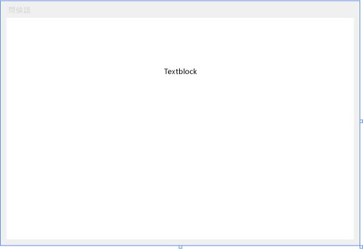
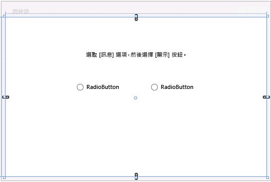

# <a name="walkthrough-create-a-simple-application-with-c-or-visual-basic"></a>逐步解說：使用 C# 或 Visual Basic 建立簡單的應用程式
藉由完成這個逐步解說，讓自己更熟悉許多可在使用 Visual Studio 開發應用程式時運用的工具、對話方塊和設計工具。 當您了解整合式開發環境 (IDE) 的運作時，您將會建立簡單的 "Hello, World" 應用程式、設計 UI、新增程式碼，以及進行偵錯。
  
##  <a name="BKMK_ConfigureIDE"></a> 設定 IDE  
當您第一次啟動 Visual Studio 時，系統會提示您登入。 在此逐步解說中為選擇性步驟。 接下來您可能會看到對話方塊，要求您選擇開發設定和色彩佈景主題。 保留預設值，然後選擇 [啟動 Visual Studio]。  

![選擇 [設定] 對話方塊](../ide/media/exploreide-settings.png "exploreide-settings")
  
Visual Studio 啟動後，您會看到工具視窗、功能表和工具列，以及主視窗空間。 工具視窗會停駐在應用程式視窗的左右端，同時 [ **快速啟動**]、功能表列和標準工具列則位於視窗的上方。 位於應用程式視窗中央的是 [ **起始頁**]。 當您載入方案或專案時，編輯器和設計工具會出現在 [起始頁]  所在的空間中。 在開發應用程式時，您大部分時間都會在此中央區域工作。  
  
  
  
##  <a name="BKMK_CreateApp"></a> 建立簡單的應用程式  
  
### <a name="create-the-project"></a>建立專案  
當您在 Visual Studio 中建立應用程式時，您需要先建立一個專案和一個方案。 在這個範例中，您將建立 Windows Presentation Foundation (WPF) 專案。  
  
#### <a name="to-create-the-wpf-project"></a>若要建立 WPF 專案  
  
1.  建立新的專案。 在功能表列上，依序選擇 [檔案]、[新增] 和 [專案...]。  
  
     ![在功能表列上，依序選擇 [檔案]、[新增] 和 [專案]](../ide/media/exploreide-filenewproject.png "ExploreIDE-FileNewProject")  
  
2.  例如，在左窗格選擇 [已安裝]、[Visual C#]、[Windows 傳統桌面]，然後在中央窗格選擇 [WPF 應用程式 (.NET Framework)]，即可選擇 Visual Basic 或 Visual C# WPF 應用程式範本。  在 [新增專案] 對話方塊下方，將專案命名為 HelloWPFApp。  
  
       
  
Visual Studio 會建立 HelloWPFApp 專案和方案，而且**方案總管**會顯示各種不同檔案。 WPF Designer 會在分割檢視中顯示 MainWindow.xaml 的設計檢視和 XAML 檢視。 您可以滑動分隔器來增加或減少顯示任一檢視。  您可以選擇只查看視覺檢視，或只查看 XAML 檢視。 (如需詳細資訊，請參閱[適用於 Windows Form 開發人員的 WPF 設計工具](http://msdn.microsoft.com/47ad0909-e89b-4996-b4ac-874d929f94ca))。下列項目會在 **方案總管**中出現：  
  
  
  
建立專案之後，您可以進行自訂。 使用 [屬性]  視窗 (在 [檢視]  功能表上)，就可以顯示和變更應用程式中的專案項目、控制項及其他項目的選項。  
  
#### <a name="to-change-the-name-of-mainwindowxaml"></a>變更 MainWindow.xaml 的名稱  
讓我們給 MainWindow 一個更具體的名稱。  

1. 在 [ **方案總管**] 中，選取 MainWindow.xaml。 您應該會看到 [屬性] 視窗；如果沒有，請選擇 [檢視] 功能表和 [屬性視窗] 項目。  
2. 將 [ **檔案名稱** ] 屬性變更為 `Greetings.xaml`。  
  
     ![已反白顯示檔案名稱的 [屬性] 視窗](../ide/media/exploreide-filenameinpropertieswindow.png "ExploreIDE-FilenameinPropertiesWindow")  
  
     **方案總管**現在顯示的檔案名稱是 Greetings.xaml，而巢狀程式碼檔案的名稱現在是 Greetings.xaml.vb 或 Greetings.xaml.cs。 這個程式碼檔案套疊在.xaml 檔案節點下，顯示它們彼此密切相關。  
  
### <a name="design-the-user-interface-ui"></a>設計使用者介面 (UI)  
我們會將三種類型的控制項加入至這個應用程式：一個 TextBlock 控制項、兩個 RadioButton 控制項和一個 Button 控制項。  
  
#### <a name="to-add-a-textblock-control"></a>加入 TextBlock 控制項  
  
1.  選擇 [檢視]  功能表和 [工具箱]  項目，開啟 [工具箱]  視窗。  
  
2.  在 [工具箱] 中展開 [通用 WPF 控制項] 節點以查看 TextBlock 控制項。  
  
     ![已反白顯示 TextBlock 控制項的 [工具箱]](../ide/media/exploreide-textblocktoolbox.png "ExploreIDE-TextBlockToolbox")  
  
3.  選擇 TextBlock 項目並將它拖曳至設計介面上的視窗，即可將 **TextBlock** 控制項加入設計介面。 將控制項置中靠近視窗頂端。  
  
您的視窗應該會和下圖類似：  
  
  
  
XAML 標記應該看起來與下列程式碼範例相似：  
  
```xaml  
<TextBlock HorizontalAlignment="Center" TextWrapping="Wrap" VerticalAlignment="Center" RenderTransformOrigin="4.08,2.312" Margin="237,57,221,238"><Run Text="TextBlock"/><InlineUIContainer><TextBlock TextWrapping="Wrap" Text="TextBlock"/>  
```  

#### <a name="to-customize-the-text-in-the-text-block"></a>自訂文字方塊中的文字  
  
1.  在 XAML 檢視中，找出 TextBlock 的標記並變更 Text 屬性：  

   ```xaml
   Text="Select a message option and then choose the Display button."
   ```  
  
2.  如有必要，請重新置中 TextBlock，按 **Ctrl-s** 或使用 [檔案] 功能表項目儲存您的變更。  
  
接下來，您會將兩個 [RadioButton](/dotnet/framework/wpf/controls/radiobutton) 控制項新增至表單。  
  
#### <a name="to-add-radio-buttons"></a>加入選項按鈕  
  
1.  在 [工具箱] 中，尋找 **RadioButton** 控制項。  
  
     ![已選取 RadioButton 控制項的 [工具箱] 視窗](../ide/media/exploreide-radiobuttontoolbox.png "ExploreIDE-RadioButtonToolbox")  
  
2.  選擇 **RadioButton** 項目並將它拖曳至設計介面的視窗，即可將兩個 RadioButton 控制項新增至設計介面。 移動按鈕 (選取它們並使用方向鍵)，讓按鈕並排顯示於 TextBlock 控制項下。  
  
     您的視窗應該會像這樣：  
  
       
  
3.  在左側 RadioButton 控制項的 [屬性] 視窗中，將 [名稱] 屬性 (在 [屬性] 視窗頂端的屬性) 變更為 **HelloButton**。  

       
  
4.  在右邊 RadioButton 控制項的 [屬性] 視窗中，將 [名稱] 屬性變更為 **GoodbyeButton**，然後儲存您的變更。  
  
您現在可以為每個 RadioButton 控制項加入顯示的文字。 下列步驟會更新 RadioButton 控制項的 [ **內容** ] 屬性。  
  
#### <a name="to-add-display-text-for-each-radio-button"></a>為每個選項按鈕加入顯示的文字  
  
1.  在設計介面上，以滑鼠右鍵按一下 HelloButton 開啟 HelloButton 捷徑功能表，選擇 [編輯文字]，然後輸入 'Hello'。  
  
2.  以滑鼠右鍵按一下 GoodbyeButton 開啟 GoodbyeButton 捷徑功能表，選擇 [編輯文字]，然後輸入 'Goodbye'。  

### <a name="to-set-a-radio-button-to-be-checked-by-default"></a>設定預設勾選的選項按鈕  
在這個步驟中，我們會設定預設勾選 HelloButton，以便一律選取這兩個選項按鈕的其中之一。  

在 XAML 檢視中，找出 HelloButton 的標記並新增 **IsChecked** 屬性：

```xaml
IsChecked="True"
```  

最後一個要新增的 UI 項目是 [Button](/dotnet/framework/wpf/controls/button) 控制項。  
  
#### <a name="to-add-the-button-control"></a>加入 Button 控制項  
  
1.  在 [工具箱] 中尋找 **Button** 控制項，然後將它拖曳至設計檢視中的表單，將它新增至設計介面的 RadioButton 控制項底下。  
  
2.  在 XAML 檢視中，將 Button 控制項的 [內容] 值從 `Content="Button"` 變更為 `Content="Display"`，然後儲存變更。  
  
     這個標記應類似於下列範例：  
     `<Button Content="Display" HorizontalAlignment="Left" VerticalAlignment="Top" Width="75" Margin="215,204,0,0"/>`  
  
     您的視窗應該會和下圖類似。  
  
       
  
### <a name="add-code-to-the-display-button"></a>將程式碼加入至 Display Button  
此應用程式執行時，會在使用者選擇選項按鈕並選擇 [顯示] 按鈕之後顯示訊息方塊。 一個訊息方塊會顯示 Hello，而另外一個會顯示 Goodbye。 若要建立這個行為，您必須將程式碼新增至 Greetings.xaml.vb 或 Greetings.xaml.cs 中的 Button_Click 事件。  
  
#### <a name="add-code-to-display-message-boxes"></a>加入程式碼以顯示訊息方塊    
1.  在設計介面上，按兩下 [ **顯示** ] 按鈕。  
  
     Greetings.xaml.vb 或 Greetings.xaml.cs 隨即開啟，並將游標置於 Button_Click 事件中。 
  
    ```vb  
    Private Sub Button_Click_1(sender As Object, e As RoutedEventArgs)  
  
    End Sub  
    ```    
    ```csharp  
    private void Button_Click_1(object sender, RoutedEventArgs e)  
    {  
  
    }  
    ```  
  
2.  輸入下列程式碼：  
  
    ```vb  
    If HelloButton.IsChecked = True Then  
        MessageBox.Show("Hello.")  
    ElseIf GoodbyeButton.IsChecked = True Then 
        MessageBox.Show("Goodbye.")  
    End If  
  
    ```    
    ```csharp  
    if (HelloButton.IsChecked == true)
    {
         MessageBox.Show("Hello.");
    }
    else if (GoodbyeButton.IsChecked == true)
    {
        MessageBox.Show("Goodbye.");
    }
    ```  
  
3.  儲存應用程式。  
  
##  <a name="BKMK_DebugTest"></a> 偵錯和測試應用程式  
接下來，您會偵錯應用程式以尋找錯誤，並測試兩個訊息方塊是否都正確出現。 下列指示會告訴您如何建置和啟動偵錯工具，不過您稍後也可閱讀 [建置 WPF 應用程式 (WPF)](/dotnet/framework/wpf/app-development/building-a-wpf-application-wpf) 和 [Debugging WPF](../debugger/debugging-wpf.md) 以取得詳細資訊。  
  
### <a name="find-and-fix-errors"></a>尋找和修正錯誤  
在這個步驟中，您會發現我們先前變更 MainWindow.xaml 檔案名稱所產生的錯誤。  
  
#### <a name="to-start-debugging-and-find-the-error"></a>開始偵錯並找出錯誤  
  
1.  依序選取 [ **偵錯**] 和 [ **開始偵錯**]，以啟動偵錯工具。  
  
     ![[偵錯] 功能表上的 [開始偵錯] 命令](../ide/media/exploreide-startdebugging.png "ExploreIDE-StartDebugging")  
  
     [中斷模式] 視窗隨即出現，而 [輸出] 視窗會指出發生了 IOException：找不到資源 'mainwindow.xaml'。  
  
2.  選擇 [偵錯]、[停止偵錯] 停止偵錯工具。  
  
     ![[偵錯] 功能表上的 [停止偵錯] 命令](../ide/media/exploreide-stopdebugging.png "ExploreIDE-StopDebugging")  
  
我們在這個逐步解說開始時，將 Mainwindow.xaml 重新命名為 Greetings.xaml，但是程式碼仍然參照 mainwindow.xaml 做為應用程式的啟動 URI，因此專案無法啟動。  
  
#### <a name="to-specify-greetingsxaml-as-the-startup-uri"></a>指定 Greetings.xaml 做為啟動 URI  
  
1.  在**方案總管**中，開啟 App.xaml 檔案 (C# 專案) 或 Application.xaml 檔案 (Visual Basic 專案)。  
  
2.  將 `StartupUri="MainWindow.xaml"` 變更為 `StartupUri="Greetings.xaml"`，然後儲存變更。  
  
再次啟動偵錯工具 (按 **F5**)。 您應該會看到應用程式的 Greetings 視窗。 立即關閉應用程式視窗停止偵錯。  
  
### <a name="to-debug-with-breakpoints"></a>使用中斷點進行偵錯  
新增一些中斷點，即可在偵錯時測試程式碼。 您可以選擇 [偵錯]、[切換中斷點]，或是在您要中斷的程式碼旁邊，按一下編輯器的左邊界，或按 **F9** 來新增中斷點。  
  
#### <a name="to-add-breakpoints"></a>加入中斷點  
  
1.  開啟 Greetings.xaml.vb 或 Greetings.xaml.cs，然後選取下列程式碼行：`MessageBox.Show("Hello.")`  
  
2.  依序選取 [ **偵錯**] 和 [ **切換中斷點**]，以新增中斷點。  
  
     ![[偵錯] 功能表上的 [切換中斷點] 命令](../ide/media/exploreide-togglebreakpoint.png "ExploreIDE-ToggleBreakpoint")  
  
     在編輯器視窗最左緣、程式碼行的旁邊會出現一個紅色圓圈。  
  
3.  請選取下列程式碼行： `MessageBox.Show("Goodbye.")`。  
  
4.  按 **F9** 鍵新增中斷點，然後按 **F5** 開始偵錯。  
  
5.  在 [ **Greetings** ] 視窗中，選擇 [ **Hello** ] 選項按鈕，然後選擇 [ **顯示** ] 按鈕。  
  
     程式碼行 `MessageBox.Show("Hello.")` 會以黃色反白顯示。 在 IDE 下方，[自動變數]、[區域變數] 和 [監看式] 視窗會一起停駐在左邊，而 [呼叫堆疊]、[中斷點]、[命令]、[即時運算] 和 [輸出] 視窗會一起停駐在右邊。  
  
6.  在功能表列上，選擇 [ **偵錯**]、[ **跳離函式**]。  
  
     應用程式會繼續執行，而且會顯示含有文字 "Hello" 的訊息方塊。  
  
7.  選擇訊息方塊上的 [ **確定** ] 按鈕將它關閉。  
  
8.  在 [ **Greetings** ] 視窗中，選擇 [ **Goodbye** ] 選項按鈕，然後選擇 [ **顯示** ] 按鈕。  
  
     程式碼行 `MessageBox.Show("Goodbye.")` 會以黃色反白顯示。  
  
9. 選擇 **F5** 鍵繼續偵錯。 當訊息方塊出現時，選擇訊息方塊中的 [ **確定** ] 按鈕關閉它。  
  
10. 關閉應用程式視窗停止偵錯。  
  
11. 在功能表列上，選擇 [ **偵錯**]、[ **停用所有中斷點**]。  
  
### <a name="build-a-release-version-of-the-application"></a>建置應用程式的發行版本  
 既然已經驗證應用程式的運作一切正常，您就可以準備其發行組建。  
  
#### <a name="to-clean-the-solution-files-and-build-a-release-version"></a>清除方案檔案和建置發行版本  
  
1.  在主功能表上，選取 [組建] 及 [清除方案] ，刪除在上一個組建期間建立的中繼檔和輸出檔。 這並非必要動作，但它可清除偵錯建置輸出。  
  
     ![[建置] 功能表上的 [清除方案] 命令](../ide/media/exploreide-cleansolution.png "ExploreIDE-CleanSolution")  
  
2.  使用工具列上的下拉式控制項 (它目前的名稱是 "Debug")，將 HelloWPFApp 的建置組態從 [偵錯] 變更為 [發行]。  
  
     ![已選取 [發行] 的 [標準] 工具列](../ide/media/exploreide-releaseversion.png "ExploreIDE-ReleaseVersion")  
  
3.  選擇 [組建] 及 [組建方案] 來組建解決方案。  
  
     ![[建置] 功能表上的 [建置方案] 命令](../ide/media/exploreide-buildsolution.png "ExploreIDE-BuildSolution")  
  
恭喜您完成此逐步解說！ 您可在方案和專案目錄下找到您建置的 (...\HelloWPFApp\HelloWPFApp\bin\Release\\)。 如果您想要探索更多範例，請參閱 [Visual Studio 範例](../ide/visual-studio-samples.md)。  
  
## <a name="see-also"></a>另請參閱
[Visual Studio 2017 中的新功能](../ide/whats-new-in-visual-studio.md)   
[Visual Studio 使用者開發入門](../ide/get-started-developing-with-visual-studio.md)   
[產能的秘訣](../ide/productivity-tips-for-visual-studio.md)