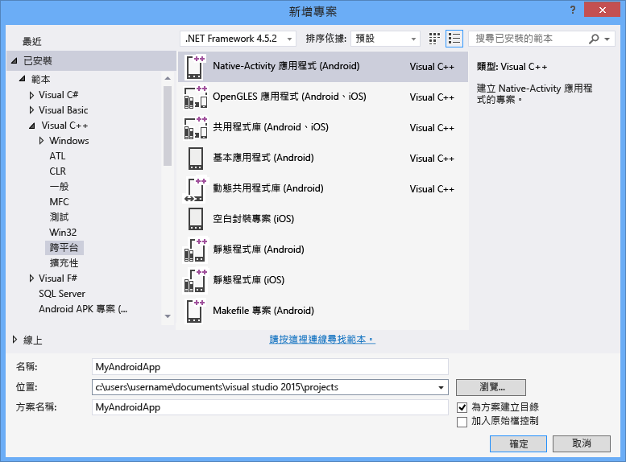

# 使用 Visual C++ 建置跨平台應用程式
您可以使用 Visual C\+\+ for Cross\-Platform Mobile Development 為 Android、iOS 和 Windows 裝置建置跨平台程式碼。  這是 Visual Studio 2015 中可用的選擇性功能，可以使用 Visual C\+\+ 進行 iOS、Android 和 Windows 的跨平台程式碼開發。  
  
 您可以使用 Visual Studio，針對傳統型 Windows 應用程式、通用 Windows 應用程式、iOS 和 Android 平台，來建置標準 C\+\+ 程式碼的共用程式庫。  您只需使用 Visual C\+\+ 以及整合在 Visual Studio 中的協力廠商工具，就可以建置適用於 Windows 和 Android 平台的原生應用程式。  如果您有 Mac 電腦，便可使用 Visual Studio 針對建立與部署在您 Mac 上的 iOS 應用程式建立及偵錯 C\+\+ 程式碼。  
  
> [!NOTE]
>  預設情況下， Visual C\+\+ for Cross\-Platform Mobile Development 可支援針對 Android 4.4 和 5.0 的 Android API Level 19 和 21。  使用 SDK Manager 可以安裝其他應用程式開發介面層級。  Visual Studio C\+\+ Android 的偵錯工具要求目標模擬器或裝置至少要執行 Android API level 17 \(4.2 版\) 或更新版本。  
  
 本文描述如何使用 Visual Studio 2015 中的  Visual C\+\+ for Cross\-Platform Mobile Development  開始建立跨平台應用程式：  
  
 [需求](#req)   
 [取得工具](#GetTools)  
 [建立新的 Android Native Activity 專案](#Create)  
 [建置並執行 Android Native Activity 應用程式](#BuildHello)  
  
##   需求  
  
-   如需安裝需求，請參閱 [Visual Studio 2015 系統需求](https://www.visualstudio.com/visual-studio-2015-system-requirements-vs)。  
  
    > [!IMPORTANT]
    >  如果您使用 Windows 7 或 Windows Server 2008 R2，便可以為傳統型 Windows 應用程式、Android 的 Native Activity 應用程式和程式碼程式庫，以及適用於 iOS 的應用程式和程式碼程式庫開發程式碼，但不適用於 Windows 市集或通用 Windows 應用程式。  
  
 若要建置特定裝置平台的應用程式，有幾個額外的需求：  
  
-   適用於 Android 的 Visual Studio 模擬器以及 Windows Phone 模擬器需要可執行 Hyper\-V 的電腦。  如需詳細資訊，請參閱模擬器的[系統需求](http://msdn.microsoft.com/zh-tw/4d5bb438-231a-4cd2-84b7-e9660b0e3baf)。  
  
-   搭配 Android SDK 的 x86 Android 模擬器在可執行 Intel HAXM 驅動程式的電腦上效能最佳。  此驅動程式需要 Intel x64 處理器並支援 VT\-x 和執行停用位元。  如需詳細資訊，請參閱 [Intel® 硬體加速執行管理器安裝指示 \- Microsoft Windows](http://go.microsoft.com/fwlink/p/?LinkId=536385)。  
  
-   建置 iOS 應用程式需要 iOS 開發人員計劃帳戶，以及可以執行 Xcode 6 的 Mac 電腦。  
  
##   取得工具  
 Visual C\+\+ for Cross\-Platform Mobile Development 是包含在 Visual Studio 2015 中的選擇性元件。  若要取得 Visual Studio，請移至 [Visual Studio 2015 下載](http://go.microsoft.com/fwlink/?linkid=517106)頁面，並下載 Visual Studio 2015。  
  
 Visual Studio 2015 的安裝程式包含支援跨平台行動開發的選項。  這包括安裝 Visual C\+\+ 行動裝置開發和下列常見工具和軟體開發套件的選項。  大多數選項是跨平台支援所需的開放原始碼軟體。  
  
-   Android 建置流程需要 Android Native Development Kit \(R10E，32 位元\)。  
  
-   Android 建置流程需要 Android SDK、Apache Ant 及 Java SE Development Kit。  
  
-   Android 的 Microsoft Visual Studio 模擬器是進行 Android 開發時快速且功能齊全的模擬器。  
  
 如需詳細的安裝指令，請參閱 [安裝 Visual C\+\+ for Cross\-Platform Mobile Development](../cross-platform/install-visual-cpp-for-cross-platform-mobile-development.md)。  
  
 若要建置 iOS 的程式碼，您需要在 Mac 上安裝和設定遠端建置代理程式，並在 Visual Studio 中連接它。  如需詳細的安裝和設定指令，請參閱 [安裝和設定工具以使用 iOS 進行建置](../cross-platform/install-and-configure-tools-to-build-using-ios.md)。  
  
##   建立新的 Android Native Activity 專案  
 您可以使用 Visual C\+\+ for Cross\-Platform Mobile Development 來建立、建置、執行和偵錯使用 C\+\+ 的完整 Android 應用程式。  Visual Studio 包含可協助您開始使用的 Android Native Activity 專案範本。  
  
 在本教學課程中您將建立新專案，然後建置並執行預設應用程式。  
  
 請先確認您已符合所有系統需求，並已安裝適用於 Visual Studio 的 Visual C\+\+ for Cross\-Platform Mobile Development，才能建立新的專案。  如需詳細資訊，請參閱[安裝 Visual C\+\+ for Cross\-Platform Mobile Development](../cross-platform/install-visual-cpp-for-cross-platform-mobile-development.md)。  
  
#### 若要建立新的專案  
  
1.  開啟 Visual Studio。  在功能表列上，選擇 \[**檔案**\]、\[**新增**\]、\[**專案**\]。  
  
2.  在 \[新增專案\] 對話方塊中的 \[範本\] 底下，選擇 \[Visual C\+\+\]、\[跨平台\]，然後選擇 \[Native\-Activity 應用程式 \(Android\)\] 範本。  
  
3.  指定應用程式的名稱，例如 `MyAndroidApp`，然後選擇 \[確定\]。  
  
       
  
     Visual Studio 會建立新的方案，並開啟 \[方案總管\]。  
  
 新的 Android Native Activity 應用程式方案包含兩個專案：  
  
-   **MyAndroidApp.NativeActivity** 包含參考和黏合程式碼 \(glue code\)，可讓您的應用程式當作 Native Activity 在 Android 上執行。  黏合程式碼 \(glue code\) 的進入點實作位於 main.cpp 中。  先行編譯標頭檔位於 pch.h 中。  您的應用程式專案會編譯至 Packaging 專案所挑選的共用程式庫 \(.so\) 檔案中。  
  
-   **MyAndroidApp.Packaging** 會建立部署在 Android 裝置或模擬器上時所使用的封裝 \(.apk\) 檔案。  其中包含資源以及您設有資訊清單屬性的 AndroidManifest.xml 檔案。  其中也包含用來控制建置流程的 build.xml 檔案。  依預設，它會設成啟始專案，以便直接從 Visual Studio 部署及執行。  
  
##   建置並執行 Android Native Activity 應用程式  
 建置並執行範本所產生的應用程式，以驗證您的安裝和設定。  根據預設，範本會將方案組態設為偵錯，並將方案平台設為 x86，以在 Microsoft Visual Studio Emulator for Android 上執行應用程式。  如果您想要在其他目標上測試您的應用程式，請載入目標模擬器，或將裝置連接至您的電腦。  
  
#### 建置並執行預設 Native Activity 應用程式  
  
1.  在功能表列上，選擇 \[**建置**\]、\[**建置方案**\]。  
  
     \[輸出\] 視窗會顯示方案中這兩個專案的建置流程輸出。  
  
2.  選擇其中一個 VS 模擬器設定檔做為部署目標。  
  
     如果您已經安裝其他模擬器或連接 Android 裝置，就可以在部署目標下拉式清單中加以選擇。  
  
3.  按 F5 啟動偵錯，或按 Shift\+F5 啟動但不偵錯。  
  
     以下是預設應用程式在 Visual Studio Emulator for Android 中的外觀。  
  
       
  
    > [!TIP]
    >  Visual Studio 啟動模擬器，這需要幾秒的時間來載入及部署您的程式碼。  在您的應用程式啟動之後，您可以設定中斷點，並使用偵錯工具，以逐步執行程式碼、檢查本機及監看值。  
  
4.  按 Shift \+ F5 停止偵錯。  
  
     模擬器是分開的程序，會繼續執行。  您可以將程式碼多次編輯、編譯及部署至相同的模擬器。  
  
## 請參閱  
 [下載 Visual Studio 2015](http://go.microsoft.com/fwlink/?linkid=517106)