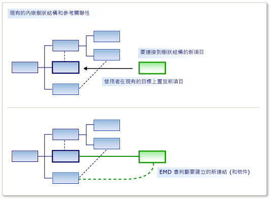

# <a name="customizing-element-creation-and-movement"></a>自訂項目的建立和移動
您可以允許的項目拖曳出來，放到另一個，從 [工具箱] 中或貼上或移動作業。 您可以移動的項目連結至目標項目中，使用您指定的關聯性。  
  
 項目合併指示詞 (EMD) 會指定一個模型項目時，會發生什麼事*合併*到另一個模型項目。 發生這種情況時：  
  
-   在使用者拖曳從 [工具箱] 拖曳到圖表或圖形。  
  
-   使用者建立的項目，使用 [總管] 或區間圖案中的 [加入] 功能表。  
  
-   使用者會將項目從一個泳道移至另一個。  
  
-   使用者貼上項目。  
  
-   您的程式碼會呼叫項目合併指示詞。  
  
 雖然建立作業可能會看起來是不同的複製操作時，它們實際運作方式相同。 當加入項目時，例如從工具箱 的原型被複寫。 原型併入模型中，做為模型的另一個組件已複製的項目相同的方式。  
  
 EMD 的責任是決定如何物件群組應該合併至模型中的特定位置。 特別是，它會決定哪些關聯性應該具現化合併的群組連結至模型。 您也可以自訂，以設定屬性，並建立其他物件。  
  
   
角色的項目合併指示詞  
  
 當您定義內嵌的關聯性時，會自動產生 EMD。 EMD 這個預設值建立關聯性的執行個體，當使用者將新的子系執行個體加入父代。 您可以將自訂程式碼，例如修改這些預設 EMDs。  
  
 您也可以加入您自己 EMDs DSL 定義中，若要讓使用者拖曳或貼上的合併和接收類別的不同組合。  
  
## <a name="defining-an-element-merge-directive"></a>定義的項目合併指示詞  
 您可以將項目合併指示詞加入網域類別、 網域關聯性、 圖形、 連接器和圖表。 您可以新增或接收的網域類別下 DSL 總管 中找到它們。 接收類別是領域類別已經在模型中，並拖曳至新的或複製的項目合併的項目。  
  
   
  
 **索引類別**是領域類別必須合併接收類別成員的項目。 子索引類別的執行個體將也由這個 EMD，合併，除非您將設定**子類別適用於**為 False。  
  
 有兩種類型的合併指示詞：  
  
-   A**合併處理序**指示詞指定的新項目應連結至樹狀目錄的關聯性。  
  
-   A**向前合併**指示詞將新項目重新導向至另一個接收項目，通常是父代。  
  
 您可以加入自訂程式碼來合併指示詞：  
  
-   設定**使用自訂接受**加入您自己的程式碼，以判斷索引的項目之特定執行個體是否應合併到目標項目。 當使用者拖曳從 [工具箱] 中時，「 無效 」 的指標會顯示是否您的程式碼就不允許合併。  
  
     例如，您可能會接收的項目處於特定狀態時，才允許合併。  
  
-   設定**使用自訂合併**加入提供自己的程式碼以定義當執行合併，對模型進行的變更。  
  
     例如，您無法使用其模型中的新位置中的資料，合併的項目中設定屬性。  
  
> [!NOTE]
>  如果您撰寫自訂的合併程式碼時，它會影響只有都是透過使用這個 EMD 的合併。 如果沒有其他 EMDs，表示合併相同類型的物件，或如果沒有其他自訂程式碼，而不使用 EMD 會建立這些物件，然後它們將不會影響您的自訂合併程式碼。  
>   
>  如果您想要確保新的項目或新的關聯性一律處理您的自訂程式碼，請考慮定義`AddRule`內嵌關聯性和`DeleteRule`項目的領域類別上。 如需詳細資訊，請參閱[規則傳播變更內模型](../modeling/rules-propagate-changes-within-the-model.md)。  
  
## <a name="example-defining-an-emd-without-custom-code"></a>範例： 定義 EMD 沒有自訂的程式碼  
 下列範例可讓使用者在同一時間建立項目連接器，從 [工具箱] 拖曳到現有的圖形拖曳。 範例會加入 EMD DSL 定義。 之前這項修改，使用者可以拖曳工具拖曳至圖表，但不是到現有的圖形。  
  
 使用者也可以貼到其他項目上的項目。  
  
#### <a name="to-let-users-create-an-element-and-a-connector-at-the-same-time"></a>若要讓使用者在同一時間建立項目和連接器  
  
1.  使用建立新的 DSL**基本語言**方案範本。  
  
     當您執行此 DSL 時，它可讓您建立的圖形及圖形之間的連接器。 您無法將新**ExampleElement**圖形從工具箱拖曳至現有的圖形。  
  
2.  若要讓使用者合併項目拖曳至`ExampleElement`圖形，建立在新 EMD`ExampleElement`領域類別：  
  
    1.  在**DSL 總管**，依序展開**網域類別**。 以滑鼠右鍵按一下`ExampleElement`，然後按一下 **加入新項目合併指示詞**。  
  
    2.  請確定**DSL 詳細資料**視窗已開啟時，讓您可以看到新 EMD 的詳細資料。 (功能表：**檢視**，**其他 Windows**， **DSL 詳細資料**。)  
  
3.  設定**索引類別**在 DSL 詳細資料視窗中，以定義哪些類別的項目可以合併到`ExampleElement`物件。  
  
     此範例中，選取`ExampleElements`，如此一來，使用者可以將新項目拖曳至現有的項目。  
  
     請注意索引類別會變成 EMD DSL 總管 中的名稱。  
  
4.  在下**藉由建立連結的程序合併**，新增兩個路徑：  
  
    1.  一個路徑會將新的項目連結至父模型。 您必須輸入的路徑運算式巡覽從現有的項目，透過內嵌關聯性的父模型。 最後，它會指派新項目的新連結中指定的角色。 其路徑如下，如下所示：  
  
         `ExampleModelHasElements.ExampleModel/!ExampleModel/.Elements`  
  
    2.  在另一個路徑指向現有項目連結的新項目。 路徑運算式會指定參考的關聯性和新的項目指派的角色。 此路徑如下所示：  
  
         `ExampleElementReferencesTargets.Sources`  
  
     您可以使用路徑瀏覽工具來建立每個路徑：  
  
    1.  在下**藉由在路徑中建立連結的程序合併**，按一下  **\<新增路徑 >**。  
  
    2.  按一下下拉式箭號右邊的清單項目。 樹狀結構檢視會顯示。  
  
    3.  展開成您想要指定的路徑樹狀目錄中的節點。  
  
5.  測試 DSL:  
  
    1.  按 F5 以重新建置並執行方案。  
  
         重建將需要比平常更長，因為產生的程式碼將會從文字範本，以符合新的 DSL 定義更新。  
  
    2.  當實驗執行個體[!INCLUDE[vsprvs](../code-quality/includes/vsprvs_md.md)]已啟動，開啟 DSL 的模型檔案。 建立一些範例項目。  
  
    3.  拖曳**範例項目**拖曳到現有的圖形工具。  
  
         將新形狀隨即出現，並連結至現有的圖形與連接器。  
  
    4.  複製現有的圖形。 選取另一個圖形，並貼上。  
  
         建立第一個圖形的複本。  它具有新名稱，它會連結至第二個圖形連接器。  
  
 請注意這個程序中的下列各點：  
  
-   藉由建立項目合併指示詞，您可以允許任何類別接受任何其他項目。 EMD 會建立在接收網域類別中，而且公認的網域類別是在**Index 類別**欄位。  
  
-   藉由定義路徑，您可以指定哪些連結應該用來連接到現有模型的新項目。  
  
     您指定的連結都應該包含一個內嵌關聯性。  
  
-   EMD 會影響這兩種建立從 [工具箱] 以及貼上作業。  
  
     如果您撰寫自訂程式碼會建立新的項目時，您可以明確叫用 EMD 使用`ElementOperations.Merge`方法。 這可確保，您的程式碼連結新的項目到模型中與其他作業相同的方式。 如需詳細資訊，請參閱[自訂複製行為](../modeling/customizing-copy-behavior.md)。  
  
## <a name="example-adding-custom-accept-code-to-an-emd"></a>範例： 接受自訂的程式碼加入至 EMD  
 將自訂程式碼加入至 EMD，您可以定義更複雜的合併行為。 這個簡單的範例會防止使用者從多個固定數目的項目加入至圖表。 下列範例會修改預設 EMD 隨附的內嵌關聯性。  
  
#### <a name="to-write-custom-accept-code-to-restrict-what-the-user-can-add"></a>撰寫自訂接受程式碼來限制使用者可以加入  
  
1.  使用建立 DSL**基本語言**方案範本。 開啟 DSL 定義圖表。  
  
2.  在 [DSL 總管] 中，展開**網域類別**， `ExampleModel`，**合併指示詞項目**。 選取名為的項目合併指示詞`ExampleElement`。  
  
     此 EMD 控制使用者如何建立新`ExampleElement`在模型中，例如藉由從工具箱拖曳的物件。  
  
3.  在**DSL 詳細資料**視窗中，選取**使用自訂接受**。  
  
4.  重建方案。 這所花時間比平常長，因為產生的程式碼將會從模型中更新。  
  
     建置錯誤將會報告，類似於: 「 Company.ElementMergeSample.ExampleElement 未包含定義 CanMergeExampleElement...」  
  
     您必須實作此方法`CanMergeExampleElement`。  
  
5.  建立新的程式碼檔案中**Dsl**專案。 下列程式碼中取代其內容並變更您的專案的命名空間的命名空間。  
  
    ```csharp  
    using Microsoft.VisualStudio.Modeling;  
  
    namespace Company.ElementMergeSample // EDIT.  
    {  
      partial class ExampleModel  
      {  
        /// <summary>  
        /// Called whenever an ExampleElement is to be merged into this ExampleModel.  
        /// This happens when the user pastes an ExampleElement  
        /// or drags from the toolbox.  
        /// Determines whether the merge is allowed.  
        /// </summary>  
        /// <param name="rootElement">The root element in the merging EGP.</param>  
        /// <param name="elementGroupPrototype">The EGP that the user wants to merge.</param>  
        /// <returns>True if the merge is allowed</returns>  
        private bool CanMergeExampleElement(ProtoElementBase rootElement, ElementGroupPrototype elementGroupPrototype)  
        {  
          // Allow no more than 4 elements to be added:  
          return this.Elements.Count < 4;  
        }  
      }  
    }  
  
    ```  
  
     這則簡易範例中，會限制可以合併到父模型的項目數目。 更有趣的情況，方法可以檢查任何屬性和接收物件的連結。 它也可以檢查的屬性合併的項目，位於<xref:Microsoft.VisualStudio.Modeling.ElementGroupPrototype>。 如需有關`ElementGroupPrototypes`，請參閱[自訂複製行為](../modeling/customizing-copy-behavior.md)。 如需如何撰寫讀取模型的程式碼的詳細資訊，請參閱[巡覽和更新程式碼中的模型](../modeling/navigating-and-updating-a-model-in-program-code.md)。  
  
6.  測試 DSL:  
  
    1.  按 f5 鍵，重建方案。 當實驗執行個體[!INCLUDE[vsprvs](../code-quality/includes/vsprvs_md.md)]隨即開啟，開啟的 DSL 執行個體。  
  
    2.  建立新的元素數種方式：  
  
        1.  拖曳**範例項目**工具拖曳至圖表。  
  
        2.  在**範例模型總管**，以滑鼠右鍵按一下根節點，然後按一下**加入新的範例項目**。  
  
        3.  複製並貼在圖表上的項目。  
  
    3.  請確認您無法使用任何一種將四個以上的項目加入至模型。 這是因為它們都會使用項目合併指示詞。  
  
## <a name="example-adding-custom-merge-code-to-an-emd"></a>範例： 將自訂合併程式碼加入至 EMD  
 自訂合併程式碼中，您可以定義當使用者拖曳工具或貼到項目時，會發生什麼事。 有兩種方式來定義自訂的合併式：  
  
1.  設定**使用自訂合併**並提供必要的程式碼。 您的程式碼取代產生的合併程式碼。 如果您想要完全重新定義合併的用途，請使用此選項。  
  
2.  覆寫`MergeRelate`方法，並選擇性地`MergeDisconnect`方法。 若要這樣做，您必須設定**會產生兩個衍生**網域類別的屬性。 您的程式碼可以呼叫產生的合併程式碼中的基底類別。 如果您想要執行其他作業在執行合併之後，請使用此選項。  
  
 這些方法只會影響使用此 EMD 所執行的合併。 如果您想要影響所有的方式可以在其中建立合併的項目，或者是定義`AddRule`內嵌關聯性和`DeleteRule`合併的網域類別上。 如需詳細資訊，請參閱[規則傳播變更內模型](../modeling/rules-propagate-changes-within-the-model.md)。  
  
#### <a name="to-override-mergerelate"></a>若要覆寫 MergeRelate  
  
1.  DSL 定義中，請確定您已定義您要將程式碼加入的 EMD。 如果您想，您可以加入路徑，並定義自訂接受程式碼，如先前章節中所述。  
  
2.  在 DslDefinition 圖表中，選取接收合併的類別。 通常它是內嵌的關聯性來源端的類別。  
  
     例如，從最小的語言方案所產生的 DSL，在選取`ExampleModel`。  
  
3.  在**屬性**視窗中，將**會產生兩個衍生**至**true**。  
  
4.  重建方案。  
  
5.  檢查的內容**Dsl\Generated Files\DomainClasses.cs**。 搜尋方法，名為`MergeRelate`並檢查其內容。 這將協助您撰寫您自己的版本。  
  
6.  在新的程式碼檔案中，撰寫接收類別的部分類別並覆寫`MergeRelate`方法。 請務必呼叫基底的方法。 例如:   
  
    ```csharp  
    partial class ExampleModel  
    {  
      /// <summary>  
      /// Called when the user drags or pastes an ExampleElement onto the diagram.  
      /// Sets the time of day as the name.  
      /// </summary>  
      /// <param name="sourceElement">Element to be added</param>  
      /// <param name="elementGroup">Elements to be merged</param>  
      protected override void MergeRelate(ModelElement sourceElement, ElementGroup elementGroup)  
      {  
        // Connect the element according to the EMD:  
        base.MergeRelate(sourceElement, elementGroup);  
  
        // Custom actions:   
        ExampleElement mergingElement = sourceElement as ExampleElement;  
        if (mergingElement != null)  
        {  
          mergingElement.Name = DateTime.Now.ToLongTimeString();  
        }  
      }  
    }  
  
    ```  
  
#### <a name="to-write-custom-merge-code"></a>撰寫自訂合併程式碼  
  
1.  在**Dsl\Generated Code\DomainClasses.cs**，檢查方法，名為`MergeRelate`。 這些方法會建立新的項目與現有的模型之間的連結。  
  
     此外，檢查方法，名為`MergeDisconnect`。 刪除時，這些方法取消連結從模型項目。  
  
2.  在**DSL 總管**，選取或建立項目合併指示詞，您想要自訂。 在**DSL 詳細資料**視窗中，將**使用自訂合併**。  
  
     當您設定此選項，**合併處理序**和**向前合併**選項都會被忽略。 改為使用您的程式碼。  
  
3.  重建方案。 它會比平常長因為產生的程式碼檔案將會從模型中更新。  
  
     會出現錯誤訊息。 按兩下要查看產生的程式碼中的指示的錯誤訊息。 這些指示會要求您提供兩種方法， `MergeRelate` *YourDomainClass*和`MergeDisconnect` *YourDomainClass*  
  
4.  在不同的程式碼檔案中的部分類別定義寫入方法。 您檢查先前的範例應建議事項。  
  
 自訂合併程式碼將不會影響程式碼會直接建立物件和關聯性，並不會影響其他 EMDs。 若要確定不論項目建立的方式實作，其他變更，請考慮撰寫`AddRule`和`DeleteRule`改為。 如需詳細資訊，請參閱[規則傳播變更內模型](../modeling/rules-propagate-changes-within-the-model.md)。  
  
## <a name="redirecting-a-merge-operation"></a>合併作業將重新導向  
 正向合併指示詞會重新導向合併作業的目標。 一般而言，新的目標是內嵌的初始目標的父系。  
  
 例如，DSL 元件圖表範本所建立，在連接埠會內嵌在元件。 連接埠會顯示為 「 元件 」 圖形的邊緣上的小圖形。 使用者建立的連接埠的連接埠工具拖曳到元件 」 圖形。 但是某些情況下，使用者不小心將連接埠工具拖曳至現有的連接埠，而不是元件，而且此作業會失敗。 有數個現有的連接埠時，這種易犯錯誤。 為了若要避免此來進行騷擾使用者，您可以允許連接埠，以將它們拖曳至現有的連接埠，但有重新導向至父元件的動作。 運算的運作方式如同目標項目是元件。  
  
 您可以建立正向合併指示詞元件模型方案中。 如果您編譯和執行原始的方案，您應該會看到使用者可以將任意數目的**輸入連接埠**或**輸出連接埠**項目從**工具箱**至**元件**項目。 不過，也無法將連接埠拖曳到現有的連接埠。 它們不是此移動已啟用無法使用指標警示。 不過，建立正向合併指示詞，使連接埠，是不小心卸除現有**輸入連接埠**轉送至**元件**項目。  
  
#### <a name="to-create-a-forward-merge-directive"></a>若要建立正向合併指示詞  
  
1.  建立[!INCLUDE[dsl](../modeling/includes/dsl_md.md)]方案使用的元件模型範本。  
  
2.  顯示**DSL 總管**開啟 DslDefinition.dsl。  
  
3.  在**DSL 總管**，依序展開**網域類別**。  
  
4.  **ComponentPort**抽象網域類別是基底類別，這兩者的**InPort**和**OutPort**。 以滑鼠右鍵按一下**ComponentPort** ，然後按一下 **加入新項目合併指示詞**。  
  
     新**元素合併指示詞**節點會出現在**合併指示詞項目**節點。  
  
5.  選取**元素合併指示詞**節點並開啟**DSL 詳細資料**視窗。  
  
6.  在索引類別清單中，選取**ComponentPort**。  
  
7.  選取**轉寄到不同的網域類別合併**。  
  
8.  在 [路徑] 選取項目清單中，依序展開**ComponentPort**，依序展開**ComponentHasPorts**，然後選取**元件**。  
  
     新的路徑應該類似下列：  
  
     **ComponentHasPorts.Component/!Component**  
  
9. 儲存方案，並再最右邊的按鈕，即可轉換範本**方案總管 中**工具列。  
  
10. 建置並執行方案。 新執行個體[!INCLUDE[vsprvs](../code-quality/includes/vsprvs_md.md)]隨即出現。  
  
11. 在**方案總管 中**，開啟 Sample.mydsl。 圖表和**ComponentLanguage 工具箱**出現。  
  
12. 拖曳**輸入連接埠**從**工具箱**到另一個**輸入連接埠。** 下一步，拖曳**OutputPort**至**InputPort** ，再為另一個**OutputPort**。  
  
     您不應該會看到無法使用的指標，以及您應該能夠將新**輸入連接埠**上現有的我的最愛。 選取新**輸入連接埠**並將它拖曳至另一個點**元件**。  
  
## <a name="see-also"></a>請參閱  
 [巡覽和更新程式碼中的模型](../modeling/navigating-and-updating-a-model-in-program-code.md)   
 [自訂工具和 [工具箱]](../modeling/customizing-tools-and-the-toolbox.md)   
 [DSL 的循環圖範例](http://code.msdn.microsoft.com/Visualization-Modeling-SDK-763778e8)