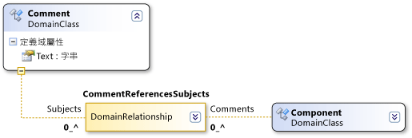

# 網域路徑語法
DSL 定義使用類似 XPath 的語法來尋找模型中的特定項目。  
  
 您通常不需要直接使用這個語法。 [DSL 詳細資料] 或 [屬性] 視窗中會顯示這個語法，您可以在視窗中按一下向下箭號並使用路徑編輯器。 不過，在使用編輯器之後，路徑會以下列格式顯示在欄位中。  
  
 網域路徑的格式如下：  
  
 *RelationshipName.PropertyName/ ！角色*  
  
   
  
 這個語法會周遊模型的樹狀結構。 例如，網域關聯性**CommentReferencesSubjects**上圖中有**主旨**角色。 路徑區段**/ ！Subjectt**指定路徑是透過存取的項目上完成**主旨**角色。  
  
 每個區段以網域關聯性的名稱開頭。 如果周遊，從項目關聯性的路徑區段會顯示為*Relationship.PropertyName*。 如果躍點，從連結的項目路徑區段會顯示為*關聯性 / ！RoleName*。  
  
 請以斜線分隔路徑的語法。 每個路徑區段可以是項目到連結的躍點 (關聯性執行個體) 或連結到項目的躍點。 路徑區段經常會成對顯示。 一個路徑區段表示項目到連結的躍點，下一個區段表示連結到項目的反向躍點。 (任何連結也可以是關聯性本身的來源或目標)。  
  
 用於表示項目到連結之躍點的名稱是角色的 [`Property Name`] 值。 用於表示連結到項目之躍點的名稱是目標角色名稱。  
  
## 另請參閱  
 [了解模型、類別和關聯性](../modeling/understanding-models-classes-and-relationships.md)