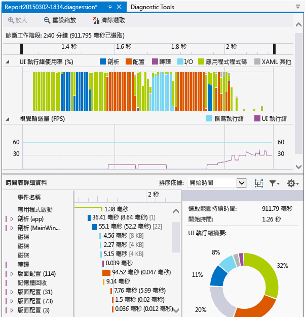

# 應用程式時間軸
使用 [應用程式時間軸]  程式碼剖析工具來找出並修正 XAML 應用程式中的應用程式互動相關效能問題。 此工具可透過提供應用程式資源耗用量的詳細檢視，來協助改善 XAML 應用程式的效能。 您可以分析應用程式準備 UI 畫面格 (版面配置和轉譯)、服務網路和磁碟要求，以及像是應用程式啟動、頁面載入和視窗大小調整等情況所花費的時間。  
  
 [應用程式時間軸]是可透過 [偵錯/效能分析工具] 命令啟動的工具之一。  
  
 此工具會取代 [XAML UI 回應性]  工具，而後者為 Visual Studio 2013 診斷工具組的一部分。  
  
 您可以在下列平台上使用此工具：  
  
1.  通用 Windows 應用程式 (於 Windows 10 上)  
  
2.  Windows 市集 8.1  
  
3.  Windows Phone 8.1 (通用 XAML 平台)  
  
4.  Windows Presentation Foundation (.Net 4.0 (含) 以上版本)  
  
5.  Windows 7  
  
> [!NOTE]
>  除了 [時間軸]  資料之外，您還可以收集並分析 CPU 使用量資料和能源消耗資料。 請參閱[使用或不使用偵錯工具來執行程式碼剖析工具 (Running Profiling Tools With or Without the Debugger)](../profiling/running-profiling-tools-with-or-without-the-debugger.md)。
  
##  收集應用程式時間軸資料  
 您可以在本機電腦、連接的裝置、Visual Studio 模擬器 (Simulator 或 Emulator) 或遠端裝置上分析應用程式的回應性。 請參閱[使用或不使用偵錯工具來執行程式碼剖析工具 (Running Profiling Tools With or Without the Debugger)](../profiling/running-profiling-tools-with-or-without-the-debugger.md)。
  
> [!TIP]
>  請盡可能直接在裝置上執行應用程式。 在模擬器上或透過遠端桌面連接觀察到的應用程式效能，可能與裝置上的實際效能不同。 相反地，使用 Visual Studio 遠端工具收集資料並不會影響效能資料。  
  
 基礎步驟如下：  
  
1.  開啟 XAML 應用程式。  
  
2.  按一下 [偵錯/效能分析工具]。 您應該會在 .diagsession 視窗中看到一份程式碼剖析工具清單。  
  
3.  選取 [應用程式時間軸]  ，然後在視窗底部按一下 [開始]  。  
  
    > [!NOTE]
    >  您可能會看到 [使用者帳戶控制] 視窗，其要求您提供執行 VsEtwCollector.exe 的權限。 按一下 [ **是**]。  
  
4.  執行您感興趣用來在應用程式中程式碼剖析的案例，來收集效能資料。  
  
5.  若要停止程式碼剖析，請切換回 .diagsession 視窗，並在視窗頂端按一下 [停止]  。  
  
     Visual Studio 會分析收集到的資料並顯示結果。  
  
       
  
##  分析時間軸程式碼剖析資料  
 收集到分析資料之後，您可以使用下面這些步驟開始分析：  
  
1.  檢查 [ **UI 執行緒使用率** ] 和 [ **視覺輸送量 (FPS)** ] 圖形中的資訊，然後使用時間軸巡覽列選取您要分析的時間範圍。  
  
2.  使用 [UI 執行緒使用率]  或 [視覺輸送量 (FPS)]  圖中的資訊，檢查 [時間軸詳細資料]  檢視中的詳細資料，找出任何明顯缺乏回應性的可能原因。  
  
###  報告情節、分類和事件  
 [應用程式時間軸]  工具會顯示與 XAML 效能相關之情節、分類和事件的計時資料。  
  
###  診斷工作階段時間軸  
   
  
 頁面頂端的尺規顯示所分析資訊的時間軸。 這個時間軸同時適用於 [ **UI 執行緒使用率** ] 圖形和 [ **視覺輸送量** ] 圖形。 您可以拖曳時間軸上的巡覽列，選取時間軸的區段，以縮小報告範圍。  
  
 時間軸也會顯示您已插入的所有使用者標記，以及應用程式的啟用週期事件。  
  
###  UI 執行緒使用率圖  
   
  
 [UI 執行緒使用率 (%)]  圖是顯示某項分類在收集時間範圍內相對花費之時間量的橫條圖。  
  
###  視覺輸送量 (FPS) 圖  
   
  
 [ **視覺輸送量 (FPS)** ] 折線圖會顯示應用程式 UI 和撰寫執行緒上的每秒畫面格數 (FPS)。  
  
###  時間軸詳細資料  
 詳細資料檢視是您會花費大部分的時間分析報表之處。 其會顯示由 UI 架構子系統分類之應用程式 CPU 使用率的詳細檢視或耗用 CPU 系統的元件。  
  
 支援的事件如下：  
  
|||  
|-|-|  
|**正在剖析**|剖析 XAML 檔案和建立物件所花費的時間。   展開 [時間軸詳細資料]  中的 [剖析]  節點會顯示剖析為根事件結果之所有 XAML 檔案的相依性鏈結。 這可讓您識別效能敏感情節中不必要的檔案剖析和物件建立作業，並排除這些作業以取得最佳化。|  
|**版面配置**|在大型應用程式裡，螢幕上可能會同時顯示數千個項目。 這可能導致低 UI 畫面播放速率和對應不佳的應用程式回應性。 配置事件準確地判斷每個項目的成本配置 (也就是在排列、量值、ApplyTemplate、ArrangeOverride 和 ArrangeOverride 所花的時間)，並建置參與配置傳遞的視覺化樹狀結構。 您可以使用此視覺效果，來判斷哪些程式邏輯樹狀結構需要清除，或評估其他延遲機制以將配置傳遞最佳化。|  
|**轉譯**|將 XAML 項目繪製到螢幕所花費的時間。|  
|**I/0**|從本機磁碟或網路資源 (透過 [Microsoft Windows 網際網路 (WinINet) API](https://msdn.microsoft.com/en-us/library/windows/desktop/aa385331.aspx)存取) 擷取資料所花費的時間。|  
|**應用程式程式碼**|執行與剖析或配置不相關的應用程式 (使用者) 程式碼所花費的時間。|  
|**XAML 其他**|執行 XAML 執行階段程式碼所花費的時間。|  
  
> [!TIP]
>  當您開始進行程式碼剖析以檢視 UI 執行緒上所執行的應用程式時，請選擇 [CPU 使用量]  工具和 [應用程式時間軸]  工具。 將長時間執行的應用程式程式碼移到背景執行緒可以改善 UI 回應性。  
  
####   自訂時間軸詳細資料  
 您可以使用 [時間軸詳細資料]  工具列來排序、篩選及指定 [時間軸詳細資料]  檢視項目的註釋。  
  
|||  
|-|-|  
|**排序依據**|依開始時間或事件長度排序。|  
||加入或移除依框架分組事件的最上層 [框架]  分類。|  
||依選取的分類和事件長度篩選清單。|  
||可讓您指定事件的註釋。|  
  
## 另請參閱  
 [WPF 團隊部落格︰WPF 應用程式的新 UI 效能分析工具 (New UI Performance Analysis Tool for WPF Applications)](http://blogs.msdn.com/b/wpf/archive/2015/01/16/new-ui-performance-analysis-tool-for-wpf-applications.aspx)   
 [使用 C++、C# 及 Visual Basic 的 Windows 市集應用程式的效能最佳做法](http://msdn.microsoft.com/en-us/567bcefa-5da5-4e42-a4b8-1358c71adfa2)   
 [最佳化 WPF 應用程式效能](http://msdn.microsoft.com/Library/ac8c6aa3-3c68-4a24-9827-3b6c829c1ebf)

<!--HONumber=Feb17_HO4-->

