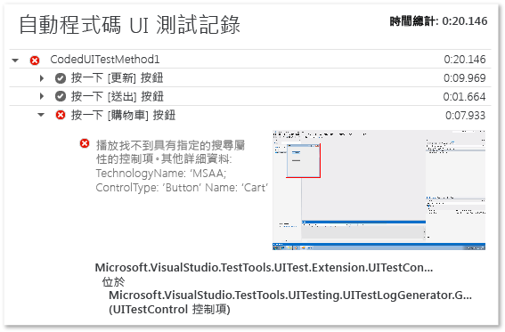

# <a name="analyzing-coded-ui-tests-using-coded-ui-test-logs"></a>使用自動程式化 UI 測試記錄分析自動程式化 UI 測試
自動程式化 UI 測試記錄會篩選和錄製您自動程式化 UI 測試執行的重要資訊。  
  
 **Requirements**  
  
-   Visual Studio 企業版  
  
## <a name="why-should-i-do-this"></a>為什麼我應該這麼做？  
 記錄是以允許快速偵錯問題的格式所呈現。  
  
## <a name="how-do-i-do-this"></a>我要怎麼做？  
  
### <a name="step-1-enable-logging"></a>步驟 1：啟用記錄  
 根據您的情節，使用下列其中一種方法來啟用記錄。  
  
-   測試專案中沒有 App.config 檔案的目標 .NET Framework 第 4 版  
  
    -   開啟 **QTAgent32_40.exe.config** 檔案。  
  
         根據預設，這個檔案位於 **\<磁碟機>:\Program Files (x86)\Microsoft Visual Studio 12.0\Common7\IDE**。  
  
         將 EqtTraceLevel 的值修改為您要的記錄層級。  
  
         儲存檔案。  
  
-   測試專案中沒有 App.config 檔案的目標 .NET Framework 第 4.5 版  
  
    -   開啟 **QTAgent32.exe.config** 檔案。  
  
         根據預設，這個檔案位於 **\<磁碟機>:\Program Files (x86)\Microsoft Visual Studio 12.0\Common7\IDE**。  
  
         將 EqtTraceLevel 的值修改為您要的記錄層級。  
  
         儲存檔案。  
  
-   測試專案中有 App.config 檔案  
  
    -   開啟專案中的 App.config 檔案。  
  
         將下列程式碼加入至組態節點下：  
  
         `<system.diagnostics>     <switches>       <add name="EqtTraceLevel" value="4" />     </switches>  </system.diagnostics>`  
  
-   透過測試程式碼本身啟用記錄  
  
    -   <xref:Microsoft.VisualStudio.TestTools.UITesting.PlaybackSettings.LoggerOverrideState%2A> = HtmlLoggerState.AllActionSnapshot;  
  
### <a name="step-2-run-your-coded-ui-test-and-view-the-log"></a>步驟 2：執行自動程式化 UI 測試並檢視記錄  
 當您在已修改 **QTAgent32.exe.config** 檔案的情況下執行自動程式化 UI 測試時，會看到 [測試總管] 結果中有輸出連結。 記錄檔不只在測試失敗時才產生，在追蹤層級設定為 "verbose" 時，就算測試成功也會產生。  
  
1.  在 [測試] 功能表上，選擇 [Windows]，然後選取 [測試總管]。  
  
2.  在 [建置] 功能表上，選擇 [建置方案]。  
  
3.  在 [測試總管] 中，選取您要執行的自動程式化 UI 測試，並開啟其捷徑功能表，然後選擇 [執行選取的測試]。  
  
     自動化測試將會執行，並指出測試通過或失敗。  
  
    > [!TIP]
    >  若要從 [測試功能表] 檢視測試總管，請指向 [Windows]，然後選擇 [測試總管]。  
  
4.  選擇 [測試總管] 結果中的 [輸出] 連結。  
  
     ![[測試總管] 中的 [輸出] 連結](~/docs/test/media/cuit_htmlactionlog1.png "CUIT_HTMLActionLog1")  
  
     這會顯示將包括動作記錄連結的測試輸出。  
  
       
  
5.  選擇 UITestActionLog.html 連結。  
  
     記錄隨即顯示在網頁瀏覽器中。  
  
       
  
## <a name="q--a"></a>問與答  
  
### <a name="q-what-happened-to-the-enablehtmllogger-key"></a>問：EnableHtmlLogger 索引鍵發生什麼事？  
 在舊版 Visual Studio 中，還有兩個組態設定可以在自動程式碼 UI 測試中啟用 Html 記錄器：  
  
```  
  
<add key="EnableHtmlLogger" value="true"/>  
  
<add key="EnableSnapshotInfo" value="true"/>  
  
```  
  
 自 Visual Studio 2012 之後，這兩個設定都已遭取代。 EqtTraceLevel 是修改為啟用 HtmlLogger 所需的唯一設定。  
  
## <a name="see-also"></a>另請參閱  
 [使用使用者介面自動化來測試您的程式碼](../test/use-ui-automation-to-test-your-code.md)   
 [如何：從 Microsoft Visual Studio 執行測試](http://msdn.microsoft.com/Library/1a1207a9-2a33-4a1e-a1e3-ddf0181b1046)

