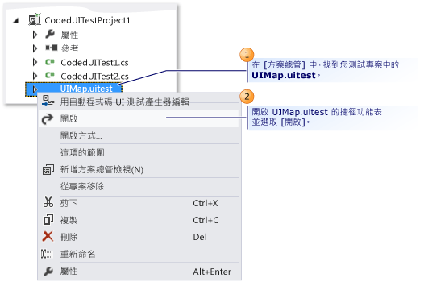
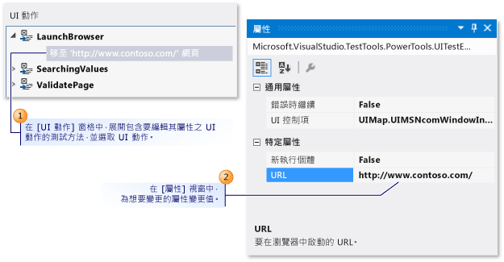
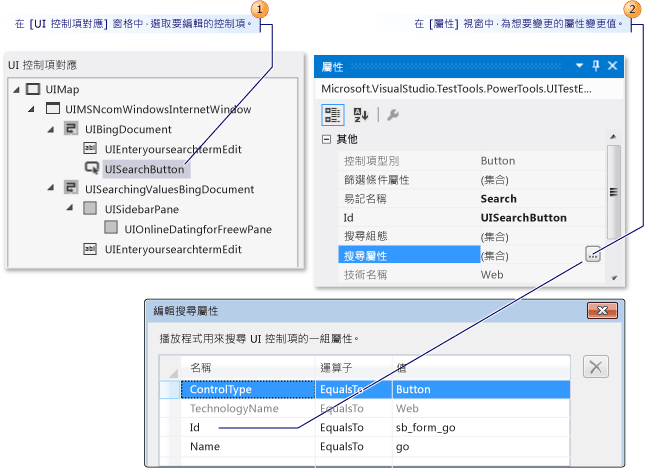
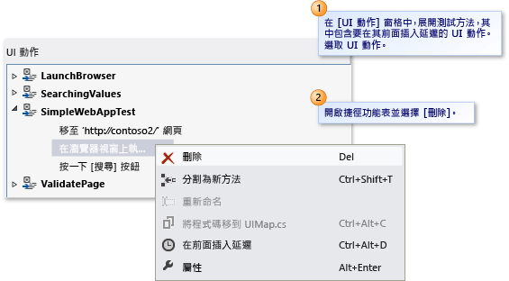
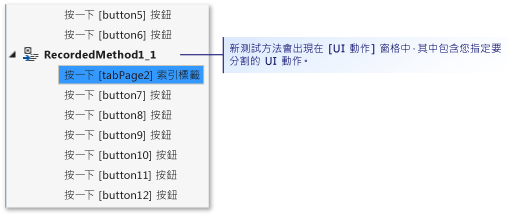
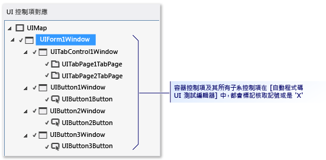
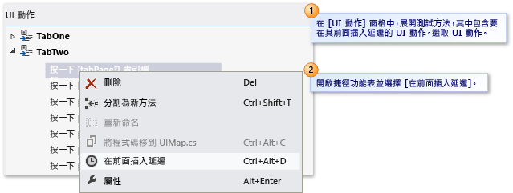
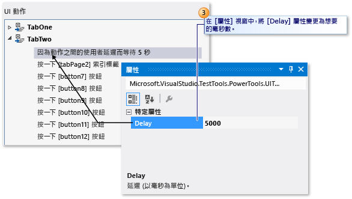

# 使用自動程式化 UI 測試編輯器，編輯自動程式化 UI 測試
自動程式碼 UI 測試編輯器可讓您輕鬆地修改自動程式碼 UI 測試。 您可以使用自動程式碼 UI 測試編輯器，尋找、檢視和編輯測試方法和 UI 動作的屬性。 此外，您也可以使用 UI 控制項對應，檢視和編輯其對應的控制項。  
  
 **需求**  
  
-   Visual Studio 企業版  
  
## 為什麼我應該這麼做？  
 比起使用程式碼編輯器以您的自動程式碼 UI 測試方法編輯程式碼，使用自動程式碼 UI 更為快速且更有效率。 在自動程式碼 UI 測試編輯器中，您可以使用工具列和捷徑功能表，快速找出和修改與 UI 動作和控制項相關聯的屬性值。 例如，您可以使用自動程式化 UI 測試編輯器的工具列來執行下列命令：  
  
   
  
1.  [尋找](../ide/finding-and-replacing-text.md)可協助您找出 UI 動作和控制項。  
  
2.  [刪除](#CodedUITestEditor_DeleteUIActions) 可移除不必要的 UI 動作。  
  
3.  **重新命名** 可變更測試方法和控制項的名稱。  
  
4.  **屬性** 可開啟所選取項目的 [屬性] 視窗。  
  
5.  [分割為新方法](#CodedUITestEditor_SplitMethods) 可讓您模組化 UI 動作。  
  
6.  [移動程式碼](#CodedUITestEditor_MoveMethods) 可將自訂程式碼加入至您的測試方法。  
  
7.  [在前面插入延遲](#CodedUITestEditor_InsertDelay) 可在 UI 動作之前加入暫停時間，並以毫秒為單位加以指定。  
  
8.  [尋找 UI 控制項](#CodedUITestEditor_LocateUIControl) 可識別受測試應用程式的 UI 中控制項的位置。  
  
9. [全部尋找](#CodedUITestEditor_LocateDecendants)可協助您驗證應用程式控制項的控制項屬性和重大變更。  
  
## 我要怎麼做？  
 在 [!INCLUDE[vs_dev11_long](../data-tools/includes/vs_dev11_long_md.md)] 中，開啟附屬於您自動程式碼 UI 測試專案中自動程式碼 UI 測試的 UIMap.uitest 檔案，將在自動程式碼 UI 測試編輯器中自動顯示自動程式碼 UI 測試。 下列程序描述如何使用編輯器的工具列和捷徑功能表，找出並編輯您的測試方法、UI 動作的屬性及控制項。  
  
## 開啟自動程式碼 UI 測試  
 您可以使用自動程式碼 UI 測試編輯器，檢視和編輯 Visual C# 和 Visual Basic 型自動程式碼 UI 測試。  
  
   
  
 在 [方案總管] 中，開啟 [ **UIMap.uitest** ] 的捷徑功能表，並選擇 [ **開啟**]。 此自動程式碼 UI 測試隨即在 [自動程式碼 UI 測試編輯器] 中顯示。 您現在可以檢視和編輯自動程式碼 UI 測試中錄製的方法、動作和對應控制項。  
  
> [!TIP]
>  當您在 [ **UI 動作** ] 窗格中選取位在方法的 UI 動作時，對應控制項即會反白顯示。 您也可以修改 UI 動作或控制項屬性。  
  
 *我看不到* 自動程式碼 UI 測試編輯器。  
 您可能使用 2012 之前的 Visual Studio Enterprise 版本。 透過 MSDN 訂閱，自動程式碼 UI 測試編輯器也可在 Visual Studio 2010 Feature Pack 2 中取得。 [!INCLUDE[crdefault](../test/includes/crdefault_md.md)][Microsoft Visual Studio 2010 Feature Pack 2](http://go.microsoft.com/fwlink/?LinkID=204119)。  
  
##   修改 UI 動作屬性和其對應的控制項屬性  
 使用自動程式碼 UI 測試編輯器，您可以快速找出並檢視測試方法中的所有 UI 動作。 當您在編輯器中選取 UI 動作時，會自動反白顯示對應的控制項。 同樣地，如果選取控制項時，會反白顯示相關聯的 UI 動作。 當您選取 UI 動作或控制項時，可以輕鬆地使用 [屬性] 視窗來修改與其對應的屬性。  
  
   
編輯 UI 動作屬性  
  
 若要修改 UI 動作的屬性，請在 [ **UI 動作** ] 窗格中，展開包含您想要編輯其屬性之 UI 動作的測試方法，選取 UI 動作，然後使用 [屬性] 視窗修改屬性。  
  
 例如，如果伺服器無法使用，而且您有一個與 Web 瀏覽器建立關聯的 UI 動作，其說明 **移至網頁 'http://Contoso1/default.aspx'**，則您可以將 URL 變更為 `'http://Contoso2/default.aspx'`。  
  
   
編輯控制項屬性  
  
 修改控制項屬性的方法與修改 UI 動作的方法一樣。 在 [ **UI 控制項對應** ] 窗格中，選取您想要使用 [屬性] 視窗來編輯和修改其屬性的控制項。  
  
 例如，開發人員可能已在受測試之應用程式的原始程式碼中將按鈕控制項上的 **(ID)** 從 "idSubmit" 變更為 "idLogin"。 一旦變更了應用程式中的 [ **(ID)** ] 屬性，自動程式碼 UI 測試將找不到按鈕控制項而失敗。 在此情況下，測試人員可以開啟 [ **搜尋屬性** ] 集合，並變更 [ **識別碼** ] 屬性，以符合開發人員在應用程式中使用的新值。 測試人員也可以將 [易記名稱] 屬性值從 "Submit" 變更為 "Login"。 藉由進行這項變更，自動程式化 UI 測試編輯器中的相關聯 UI 動作會從「選擇 [提交] 按鈕」更新為「選擇 [登入] 按鈕」。  
  
 完成您的修改之後，選擇 **工具列上的 [** 儲存 [!INCLUDE[vsprvs](../code-quality/includes/vsprvs_md.md)] ]，儲存 UIMap.Designer 檔案的變更。  
  
 *我還應該知道什麼？*  
 **祕訣**  
  
-    如果未顯示 [屬性] 視窗，請按住 **Alt** 再按 **Enter**，或是按 **F4**。  
  
-    若要復原您所做的屬性變更，請從 [編輯] 功能表中選取 [復原]，或是按 Ctrl+Z。  
  
-    您可以使用自動程式碼 UI 測試編輯器工具列中的 [尋找] 按鈕，以開啟 Visual Studio 中的 [尋找和取代] 工具。 接著，您可以使用 [尋找] 控制項，找出自動程式碼 UI 測試編輯器中的 UI 動作。 例如，您可以嘗試尋找「按一下 [登入] 按鈕」。 在大型測試中，這樣做很有用。 請注意，您無法在自動程式碼 UI 測試編輯器的 [尋找和取代] 工具中使用取代功能。 如需詳細資訊，請參閱[尋找和取代文字](../ide/finding-and-replacing-text.md)中的＜尋找控制項＞。  
  
-    有時候，很難視覺化控制項在受測應用程式之 UI 中的位置。 自動程式碼 UI 測試編輯器的其中一項功能，就是您可以選取 UI 控制項對應中列出的控制項，並檢視其在受測試應用程式中的位置。 [!INCLUDE[crdefault](../test/includes/crdefault_md.md)][尋找受測應用程式中的 UI 控制項](#CodedUITestEditor_LocateUIControl)，位於這個主題更下面的位置。  
  
-    您可能必須展開包含想要編輯之控制項的容器控制項。 [!INCLUDE[crdefault](../test/includes/crdefault_md.md)][尋找控制項和其子系](#CodedUITestEditor_LocateDecendants)，位於這個主題更下面的位置。  
  
##   刪除不必要的 UI 動作  
 您可以輕易地在自動程式碼 UI 測試中移除不必要的 UI 動作。  
  
   
  
 在 [ **UI 動作** ] 窗格中，展開包含您想要刪除之 UI 動作的測試方法。 開啟 UI 動作的捷徑功能表，然後選擇 [ **刪除**]。  
  
##   將測試方法分成兩種不同的方法  
 您可以分割測試方法，以精簡或模組化 UI 動作。 例如，您的測試可能已在兩個容器控制項中具有搭配 UI 動作的單一測試方法。 UI 動作可能在與某個容器對應的兩個方法中更能夠模組化。  
  
   
  
   
  
 在 [ **UI 動作** ] 窗格中，展開您想要分割為兩個各自方法的測試方法，並選取您想要新的測試方法開始的 UI 動作。 開啟 UI 動作的捷徑功能表，然後選擇 [ **分割為新方法**]，或選擇自動程式碼 UI 測試編輯器工具列上的 [ **分割為新方法** ] 按鈕。 新的測試方法會出現在 [UI 動作] 窗格中。 它包含的 UI 動作從您指定分割的動作開始。  
  
 完成分割方法之後，請選擇 **工具列上的[** 儲存 [!INCLUDE[vsprvs](../code-quality/includes/vsprvs_md.md)] ]，儲存 UIMap.Designer 檔案的變更。  
  
 *我還應該知道什麼？*  
 **重要問題**  
  
-    **警告：**分割方法時，如果您仍然想要併入那些 UI 動作，則必須將任何呼叫現有方法的程式碼修改為同時也呼叫您即將建立的新方法。 當您分割方法時，Microsoft Visual Studio 對話方塊隨即顯示。 它會警告您，必須將任何呼叫現有方法的程式碼修改為同時也呼叫您即將建立的新方法。 選擇 [ **是**]。  
  
 **祕訣**  
  
-    若要復原分割，請從 [編輯] 功能表中選擇 [復原]，或是按 Ctrl+Z。  
  
-    您可以重新命名新方法。 在 [UI 動作] 窗格中選取它，然後選擇自動程式碼 UI 測試編輯器工具列中的 [ **重新命名** ] 按鈕。  
  
     -或-  
  
     開啟新測試方法的捷徑功能表，並選擇 [ **重新命名**]。  
  
     Microsoft Visual Studio 對話方塊隨即顯示。 它會警告您，必須修改任何參考方法的程式碼。 選擇 [ **是**]。  
  
##   將測試方法移至 UIMap 檔案，以更方便自訂  
 如果您判斷自動程式碼 UI 測試的其中一個測試方法需要自訂程式碼，則必須將它移至 UIMap.cs 或 UIMap.vb 檔案。 否則，每當重新編譯自動程式碼 UI 測試，就會覆寫您的程式碼。 如果未移動方法，每次重新編譯測試，就會覆寫自訂程式碼。  
  
 在 [UI 動作] 窗格中，選取要移至 UIMap.cs 或 UIMap.vb 檔案的測試方法，以促進自訂程式碼功能，如此一來，當測試程式碼重新編譯時，就不會覆寫自訂程式碼。 接下來，選擇自動程式碼 UI 測試編輯器工具列上的 [ **移動程式碼** ] 按鈕，或開啟測試方法的捷徑功能表，並選擇 [ **移動程式碼**]。 測試方法就會從 UIMap.uitest 檔案移除，不再顯示在 [UI 動作] 窗格中。 若要編輯您所移動的測試檔案，請從 [方案總管] 中開啟 UIMap.cs 或 UIMap.vb 檔案。  
  
 完成移動方法之後，請選擇 **工具列上的 [** 儲存 [!INCLUDE[vsprvs](../code-quality/includes/vsprvs_md.md)] ]，儲存 UIMap.Designer 檔案的變更。  
  
 *我還應該知道什麼？*  
 **重要問題**  
  
-    **警告：**一旦移動方法，便無法再使用自動程式碼 UI 測試編輯器來編輯方法。 您必須使用 [程式碼編輯器] 加入及維護自訂程式碼。 當您移動方法時，Microsoft Visual Studio 對話方塊隨即顯示。 它會警告此方法將從 UIMap.uitest 檔案移至 UIMap.cs 或 UIMap.vb 檔案，而且您將無法再使用 [自動程式碼 UI 測試編輯器] 編輯此方法。 選擇 [ **是**]。  
  
 **祕訣**  
  
-    若要復原移動，請從 [編輯] 功能表中選擇 [復原]，或是按 Ctrl+Z。 不過，您必須從 UIMap.cs 或 UIMap.vb 檔案手動移除此程式碼。  
  
##   Locating a UI Control in the application under test  
 有時候，很難視覺化控制項在受測試應用程式之 UI 中的位置。 自動程式碼 UI 測試編輯器的其中一項功能，就是您可以選取 UI 控制項對應中列出的控制項，並檢視其在受測試應用程式中的位置。 使用受測試應用程式上的 [ **尋找 UI 控制項** ] 功能，也可用來確認您已對控制項所做的搜尋屬性修改。  
  
   
  
   
  
 在 [ **UI 控制項對應** ] 窗格中，選取您想要在與測試相關聯的應用程式尋找的控制項。 接下來，開啟控制項的捷徑功能表，然後選擇 [ **尋找 UI 控制項**]。 在受測試的應用程式中，以藍色框線指定控制項。  
  
 *我還應該知道什麼？*  
 **重要問題**  
  
-    **警告：**找出 UI 控制項之前，請確認與測試相關聯的應用程式正在執行。  
  
 **祕訣**  
  
-    或者，您可以使用 [全部尋找] 選項，確認可以正確地找出容器下的所有控制項。 下一節將說明此選項。  
  
##   尋找控制項和其子系  
 您可以確認容器下所有的控制項可以正確地位於受測試應用程式的 UI 中。 在確認您可能對容器所做的搜尋屬性變更時，這樣做很有幫助。 此外，如果受測試應用程式的 UI 中已有重大變更，您可以確認現有的控制項搜尋屬性仍然正確。  
  
   
  
   
  
 在 [ **UI 控制項對應** ] 窗格中，選取您想要尋找和檢視其所有子系的容器控制項。 接下來，開啟控制項的捷徑功能表，然後選擇 [ **全部尋找**]。 容器控制項及其所有子系控制項，在自動程式化 UI 測試編輯器中會以綠色核取記號或紅色 'X' 標示。 這些標記可讓您知道控制項已成功地是否位於受測試應用程式中。  
  
 *我還應該知道什麼？*  
 **重要問題**  
  
-    **警告：**找出 UI 控制項之前，請確認與測試相關聯的應用程式正在執行。  
  
##   在 UI 動作之前插入延遲  
 有時候，您可能想要指示測試等待特定事件發生 (例如出現視窗、進度列消失等)。 使用自動程式碼 UI 測試編輯器，您可以在 UI 動作之前插入延遲來完成此作業。 您可以指定您想要延遲的秒數。  
  
   
  
   
  
 在 [ **UI 動作** ] 窗格中，展開包含 UI 動作的測試方法，而您想要在該 UI 動作之前插入延遲。 選取 UI 動作。 接下來，開啟 UI 動作的捷徑功能表，然後選擇 [ **在前面插入延遲**]。 在選取的 UI 動作之前，以下列文字插入延遲並反白顯示： **動作之間等候 1 秒的使用者延遲**。 在 [屬性] 視窗中，將 [ **延遲** ] 屬性的值變更為需要的毫秒數。  
  
 完成插入延遲之後，請選擇 **工具列上的[** 儲存 [!INCLUDE[vsprvs](../code-quality/includes/vsprvs_md.md)] ]，儲存 UIMap.Designer 檔案的變更。  
  
 *我還應該知道什麼？*  
 **備註**  
  
-    如果您需要確保可在 UI 動作之前使用特定控制項，您應該考慮使用適當的 UITestControl.WaitForControlXXX() 方法，將自訂程式碼新增至測試方法。 [!INCLUDE[crdefault](../test/includes/crdefault_md.md)][Making Coded UI Tests Wait For Specific Events During Playback](../test/making-coded-ui-tests-wait-for-specific-events-during-playback.md)。  
  
 **祕訣**  
  
-    如果未顯示 [屬性] 視窗，請按住 Alt 再按 Enter，或是按 F4。  
  
## 外部資源  
  
### 指引  
 [使用 Visual Studio 2012 測試持續傳遞 - 第 2 章：單元測試：測試內部](http://go.microsoft.com/fwlink/?LinkID=255188)  
  
### 常見問題集  
 [自動程式碼 UI 測試常見問題集 - 1](http://go.microsoft.com/fwlink/?LinkID=230576)  
  
 [自動程式碼 UI 測試常見問題集 - 2](http://go.microsoft.com/fwlink/?LinkID=230578)  
  
### 論壇  
 [Visual Studio 使用者介面自動化測試 (包括 CodedUI)](http://go.microsoft.com/fwlink/?LinkID=224497)  
  
## 另請參閱

[使用 UI 自動化來測試您的程式碼](../test/use-ui-automation-to-test-your-code.md)  
[建立自動程式化 UI 測試](../test/use-ui-automation-to-test-your-code.md)  
[建立資料驅動自動程式化 UI 測試](../test/creating-a-data-driven-coded-ui-test.md)  
[逐步解說：建立、編輯和維護自動程式化 UI 測試](../test/walkthrough-creating-editing-and-maintaining-a-coded-ui-test.md)
