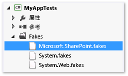
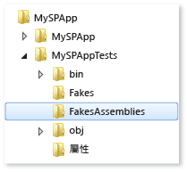

# 使用模擬器來隔離 Sharepoint 2010 應用程式的單元測試
[!INCLUDE[vs2017banner](../code-quality/includes/vs2017banner.md)]

Microsoft.SharePoint.Emulators 套件提供一組程式庫，可協助您建立 Microsoft SharePoint 2010 應用程式的隔離單元測試。  模擬器會使用來自 [Microsoft Fakes](../test/isolating-code-under-test-with-microsoft-fakes.md) 隔離架構的[填充碼](../test/using-shims-to-isolate-your-application-from-other-assemblies-for-unit-testing.md)建立輕量型記憶體內部物件，用於模仿 SharePoint 應用程式開發介面最常見的物件和方法。  沒有模擬 SharePoint 方法或要變更模擬器的預設行為時，則可以建立 Fakes 填充碼提供您想要的結果。  
  
 現有的測試方法和類別可以輕鬆轉換成在模擬器內容中執行。  這項功能可讓您建立兩用測試。  兩用測試可在針對真正的 SharePoint 應用程式開發介面之整合測試與使用模擬器的隔離單元測試之間切換。  
  
##  <a name="BKMK_In_this_topic"></a> 本主題內容  
 [需求](#BKMK_Requirements)  
  
 [AppointmentsWebPart 範例](#BKMK_The_AppointmentsWebPart_example)  
  
 [轉換現有測試](#BKMK_Converting_an_existing_test)  
  
-   [將模擬器封裝加入至測試專案](#BKMK_Adding_the_Emulators_package_to_a_test_project)  
  
-   [使用模擬執行測試方法](#BKMK__Running_a_test_method_in_the_emulation_context)  
  
 [建立兩用類別和方法](#BKMK_Creating_dual_use_classes_and_methods)  
  
 [使用 TestInitialize 和 TestCleanup 屬性建立兩用測試類別](#BKMK_Using_TestInitialize_and_TestCleanup_attributes_to_create_a_dual_use_test_class)  
  
 [處理非模擬的 SharePoint 方法](#BKMK_Handling_non_emulated_SharePoint_methods)  
  
 [從頭開始撰寫模擬測試和摘要](#BKMK_Writing_emulation_tests_from_scratch__and_a_summary)  
  
 [範例](#BKMK_Example)  
  
 [模擬的 SharePoint 型別](#BKMK_Emulated_SharePoint_types)  
  
##  <a name="BKMK_Requirements"></a> 需求  
  
-   Microsoft SharePoint 2010 \(SharePoint 2010 Server 或 SharePoint 2010 Foundation\)  
  
-   Microsoft Visual Studio Enterprise  
  
-   Microsoft SharePoint 模擬器 NuGet 套件  
  
 您也應該要熟悉 [Visual Studio 中單元測試的基本概念](../test/unit-test-basics.md)和 [Microsoft Fakes](../test/isolating-code-under-test-with-microsoft-fakes.md) 的一些知識。  
  
##  <a name="BKMK_The_AppointmentsWebPart_example"></a> AppointmentsWebPart 範例  
 AppointmentsWebPart 會讓您檢視和管理約會的 SharePoint 清單。  
  
   
  
 在本範例中，我們將測試 Web 組件的兩個方法：  
  
-   `ScheduleAppointment` 方法會驗證傳遞至此方法的清單項目值，並在指定的 SharePoint 網站上建立清單中的新項目。  
  
-   `GetAppointmentsForToday` 方法會傳回今天約會的詳細資料。  
  
 [本主題內容](#BKMK_In_this_topic)  
  
##  <a name="BKMK_Converting_an_existing_test"></a> 轉換現有測試  
 在 SharePoint 元件中方法的一般測試，此測試方法會在 SharePoint Foundation 中建立暫存網站，並將 SharePoint 元件加入受測程式碼所需的網站。  此測試方法接著會建立該元件的執行個體並加以執行。  在測試結束時，會終止此站台。  
  
 受測程式碼的 `ScheduleAppointment` 方法可能是第一次為元件撰寫的其中一個方法：  
  
```  
// method under test  
public bool ScheduleAppointment(SPWeb web, string listName, string name,   
    string phone, string email, string age, DateTime date, out string errorMsg)  
{  
    errorMsg = string.Empty;  
    var badFormat = this.checkInput(name, phone, email, age);  
    if (badFormat)  
    {  
        errorMsg = "Bad Format";  
        return false;  
    }  
    var exists = this.CheckDuplicate(listName, web, name, phone, email, age, date);  
    if (exists)  
    {  
        errorMsg = "Item already exists";  
        return false;  
    }  
    SPListItemCollection items = web.Lists[listName].Items;  
    // create item and populate fields  
    SPListItem item = items.Add();  
    item["Name"] = name;  
    item["Phone"] = phone;  
    item["Email"] = email;  
    item["Age"] = age;  
    item["Date"] = date.ToString("D");  
    item.Update();  
    return true;  
}  
  
```  
  
 `ScheduleAppointment` 方法中的第一個功能測試可能看起來如下：  
  
```c#  
  
[TestMethod]  
public void ScheduleAppointmentReturnsTrueWhenNewAppointmentIsCreated()  
{  
    using( var site = new SPSite("http://localhost"))  
    using (var webPart = new BookAnAppointmentWebPart())  
    {  
        // Arrange  
        string errorMsg = string.Empty;  
        DateTime date = DateTime.Now;  
        SPList list = AddListToSiteHelper(site);  
  
        // Act  
        bool success = webPart.ScheduleAppointment(site.RootWeb, list.Title,  
            "Raisa Pokrovskaya", "425-555-0163", "raisa@outlook.com", "55", date,   
            out errorMsg);  
        list.Delete();  
  
        // Assert  
        Assert.IsTrue(success);  
    }  
}  
```  
  
 雖然這個測試方法會驗證 `ScheduleAppointment` 方法是否正確地將新項目加入清單，但它比較像是 Web 組件的整合測試，而不僅用於測試程式碼特定行為的測試。  對 SharePoint 與 SharePoint 應用程式開發介面的外部相依性，可能因為 `ScheduleAppointment` 方法中使用者程式碼以外的原因，而導致測試失敗。  建立和終結 SharePoint 網站的額外負荷也可能會讓測試變得太慢，而無法當做編碼過程的一般階段來執行。  針對每個測試方法執行網站設定和解構，只會使建立有效率之開發人員單元測試的問題更加複雜。  
  
 Microsoft SharePoint 模擬器提供一組物件和方法 "doubles"，模仿最常見的 SharePoint 應用程式開發介面之行為。  模擬的方法是不需要 SharePoint 執行之 SharePoint 應用程式開發介面的輕量型實作。  使用 Microsoft Fakes 將對 SharePoint 應用程式開發介面的呼叫繞道至 SharePoint 模擬器的 doubles 方法，可以隔離您的測試，並確定只測試您想要的程式碼。  當您呼叫沒有模擬的 SharePoint 方法時，可以直接使用 Fakes 建立所需的行為。  
  
 [本主題內容](#BKMK_In_this_topic)  
  
###  <a name="BKMK_Adding_the_Emulators_package_to_a_test_project"></a> 將模擬器封裝加入至測試專案  
 若要將 SharePoint 模擬器加入測試專案：  
  
1.  在 \[方案總管\] 中選取測試專案。  
  
2.  選擇捷徑功能表上的 \[管理 NuGet 套件...\]。  
  
3.  搜尋 `Microsoft.SharePoint.Emulators` 的 \[線上\] 分類，然後選擇 \[安裝\]。  
  
   
  
 [本主題內容](#BKMK_In_this_topic)  
  
###  <a name="BKMK__Running_a_test_method_in_the_emulation_context"></a> 使用模擬執行測試方法  
 安裝此套件會將參考加入您的專案之必要程式庫中。  若要在現有的測試類別中輕鬆使用模擬器，請加入命名空間 `Microsoft.SharePoint.Emulators` 和 `Microsoft.QualityTools.Testing.Emulators`。  
  
 若要在測試方法中啟用模擬，請將方法主體包裝在建立 `SharePointEmulationScope` 物件的 `using` 陳述式中。  例如:  
  
```c#  
  
[TestMethod]  
public void ScheduleAppointmentReturnsTrueWhenNewAppointmentIsCreated()  
{  
    // create the emulation scope with a using statement  
    using (new SharePointEmulationScope())  
    using( var site = new SPSite("http://localhost"))  
    using (var webPart = new BookAnAppointmentWebPart())  
    {  
        // Arrange  
        string errorMsg = string.Empty;  
        DateTime date = DateTime.Now;  
        SPList list = AddListToSiteHelper(site);  
  
        // Act  
        bool success = webPart.ScheduleAppointment(site.RootWeb, list.Title,  
            "Raisa Pokrovskaya", "425-555-0163", "raisa@outlook.com", "55", date,   
            out errorMsg);  
        list.Delete();  
  
        // Assert  
        Assert.IsTrue(success);  
    }  
}  
  
```  
  
 當測試方法執行時，此模擬器執行階段會呼叫 Microsoft Fakes，將程式碼動態插入至 SharePoint 方法，藉此將對這些方法的呼叫轉向至 Microsoft.SharePoint.Fakes.dll 中宣告的委派。  Microsoft.SharePoint.Emulators.dll 會實作模擬方法的委派，仔細模仿實際的 SharePoint 行為。  當測試方法或受測元件呼叫 SharePoint 方法時，產生的行為是模擬的行為。  
  
   
  
 [本主題內容](#BKMK_In_this_topic)  
  
##  <a name="BKMK_Creating_dual_use_classes_and_methods"></a> 建立兩用類別和方法  
 若要建立方法，同時用於真正 SharePoint 應用程式開發介面的整合測試與使用模擬器的隔離單元測試，請使用多載建構函式 `SharePointEmulationScope(EmulationMode)` 包裝測試方法程式碼。  `EmulationMode` 列舉的兩個值指定此範圍是否使用模擬器 \(`EmulationMode.Enabled`\) 或者此範圍是否使用 SharePoint 應用程式開發介面 \(`EmulationMode.Passthrough`\)。  
  
 例如，以下說明如何修改前一項測試使其變成兩用：  
  
```c#  
  
// class level field specifies emulation mode  
private const EmulationMode emulatorMode = EmulationMode.Enabled;  
  
[TestMethod]  
public void ScheduleAppointmentReturnsTrueWhenNewAppointmentIsCreated()  
{  
    // emulation scope determined by emulatorMode  
    using( SharePointEmulationScope(emulatorMode))  
    using( var site = new SPSite("http://localhost"))  
    using (var webPart = new BookAnAppointmentWebPart())  
    {  
        // Arrange  
        string errorMsg = string.Empty;  
        DateTime date = DateTime.Now;  
        SPList list = AddListToSiteHelper(site);  
  
        // Act  
        bool success = webPart.ScheduleAppointment(site.RootWeb, list.Title,  
            "Raisa Pokrovskaya", "425-555-0163", "raisa@outlook.com", "55", date,   
            out errorMsg);  
        list.Delete();  
  
        // Assert  
        Assert.IsTrue(success);  
    }  
}  
```  
  
 [本主題內容](#BKMK_In_this_topic)  
  
##  <a name="BKMK_Using_TestInitialize_and_TestCleanup_attributes_to_create_a_dual_use_test_class"></a> 使用 TestInitialize 和 TestCleanup 屬性建立兩用測試類別  
 如果您使用 `SharePointEmulationScope` 執行類別中的所有或大部分測試，就可以利用類別層級技術設定模擬模式。  
  
-   以 <xref:Microsoft.VisualStudio.TestTools.UnitTesting.TestInitializeAttribute> 和 <xref:Microsoft.VisualStudio.TestTools.UnitTesting.TestCleanupAttribute> 屬性化的測試類別方法可以建立和終結此範圍。  
  
-   在類別層級設定 `EmulationMode` 可讓您自動化 `EmulationMode.Enabled` 和 `EmulationMode.Passthrough` 之間的模式變更。  
  
 屬性為 `[TestInitialize]` 的類別方法會在每個測試方法的開頭執行，屬性為 `[TestCleanup]` 的方法則在每個測試方法的結束執行。  您可以在類別層級宣告 `SharePointEmulationScope` 物件的私用欄位，在 `TestInitialize` 屬性方法中初始化，然後在 `TestCleanup` 屬性化方法中處置物件。  
  
 您可以使用任何您選擇用來自動化 `EmulationMode` 選取的方法。  其中一種方式為使用前置處理器指示詞檢查符號的存在。  例如，若要使用模擬器在類別中執行測試方法，您可以在測試專案檔或建置命令列中定義符號 \(如 `USE_EMULATION`\)。  如果已定義符號，則會宣告類別層級 `EmulationMode` 常數，並將其設定為 `Enabled`。  否則，會將此常數設定為 `Passthrough`。  
  
 這裡提供測試類別的範例，示範如何使用前置處理器指示詞及 `TestInitialize` 和 `TestCleanup` 屬性方法設定模擬模式。  
  
```c#  
//namespace declarations  
...  
  
namspace MySPAppTests   
{  
    [TestClass]  
    public class BookAnAppointmentWebPartTests  
    {  
  
        // emulationScope is a class level field  
        private SharePointEmulationScope emulationScope;  
  
        // preprocessor directives determine the value of emulatorMode  
        #if USE_EMULATION private const EmulationMode emulatorMode = EmulationMode.Enabled; #else private const EmulationMode emulatorMode = EmulationMode.Passthrough; #endif  
  
        // InitializeTest sets the emulation scope at the beginning of each test method  
        [TestInitialize] public void InitializeTest() { this.emulationScope = new SharePointEmulationScope(emulatorMode); }  
  
        // CleanupTest disposes the emulation scope at the end of each test method  
        [TestCleanup] public void CleanupTest() { this.emulationScope.Dispose(); }  
  
        [TestMethod]  
        public void ScheduleAppointmentReturnsTrueWhenNewAppointmentIsCreated()  
        {  
            // remove the SharePointEmulationScope using statement from the method  
            using( var site = new SPSite("http://localhost"))  
            using (var webPart = new BookAnAppointmentWebPart())  
            {  
                // Arrange  
                string errorMsg = string.Empty;  
                DateTime date = DateTime.Now;  
                SPList list = AddListToSiteHelper(site);  
  
                // Act  
                bool success = webPart.ScheduleAppointment(site.RootWeb, list.Title,  
                    "Raisa Pokrovskaya", "425-555-0163", "raisa@outlook.com", "55", date,   
                    out errorMsg);  
                list.Delete()  
  
                // Assert  
                Assert.IsTrue(success);  
            }  
        }  
  
        ...// More tests  
  
    }  
}  
  
```  
  
 [本主題內容](#BKMK_In_this_topic)  
  
##  <a name="BKMK_Handling_non_emulated_SharePoint_methods"></a> 處理非模擬的 SharePoint 方法  
 並非所有的 SharePoint 類型都是模擬的，而且在某些模擬類型中的方法並非都是模擬的。  如果正在進行測試的程式碼呼叫未模擬的 SharePoint 方法，則此方法會擲回 `NotSupportedException` 例外狀況。  當例外狀況發生時，您要加入此 SharePoint 方法的 Fakes 填充碼。  
  
 **設定 Sharepoint Fakes**  
  
 若要明確呼叫 Microsoft Fakes 填充碼：  
  
1.  如果您要使用未模擬之 SharePoint 類別的填充碼，請編輯 Microsoft.SharePoint.fakes 檔，並將此類別加入填充類別清單。  請參閱 [Microsoft Fakes 中的程式碼產生、編譯和命名慣例](../test/code-generation-compilation-and-naming-conventions-in-microsoft-fakes.md)的[設定虛設常式和填充碼的程式碼產生](http://msdn.microsoft.com/library/hh708916.aspx#bkmk_configuring_code_generation_of_stubs)一節。  
  
       
  
2.  在您安裝 Microsoft SharePoint 模擬器套件之後，以及如果您編輯了 Microsoft.SharePoint.Fakes 檔案，請重建此測試專案至少一次。  建置此專案會在磁碟上專案根資料夾中建立 **FakesAssembly** 資料夾並予以填入。  
  
       
  
3.  請將參考加入位於 **FakesAssembly** 資料夾中的 **Microsoft.SharePoint.14.0.0.0.Fakes.dll** 組件。  
  
4.  \(選擇性\) 加入 `Microsoft.QualityTools.Testing.Fakes`、`Microsoft.SharePoint.Fakes` 和您要使用的 `Microsoft.SharePoint.Fakes` 之任何巢狀命名空間的測試類別命名空間指示詞。  
  
 **實作 SharePoint 方法的填充碼委派**  
  
 在範例專案中，`GetAppointmentsForToday` 方法會呼叫 [SPList.GetItems\(SPQuery\)](http://msdn.microsoft.com/library/ms457534.aspx) SharePoint 應用程式開發介面方法。  
  
```c#  
// method under test  
public string GetAppointmentsForToday(string listName, SPWeb web)  
{  
    SPList list = web.Lists[listName];  
    DateTime today = DateTime.Now;  
    var listQuery = new SPQuery { Query = String.Format( "<Where><Eq><FieldRef Name='Date'/>" + "<Value Type='Text'>{0}</Value>" + "</Eq></Where>", today.ToString("D")) };  
    var result = new System.Text.StringBuilder();  
    foreach (SPListItem item in list.GetItems(listQuery))  
    {  
        result.AppendFormat("Name: {0}, Phone: {1}, Email: {2}, Age: {3}, Date: {4}\n",   
            item["Name"], item["Phone"], item["Email"], item["Age"], item["Date"]);  
    }  
    return result.ToString();  
}  
  
```  
  
 多載 `GetItems` 方法的 `SPList.GetItems(SPQuery)` 版本不是模擬的。  因此，將 `GetAppointmentsForToday` 的現有測試包裝在 `SharePoint.Emulation.Scope` 中會失敗。  若要建立可執行的測試，您必須撰寫會傳回要測試之結果的 Fakes 委派 `ShimSPList.GetItemsSPQuery` 實作。  
  
 以下是現有測試方法 `GetAppointmentsForTodayReturnsOnlyTodaysAppointments` 的修改，會實作 Fakes 委派。  必要的變更會在註解中叫出：  
  
> [!IMPORTANT]
>  在 `EmulationMode.Passthrough` 內容中執行測試時，明確建立 Fakes 填充碼的測試方法會擲回 `ShimNotSupported` 例外狀況。  若要避免這個問題，請使用變數設定 `EmulationMode` 值，並將任何 Fakes 程式碼包裝在測試該值的 `if` 陳述式中。  
  
```c#  
// class level field to set emulation mode  
private const EmulationMode emulatorMode = EmulationMode.Enabled  
  
[TestMethod]  
public void GetAppointmentsForTodayReturnsOnlyTodaysAppointments()  
{  
  
    // create the emulation scope with a using statement  
    using (var emulationScope = new SharePointEmulationScope(emulatorMode))  
    using( var site = new SPSite("http://localhost"))  
    using (var webPart = new BookAnAppointmentWebPart())  
    {  
        // Arrange  
        DateTime date = DateTime.Now;  
        SPList list = AddListToSiteHelper(site);  
        // insert 2 items into list  
        AddItemsToListHelper(list, new string[] {"Raisa Pokrovskaya", "425-555-0163",  
            "raisa@outlook.com", "55", date.ToString("D") });  
        AddItemsToListHelper(list, new string[] {"Francis Totten", "313-555-0100",  
            "francis@contoso.com", "42", date.AddDays(1).ToString("D") });  
  
        // use Fakes shims only if emulation is enabled  
        if (emulatorMode == EmulationMode.Enabled) { var sList = new ShimSPList(list); sList.GetItemsSPQuery = (query) => { var shim = new ShimSPListItemCollection(); shim.Bind(new[] { list.Items[0] }); return shim.Instance; } }  
  
        // Act  
        string result = webPart.GetAppointmentsForToday(list.Title, site.RootWeb);  
        list.Delete();  
  
        // Assert  
        Assert.IsTrue(result.Contains(String.Format(  
            "Name: Raisa Pokrovskaya, Phone: 425-555-0163, Email: raisa@outlook.com," +  
            "Age: 55, Date: {0}", date.ToString("D"))));  
        Assert.IsFalse(result.Contains("Name: Francis Totten"));  
    }  
}  
  
```  
  
 在此方法中，我們先測試模擬是否已啟用。  如果已啟用，則我們會為 `SPList` 清單建立 Fakes 填充碼物件，然後建立方法並將它指派給其 `GetItemsSPQuery` 委派。  此委派會使用 Fakes `Bind` 方法，將正確的清單項目加入傳回給呼叫端的 `ShimSPListItemCollection`。  
  
 [本主題內容](#BKMK_In_this_topic)  
  
##  <a name="BKMK_Writing_emulation_tests_from_scratch__and_a_summary"></a> 從頭開始撰寫模擬測試和摘要  
 雖然先前章節描述的建立模擬和兩用測試的技術假設您要轉換現有的測試，但您也可以使用這些技術從頭開始撰寫測試。  下列清單摘要說明這些技術：  
  
-   若要在測試專案中使用模擬器，請將 Microsoft.SharePoint.Emulators NuGet 套件加入到該專案。  
  
-   若要在測試方法中使用模擬器，請在該方法的開頭建立 `SharePointEmulationScope` 物件。  會模擬所有支援的 SharePoint 應用程式開發介面，直到已處置此範圍為止。  
  
-   撰寫您的測試程式碼，就如同您針對實際的 SharePoint 應用程式開發介面撰寫測試程式碼一樣。  模擬內容會自動將至 SharePoint 方法的呼叫繞道至其模擬器。  
  
-   並非所有的 SharePoint 物件都是模擬的，而且某些模擬物件的方法並非都是模擬的。  當您使用非模擬物件或方法時，就會擲回 `NotSupportedException` 例外狀況。  如果發生這種情況，請明確建立此方法的 Fakes 填充碼委派，以傳回必要的行為。  
  
-   若要建立兩用測試，請使用 `SharePointEmulationScope(EmulationMode)` 建構函式建立模擬範圍物件。  `EmulationMode` 值會指定要模擬 SharePoint 呼叫，還是針對實際 SharePoint 網站執行該呼叫。  
  
-   如果測試類別中的全部或大部分測試方法都是在模擬內容中執行，則您可以使用類別層級的 `TestInitialize` 屬性方法建立 `SharePointEmulationScope` 物件，以及使用類別層級欄位來設定模擬模式。  這會幫助您自動變更模擬模式。  然後使用 `TestCleanup` 屬性方法處置此範圍物件。  
  
 [本主題內容](#BKMK_In_this_topic)  
  
##  <a name="BKMK_Example"></a> 範例  
 以下是合併上述各項 SharePoint 模擬器技術的最後一個範例：  
  
```c#  
using System;   
//other namespace declarations  
...   
// code under test  
using MySPApps;  
using Microsoft.SharePoint;  
// unit testing and emulators  
using Microsoft.VisualStudio.TestTools.UnitTesting;  
using Microsoft.QualityTools.Testing.Emulators;  
using Microsoft.SharePoint.Emulators;  
// explicit Fakes shims  
using Microsoft.QualityTools.Testing.Fakes;  
using Microsoft.SharePoint.Fakes  
  
namspace MySPAppTests   
{  
    [TestClass]  
    public class BookAnAppointmentWebPartTests  
    {  
  
        // emulationScope is a class level field  
        private SharePointEmulationScope emulationScope;  
  
        // preprocessor directives determine the value of emulatorMode  
        #if USE_EMULATION  
            private const EmulationMode emulatorMode = EmulationMode.Enabled;  
        #else  
            private const EmulationMode emulatorMode = EmulationMode.Passthrough;  
        #endif  
  
        // InitializeTest sets the emulation scope at the beginning of each test method  
        [TestInitialize]  
        public void InitializeTest()  
        {  
            this.emulationScope = new SharePointEmulationScope(emulatorMode);  
        }  
  
        // CleanupTest disposes the emulation scope at the end of each test method  
        [TestCleanup]  
        public void Cleanup()  
        {  
            this.emulationScope.Dispose();  
        }  
  
        [TestMethod]  
        public void ScheduleAppointmentReturnsTrueWhenNewAppointmentIsCreated()  
        {  
            // remove the SharePointEmulationScope using statement from the method  
            using( var site = new SPSite("http://localhost"))  
            using (var webPart = new BookAnAppointmentWebPart())  
            {  
                // Arrange  
                string errorMsg = string.Empty;  
                DateTime date = DateTime.Now;  
                SPList list = AddListToSiteHelper(site);  
  
                // Act  
                bool success = webPart.ScheduleAppointment(site.RootWeb, list.Title,  
                    "Raisa Pokrovskaya", "425-555-0163", "raisa@outlook.com", "55", date,   
                    out errorMsg);  
                list.Delete()  
  
                // Assert  
                Assert.IsTrue(success);  
            }  
        }  
  
        [TestMethod]  
        public void GetAppointmentsForTodayReturnsOnlyTodaysAppointments()  
        {  
  
            // remove the SharePointEmulationScope using statement from the method  
            using( var site = new SPSite("http://localhost"))  
            using (var webPart = new BookAnAppointmentWebPart())  
            {  
                // Arrange  
                DateTime date = DateTime.Now;  
                SPList list = AddListToSiteHelper(site);  
                // insert 2 items into list  
                AddItemsToListHelper(list, new string[] {"Raisa Pokrovskaya", "425-555-0163",  
                    "raisa@outlook.com", "55", date.ToString("D") });  
                AddItemsToListHelper(list, new string[] {"Francis Totten", "313-555-0100",  
                    "francis@contoso.com", "42", date.AddDays(1).ToString("D") });  
  
                // use Fakes shims only if emulation is enabled  
                if (emulatorMode == EmulationMode.Enabled)  
                {  
                    var sList = new ShimSPList(list);  
  
                    sList.GetItemsSPQuery = (query) =>  
                    {  
                        var shim = new ShimSPListItemCollection();  
                        shim.Bind(new[] { list.Items[0] });  
                        return shim.Instance;  
                    }  
                }  
  
                // Act  
                string result = webPart.GetAppointmentsForToday(list.Title, site.RootWeb);  
                list.Delete();  
  
                // Assert  
                Assert.IsTrue(result.Contains(String.Format(  
                    "Name: Raisa Pokrovskaya, Phone: 425-555-0163, Email: raisa@outlook.com," +  
                    "Age: 55, Date: {0}", date.ToString("D"))));  
                Assert.IsFalse(result.Contains("Name: Francis Totten"));  
            }  
        }  
  
        ...// More tests  
  
    }  
}  
  
```  
  
##  <a name="BKMK_Emulated_SharePoint_types"></a> 模擬的 SharePoint 型別  
 [Microsoft.SharePoint.SPField](http://msdn.microsoft.com/library/Microsoft.SharePoint.SPField)  
  
 [Microsoft.SharePoint.SPFieldIndex](http://msdn.microsoft.com/library/Microsoft.SharePoint.SPFieldIndex)  
  
 [Microsoft.SharePoint.SPFieldIndexCollection](http://msdn.microsoft.com/library/Microsoft.SharePoint.SPFieldIndexCollection)  
  
 [Microsoft.SharePoint.SPFieldLink](http://msdn.microsoft.com/library/Microsoft.SharePoint.SPFieldLink)  
  
 [Microsoft.SharePoint.SPFieldLinkCollection](http://msdn.microsoft.com/library/Microsoft.SharePoint.SPFieldLinkCollection)  
  
 [Microsoft.SharePoint.SPFieldUrlValue](http://msdn.microsoft.com/library/Microsoft.SharePoint.SPFieldUrlValue)  
  
 [Microsoft.SharePoint.SPFile](http://msdn.microsoft.com/library/Microsoft.SharePoint.SPFile)  
  
 [Microsoft.SharePoint.SPFileCollection](http://msdn.microsoft.com/library/Microsoft.SharePoint.SPFileCollection)  
  
 [Microsoft.SharePoint.SPFolder](http://msdn.microsoft.com/library/Microsoft.SharePoint.SPFolder)  
  
 [Microsoft.SharePoint.SPFolderCollection](http://msdn.microsoft.com/library/Microsoft.SharePoint.SPFolderCollection)  
  
 [Microsoft.SharePoint.SPItem](http://msdn.microsoft.com/library/Microsoft.SharePoint.SPItem)  
  
 [Microsoft.SharePoint.SPItemEventDataCollection](http://msdn.microsoft.com/library/Microsoft.SharePoint.SPItemEventDataCollection)  
  
 [Microsoft.SharePoint.SPItemEventProperties](http://msdn.microsoft.com/library/Microsoft.SharePoint.SPItemEventProperties)  
  
 [Microsoft.SharePoint.SPList](http://msdn.microsoft.com/library/Microsoft.SharePoint.SPList)  
  
 [Microsoft.SharePoint.SPListCollection](http://msdn.microsoft.com/library/Microsoft.SharePoint.SPListCollection)  
  
 [Microsoft.SharePoint.SPListEventProperties](http://msdn.microsoft.com/library/Microsoft.SharePoint.SPListEventProperties)  
  
 [Microsoft.SharePoint.SPListItem](http://msdn.microsoft.com/library/Microsoft.SharePoint.SPListItem)  
  
 [Microsoft.SharePoint.SPListItemCollection](http://msdn.microsoft.com/library/Microsoft.SharePoint.SPListItemCollection)  
  
 [Microsoft.SharePoint.SPQuery](http://msdn.microsoft.com/library/Microsoft.SharePoint.SPQuery)  
  
 [Microsoft.SharePoint.SPRoleAssignment](http://msdn.microsoft.com/library/Microsoft.SharePoint.SPRoleAssignment)  
  
 [Microsoft.SharePoint.SPRoleAssignmentCollection](http://msdn.microsoft.com/library/Microsoft.SharePoint.SPRoleAssignmentCollection)  
  
 [Microsoft.SharePoint.SPSecurableObject](http://msdn.microsoft.com/library/Microsoft.SharePoint.SPSecurableObject)  
  
 [Microsoft.SharePoint.SPSecurity](http://msdn.microsoft.com/library/Microsoft.SharePoint.SPSecurity)  
  
 [Microsoft.SharePoint.SPSite](http://msdn.microsoft.com/library/Microsoft.SharePoint.SPSite)  
  
 [Microsoft.SharePoint.SPUser](http://msdn.microsoft.com/library/Microsoft.SharePoint.SPUser)  
  
 [Microsoft.SharePoint.SPUserCollection](http://msdn.microsoft.com/library/Microsoft.SharePoint.SPUserCollection)  
  
 [Microsoft.SharePoint.SPView](http://msdn.microsoft.com/library/Microsoft.SharePoint.SPView)  
  
 [Microsoft.SharePoint.SPViewCollection](http://msdn.microsoft.com/library/Microsoft.SharePoint.SPViewCollection)  
  
 [Microsoft.SharePoint.SPViewContext](http://msdn.microsoft.com/library/Microsoft.SharePoint.SPViewContext)  
  
 [Microsoft.SharePoint.SPWeb](http://msdn.microsoft.com/library/Microsoft.SharePoint.SPWeb)  
  
 [Microsoft.SharePoint.SPWebCollection](http://msdn.microsoft.com/library/Microsoft.SharePoint.SPWebCollection)  
  
 [本主題內容](#BKMK_In_this_topic)  
  
## 請參閱  
 [對程式碼進行單元測試](../test/unit-test-your-code.md)   
 [使用自動程式碼 UI 測試來測試 SharePoint 2010 應用程式](../test/testing-sharepoint-2010-applications-with-coded-ui-tests.md)   
 [對 SharePoint 2010 和 2013 應用程式執行 Web 效能和負載測試](/devops-test-docs/test/web-performance-and-load-testing-sharepoint-2010-and-2013-applications)   
 [Developing SharePoint Solutions](/office-dev/office-dev/developing-sharepoint-solutions)