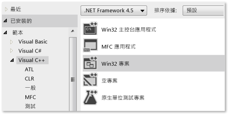
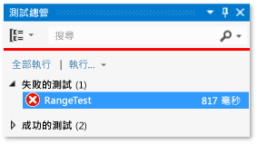
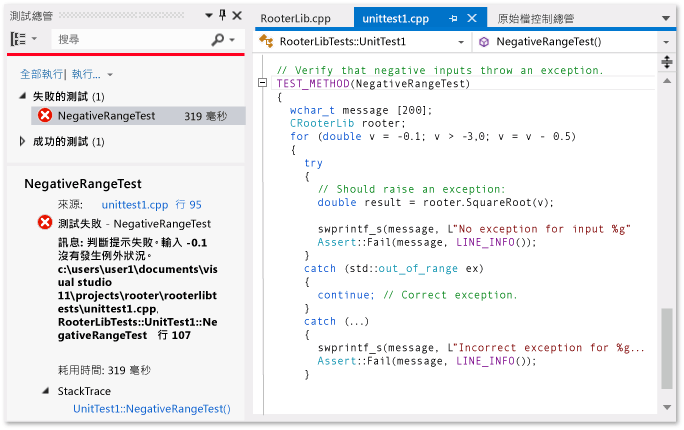
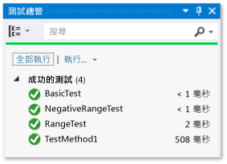

# <a name="writing-unit-tests-for-cc-with-the-microsoft-unit-testing-framework-for-c"></a>使用適用於 C++ 的 Microsoft 單元測試架構撰寫適用於 C/C++ 的單元測試
在 Visual Studio 中，您可以為以 C++ 撰寫的 Unmanaged 程式碼建立單元測試。 Unmanaged 程式碼有時是指原生程式碼。  
  
 下列程序包含可協助您開始進行的重要資訊。 後續章節提供的逐步解說將詳細說明這些步驟。  
  
### <a name="to-write-unit-tests-for-an-unmanaged-code-dll"></a>為 Unmanaged 程式碼 DLL 撰寫單元測試  
  
1.  使用 [原生測試專案]  範本，為您的測試建立個別的 Visual Studio 專案。  
  
     專案中包含一些範例測試程式碼。  
  
2.  讓測試專案能夠存取 DLL：  
  
    -   `#include` 一個 `.h` 檔案，該檔案中包含 DLL 可外部存取函式的宣告。  
  
         `.h` 檔案應包含標記 `_declspec(dllimport)` 的函式宣告。 或者，您可以使用 .DEF 檔案來匯出方法。 如需詳細資訊，請參閱[匯入及匯出](/cpp/build/importing-and-exporting)。  
  
         單元測試只能存取從受測試之 DLL 匯出的函式。  
  
    -   將 DLL 專案加入測試專案的參考中：  
  
         在測試專案的 [屬性]  中，展開 [通用屬性] 、[架構和參考] ，然後選擇 [加入參考] 。  
  
3.  在測試專案中，透過下列方式使用 TEST 巨集和 Assert 類別建立測試類別和測試方法：  
  
    ```cpp  
    #include "stdafx.h"  
    #include <CppUnitTest.h>  
    #include "..\MyProjectUnderTest\MyCodeUnderTest.h"  
    using namespace Microsoft::VisualStudio::CppUnitTestFramework;  
    TEST_CLASS(TestClassName)  
    {  
    public:  
      TEST_METHOD(TestMethodName)  
      {  
        // Run a function under test here.  
        Assert::AreEqual(expectedValue, actualValue, L"message", LINE_INFO());  
      }  
    }  
    ```  
  
    -   `Assert` 包含數個靜態函式，可讓您用來驗證測試結果。  
  
    -   `LINE_INFO()` 是選擇性參數。 若沒有 PDB 檔案，它可以讓測試執行器識別失敗的位置。  
  
    -   您也可以撰寫測試設定和清除方法。 如需詳細資訊，請開啟 `TEST_METHOD` 巨集的定義，並參閱 CppUnitTest.h 中的註解。  
  
    -   您不能巢狀設定測試類別。  
  
4.  使用測試總管來執行測試：  
  
    1.  在 [ **檢視** ] 功能表上，選擇 [ **其他視窗**]、[ **測試總管**]。  
  
    2.  建置 Visual Studio 方案。  
  
    3.  在 [測試總管] 中，選擇 [ **全部執行**]。  
  
    4.  若要在測試總管中詳細調查任何測試：  
  
        1.  選取要查看更多詳細資訊的測試名稱，例如失敗訊息和堆疊追蹤。  
  
        2.  開啟測試名稱 (例如按兩下)，以前往失敗位置或測試程式碼。  
  
        3.  在測試的捷徑功能表上，選擇 [偵錯選取的測試]  ，以在偵錯工具中執行測試。  
  
##  <a name="walkthrough"></a> 逐步解說：使用測試總管來開發 Unmanaged DLL  
 您可以調整此逐步解說來開發您自己的 DLL。 主要步驟如下所示：  
  
1.  [建立原生測試專案](#unitTestProject)。 測試會建立在個別的專案中，與您所開發的 DLL 不同。  
  
2.  [建立 DLL 專案](#createDllProject)。 此逐步解說會建立新的 DLL，但是測試現有 DLL 的程序很相似。  
  
3.  [讓測試能夠看到 DLL 函式](#coupleProjects)。  
  
4.  [反覆擴大測試範圍](#iterate)。 建議您使用由測試所引導之程式碼開發的「紅-綠-重構」循環。  
  
5.  [偵錯導致失敗的測試](#debug)。 您可以在偵錯模式下執行測試。  
  
6.  [在測試保持不變的情況下重構](#refactor)。 重構代表改善程式碼的結構，而不會變更其外部行為。 這麼做可以改善程式碼的效能、擴充性或可讀性。 由於目的並不是要變更行為，所以當您對程式碼進行重構變更時，不會變更測試。 測試有助於確保進行重構時不會產生 Bug。 因此，當您進行這類變更時，會比沒有測試時更具信心。  
  
7.  [檢查涵蓋範圍](https://msdn.microsoft.com/en-us/library/fc8hec9e.aspx)。 單元測試運用愈多程式碼，就愈有用。 您可以探索測試曾經使用過程式碼的哪些部分。  
  
8.  [將單元與外部資源隔離](https://msdn.microsoft.com/library/hh549174.aspx)。 一般而言，DLL 相依於您開發之系統的其他元件，例如其他 DLL、資料庫或遠端子系統。 將每個單元與其相依性隔離，進行獨立測試會很有用。 外部元件可能會使測試執行速度變慢。 在開發期間，其他元件可能並不完整。  
  
###  <a name="unitTestProject"></a> 建立原生單元測試專案  
  
1.  在 [檔案]  功能表上，依序選擇 [新增] 和 [專案] 。  
  
     在對話方塊中，依序展開 [已安裝] 、[範本] 、[Visual C++] 、[測試] 。  
  
     選擇 [原生測試專案]  範本。  
  
     在此逐步解說中，測試專案名為 `NativeRooterTest`。  
  
       
  
2.  在新的專案中，檢查 **unittest1.cpp**  
  
       
  
     請注意：  
  
    -   每項測試都會使用 `TEST_METHOD(YourTestName){...}`來定義。  
  
         您不必撰寫傳統的函式簽章。 簽章會由巨集 TEST_METHOD 建立。 該巨集會產生傳回 void 的執行個體函式。 它也會產生靜態函式，以傳回測試方法的相關資訊。 此資訊可讓測試總管找到該方法。  
  
    -   測試方法會使用 `TEST_CLASS(YourClassName){...}`來分類。  
  
         當測試執行時，就會建立每個測試類別的執行個體。 將會以非指定的順序來呼叫測試方法。 您可以定義在每個模組、類別或方法之前和之後叫用的特殊方法。  
  
3.  確認測試在測試總管中執行：  
  
    1.  插入一些測試程式碼：  
  
        ```cpp  
        TEST_METHOD(TestMethod1)  
        {  
        Assert::AreEqual(1,1);  
        }  
        ```  
  
         請注意， `Assert` 類別提供數個靜態方法，可讓您在測試方法中用來驗證結果。  
  
    2.  在 [測試]  功能表上，選擇 [執行]  、[所有測試] 。  
  
         測試會開始建置及執行。  
  
         [測試總管] 隨即出現。  
  
         此測試會出現在 [通過的測試] 底下。  
  
         ![[單元測試總管] 中有一個測試成功](../test/media/utecpp04.png "UteCpp04")  
  
###  <a name="createDllProject"></a> 建立 Unmanaged DLL 專案  
  
1.  使用 **Win32 Project** 範本來建立 **Visual C++** 專案。  
  
     在此逐步解說中，專案名為 `RootFinder`。  
  
       
  
2.  在 [Win32 應用程式精靈] 中選取 [DLL]  和 [匯出符號]  。  
  
     [匯出符號]  選項會產生方便的巨集，可讓您用來宣告匯出的方法。  
  
     ![[DLL] 和 [匯出符號] 的 C&#43;&#43; 專案精靈設定](../test/media/utecpp06.png "UteCpp06")  
  
3.  在主體 .h 檔案中宣告匯出的函式：  
  
       
  
     宣告子 `__declspec(dllexport)` 會使類別的 public 和 protected 成員顯示在 DLL 外部。 如需詳細資訊，請參閱 [Using dllimport and dllexport in C++ Classes](/cpp/cpp/using-dllimport-and-dllexport-in-cpp-classes)。  
  
4.  在主體 .cpp 檔案中，加入函式的最小主體：  
  
    ```cpp  
    // Find the square root of a number.  
    double CRootFinder::SquareRoot(double v)  
    {  
      return 0.0;  
    }  
    ```  
  
###  <a name="coupleProjects"></a> 將測試專案結合至 DLL 專案  
  
1.  將 DLL 專案加入測試專案的專案參考中：  
  
    1.  開啟測試專案的屬性，然後選擇 [通用屬性] 、[架構和參考] 。  
  
         ![C&#43;&#43; 專案屬性 &#45; [架構和參考]](../test/media/utecpp08.png "UteCpp08")  
  
    2.  選擇 [加入新參考] 。  
  
         在 [加入參考]  對話方塊中，選取 DLL 專案，並選擇 [加入] 。  
  
         ![C&#43;&#43; 專案屬性 &#45; [加入新參考]](../test/media/utecpp09.png "UteCpp09")  
  
2.  在主體單元測試 .cpp 檔案中，加入 DLL 程式碼的 .h 檔案：  
  
    ```cpp  
    #include "..\RootFinder\RootFinder.h"  
    ```  
  
3.  加入使用匯出函式的基本測試：  
  
    ```cpp  
    TEST_METHOD(BasicTest)  
    {  
    CRootFinder rooter;  
    Assert::AreEqual(  
    // Expected value:  
    0.0,   
    // Actual value:  
    rooter.SquareRoot(0.0),   
    // Tolerance:  
    0.01,  
    // Message:  
    L"Basic test failed",  
    // Line number - used if there is no PDB file:  
    LINE_INFO());  
    }  
    ```  
  
4.  建置方案。  
  
     新測試會出現在 [測試總管] 中。  
  
5.  在 [測試總管] 中，選擇 [ **全部執行**]。  
  
       
  
 您已經設定測試和程式碼專案，並確認您可以執行在程式碼專案中執行函式的測試。 現在您可以開始撰寫真正的測試和程式碼。  
  
###  <a name="iterate"></a> 反覆擴大測試範圍並使其通過  
  
1.  加入新的測試：  
  
    ```cpp  
    TEST_METHOD(RangeTest)  
    {  
      CRootFinder rooter;  
      for (double v = 1e-6; v < 1e6; v = v * 3.2)  
      {  
        double actual = rooter.SquareRoot(v*v);  
        Assert::AreEqual(v, actual, v/1000);  
      }  
    }  
    ```  
  
    > [!TIP]
    >  建議您不要變更已通過的測試。 相反地，請加入新的測試，更新程式碼，使測試通過，然後再加入另一個測試，依此類推。  
    >   
    >  當您的使用者變更他們的需求時，請停用已不再正確的測試。 以相同的累加方式，撰寫新的測試，一次使一個測試生效。  
  
2.  建置方案，然後在 [測試總管] 中選擇 [全部執行] 。  
  
     新的測試失敗。  
  
       
  
    > [!TIP]
    >  確認每個測試在您撰寫之後立即失敗。 這樣有助於避免撰寫永遠不會失敗的測試這種易犯的錯誤。  
  
3.  增強受測試的程式碼，使新的測試通過：  
  
    ```cpp  
    #include <math.h>  
    ...  
    double CRootFinder::SquareRoot(double v)  
    {  
      double result = v;  
      double diff = v;  
      while (diff > result/1000)  
      {  
        double oldResult = result;  
        result = result - (result*result - v)/(2*result);  
        diff = abs (oldResult - result);  
      }  
      return result;  
    }  
    ```  
  
4.  建置方案，然後在 [測試總管] 中選擇 [全部執行] 。  
  
     這兩個測試都通過。  
  
       
  
    > [!TIP]
    >  開發程式碼時，一次加入一個測試。 確定所有測試在每次反覆之後都通過。  
  
###  <a name="debug"></a> 對失敗的測試進行偵錯  
  
1.  加入另一個測試：  
  
    ```cpp  
  
    #include <stdexcept>  
    ...  
    // Verify that negative inputs throw an exception.  
    TEST_METHOD(NegativeRangeTest)  
    {  
      wchar_t message[200];  
      CRootFinder rooter;  
      for (double v = -0.1; v > -3.0; v = v - 0.5)  
      {  
        try   
        {  
          // Should raise an exception:  
          double result = rooter.SquareRoot(v);  
  
          _swprintf(message, L"No exception for input %g", v);  
          Assert::Fail(message, LINE_INFO());  
        }  
        catch (std::out_of_range ex)  
        {  
          continue; // Correct exception.  
        }  
        catch (...)  
        {  
          _swprintf(message, L"Incorrect exception for %g", v);  
          Assert::Fail(message, LINE_INFO());  
        }  
      }  
    }  
    ```  
  
2.  建置方案，然後選擇 [全部執行] 。  
  
3.  開啟 (或按兩下) 失敗的測試。  
  
     失敗的判斷提示會反白顯示。 [測試總管] 的詳細資料窗格中會顯示失敗的訊息。  
  
       
  
4.  若要查看測試失敗的原因，請逐步執行函式：  
  
    1.  在 SquareRoot 函式開頭設定中斷點。  
  
    2.  在失敗測試的捷徑功能表上，選擇 [偵錯選取的測試] 。  
  
         當在中斷點停止執行時，逐步執行程式碼。  
  
5.  將程式碼插入您開發的函式中：  
  
    ```cpp  
  
    #include <stdexcept>  
    ...  
    double CRootFinder::SquareRoot(double v)  
    {  
        // Validate parameter:  
        if (v < 0.0)   
        {  
          throw std::out_of_range("Can't do square roots of negatives");  
        }  
  
    ```  
  
6.  現在所有測試都通過了。  
  
       
  
> [!TIP]
>  如果個別測試之間沒有任何相依性，因此可依任意順序執行，請使用工具列上的  切換按鈕，以開啟平行測試的執行。 這可大幅縮短執行所有測試所需的時間。  
  
###  <a name="refactor"></a> 重構程式碼，但不變更測試  
  
1.  簡化 SquareRoot 函式中的主要計算：  
  
    ```  
    // old code:  
    //   result = result - (result*result - v)/(2*result);  
    // new code:  
         result = (result + v/result)/2.0;  
  
    ```  
  
2.  建置方案，然後選擇 [全部執行] ，確定您沒有引入錯誤。  
  
    > [!TIP]
    >  一組良好的單元測試可讓您有信心，當您變更程式碼時，不會引入 Bug。  
    >   
    >  將重構作業與其他變更分開。  
  
## <a name="next-steps"></a>後續步驟  
  
-   **隔離性。** 大部分 DLL 相依於其他子系統，例如資料庫和其他 DLL。 這些其他元件通常會以平行方式開發。 若要在還無法使用其他元件時，允許單元測試，您必須替換模擬或  
  
-   **組建驗證測試。** 您可以依設定的間隔，在小組的組建伺服器上執行測試。 這樣可以確保，當整合數個小組成員的工作時，不會引入 Bug。  
  
-   **簽入測試。** 您可以強制在每位小組成員將程式碼簽入原始檔控制之前，執行某些測試。 一般而言，這是一組完整組建驗證測試的子集。  
  
     您也可以強制規定程式碼涵蓋範圍的最低層級。  
  
## <a name="see-also"></a>另請參閱  
 [將單元測試加入至現有的 C++ 應用程式](../test/unit-testing-existing-cpp-applications-with-test-explorer.md)   
 [使用 Microsoft.VisualStudio.TestTools.CppUnitTestFramework](../test/using-microsoft-visualstudio-testtools-cppunittestframework.md)   
 [Managed/Unmanaged 程式碼互通性概觀](http://msdn.microsoft.com/library/ms973872.aspx)   
 [偵錯機器碼](../debugger/debugging-native-code.md)   
 [逐步解說：建立和使用動態連結程式庫 (C++)](/cpp/build/walkthrough-creating-and-using-a-dynamic-link-library-cpp)   
 [匯入和匯出](/cpp/build/importing-and-exporting)
