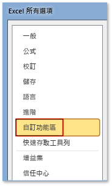

# 如何：在功能區顯示開發人員索引標籤
  若要存取**開發人員** 索引標籤在 Office 應用程式的功能區，您必須將它顯示此索引標籤，因為它不會出現預設設定。 例如，如果您要將 <xref:Microsoft.Office.Tools.Word.GroupContentControl> 加入至 Word 文件層級自訂中，您必須顯示此索引標籤。  
  
> [!NOTE]  
>  本指導僅適用於 Office 2010 或更新版應用程式。 如果您想要在 2007 Microsoft Office System 中顯示此索引標籤，請參閱本主題的下列版本[How to： 在功能區顯示開發人員索引標籤](http://msdn.microsoft.com/library/bb608625(v=vs.90).aspx)。  
  
 [!INCLUDE[appliesto_ribbon](../vsto/includes/appliesto-ribbon-md.md)]  
  
> [!NOTE]  
>  Access 沒有**開發人員** 索引標籤。  
  
### 顯示開發人員索引標籤  
  
1.  啟動本主題支援的任何 Office 應用程式。 請參閱**適用於：**稍早在本主題中的附註。  
  
2.  在**檔案**索引標籤上，選擇**選項** 按鈕。  
  
     下圖顯示**檔案** 索引標籤和**選項**Office 2010 中的按鈕。  
  
     ![選擇 [檔案]，Outlook 2010 中的選項](../vsto/media/vsto-office-file-tab.png "Outlook 2010 中選擇 [檔案]，選項")  
  
     下圖顯示**檔案**Office 2013 中的索引標籤。  
  
     ![Outlook 2013 中的 [檔案] 索引標籤](../vsto/media/vsto-office2013-filetab.png "Outlook 2013 中的 [檔案] 索引標籤")  
  
     下圖顯示**選項**Office 2013 中的按鈕。  
  
     ![Outlook 2013 Preview 中的 [選項] 按鈕](../vsto/media/vsto-office2013-optionsbutton.png "Outlook 2013 Preview 中的 [選項] 按鈕")  
  
3.  在*ApplicationName***選項**對話方塊方塊中，選擇**自訂功能區** 按鈕。  
  
     下圖顯示**選項**對話方塊和**自訂功能區**Excel 2010 中的按鈕。 在本主題頂端附近的「適用於」一節中所列的所有其他應用程式中，此按鈕的位置類似。  
  
       
  
4.  在主要索引標籤的清單中選取**開發人員**核取方塊。  
  
     下圖顯示**開發人員**Word 2010 中的核取方塊和[!INCLUDE[Word_15_short](../vsto/includes/word-15-short-md.md)]。 在本主題頂端附近的「適用於」一節中所列的所有其他應用程式中，此核取方塊的位置類似。  
  
     ![[Word 選項] 對話方塊中的 [開發人員] 核取方塊](../vsto/media/vsto-office2010-developercheckbox.png "開發人員 [Word 選項] 對話方塊中的核取方塊")  
  
5.  選擇**確定**按鈕以關閉**選項** 對話方塊。  
  
## 另請參閱  
 [Office UI 自訂](../vsto/office-ui-customization.md)  
  
  