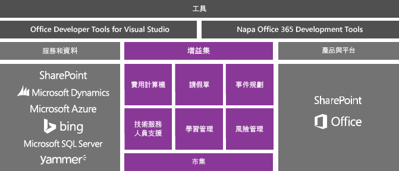
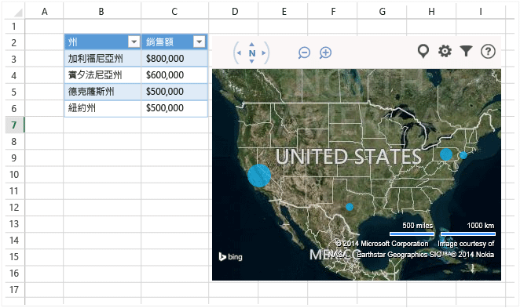
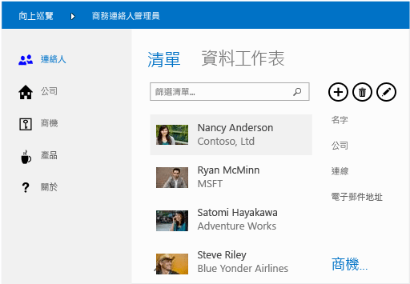

# Visual Studio 中的 Office 和 SharePoint 開發
  若要擴充 Microsoft Office 和 SharePoint，您可以建立讓使用者從 [Office 市集](https://store.office.com/)或組織目錄下載的輕量應用程式或增益集，或是建立以 .NET Framework 為基礎的解決方案，讓使用者可以安裝在電腦上。  
  
 本主題內容：  
  
-   [建立適用於 Office 和 SharePoint 的增益集](#Apps)  
  
-   [建立 VSTO 增益集](#Add-ins)  
  
-   [建立 SharePoint 解決方案](#Solutions)  
  
##   建立適用於 Office 和 SharePoint 的增益集  
 Office 2013 與 SharePoint 2013 導入新的增益集模型，可協助您將擴充 Office 和 SharePoint 的增益集加以建置、散佈及商品化。  這些增益集可以在 Office 或 SharePoint Online 上執行，而且使用者可以從許多裝置來與其互動。  
  
 了解如何使用新的 [Office 增益集模型](https://msdn.microsoft.com/library/office/jj220082.aspx)，以擴充使用者的 Office 體驗。  
  
 相較於 VSTO 增益集和解決方案，這些增益集的使用量非常小，而且可以使用 HTML5、JavaScript、CSS3 和 XML 等幾乎任何 Web 程式設計技術來建置。  若要開始，請使用 Visual Studio 中的 Office Developer Tools，或是名稱代碼為 Napa Office 365 Development Tools 的輕量 Web 型工具，其可讓您建立專案、撰寫程式碼，以及在瀏覽器中執行您的增益集。  
  
   
  
 **進一步了解**  
  
|以|請參閱|  
|-------|---------|  
|進一步了解 Napa Office 365 Development Tools。|[Napa Office 365 Development Tools](https://msdn.microsoft.com/library/dn974046.aspx)|  
  
### 建置 Office 增益集  
 若要擴充 Office 的功能，請建置 Office 增益集。 基本上，它是裝載於 Office 應用程式 \(例如 Excel、Word、Outlook 和 PowerPoint\) 中的網頁。 您的應用程式可以將功能加入至文件、工作表、電子郵件訊息、約會、簡報和專案中。  
  
 您可以在 Office 市集販售您的應用程式。[Office 市集](https://store.office.com/)可讓您輕鬆將您的增益集商品化、管理更新，以及追蹤遙測。 您也可以透過 SharePoint 或 Exchange Server 上的應用程式目錄，將您的應用程式發佈給使用者。  
  
 下列適用於 Office 的應用程式在 Bing 地圖中顯示工作表資料。  
  
   
  
 **進一步了解**  
  
|以|請參閱|  
|-------|---------|  
|深入了解 Office 增益集，然後建置一個。|[Office 增益集](http://msdn.microsoft.com/office/dn448457)|  
|比較擴充 Office 的不同方式，並決定您應該要使用應用程式或 Office 增益集。|[Office 增益集、VSTO 與 VBA 的藍圖](http://blogs.msdn.com/b/officeapps/archive/2013/06/18/roadmap-for-apps-for-office-vsto-and-vba.aspx)|  
|進一步了解 Napa Office 365 Development Tools。|[Napa Office 365 Development Tools](https://msdn.microsoft.com/library/dn974046.aspx)|  
  
### 建置 SharePoint 增益集  
 若要為您的使用者擴充 SharePoint，請建置 SharePoint 增益集。 基本上它是一個小型、易於使用的獨立應用程式，可以解決您的使用者或企業的需求。  
  
 您可以在 [Office 市集](https://store.office.com/)販售您的 SharePoint 相關應用程式。 您也可以透過 SharePoint 中的增益集目錄，將您的增益集發佈給使用者。  網站擁有者可以在其 SharePoint 網站上安裝、升級和解除安裝您的增益集，而不需陣列伺服器或網站集合管理員的協助。  
  
 下面是可以協助使用者管理商務連絡人的 SharePoint 應用程式範例。  
  
   
  
 **進一步了解**  
  
|以|請參閱|  
|-------|---------|  
|深入了解 SharePoint 增益集，然後建置一個。|[SharePoint 增益集](https://msdn.microsoft.com/library/office/fp179930.aspx)|  
|將 SharePoint 增益集與傳統 SharePoint 解決方案相比較。|[SharePoint 增益集與 SharePoint 解決方案相比較](http://msdn.microsoft.com/library/office/jj163114.aspx)|  
|選擇要建置 SharePoint 增益集，還是建置 SharePoint 解決方案。|[在 SharePoint 增益集與 SharePoint 解決方案間抉擇](https://msdn.microsoft.com/library/office/jj163114.aspx)|  
|進一步了解 Napa Office 365 Development Tools。|[Napa Office 365 Development Tools](https://msdn.microsoft.com/library/dn974046.aspx)|  
  
##   建立 VSTO 增益集  
 建立以 Office 2007 或 Office 2010 為目標的 VSTO 增益集，或使用 Office 增益集來超越 Office 2013 和 Office 2016 的功能極限。 VSTO 增益集只會在桌面上執行。 使用者必須安裝 VSTO 增益集，所以通常較難部署和支援。  不過，您的 VSTO 增益集可以與 Office 更密切地整合。 例如，它可以將索引標籤和控制項加入至 Office 功能區，以及執行進階的自動化工作，例如合併文件或修改圖表。 您可以運用 .NET Framework，並使用 C\# 和 Visual Basic 來與 Office 物件互動。  
  
 以下是 VSTO 增益集可以執行的作業範例。 這個 VSTO 增益集將功能區控制項、自訂工作窗格與對話方塊加入 PowerPoint 中。  
  
   
  
 **進一步了解**  
  
|以|讀取|  
|-------|--------|  
|比較擴充 Office 的不同方式，並決定您應該要使用 VSTO 增益集或 Office 增益集。|[Office 增益集、VSTO 與 VBA 的藍圖](http://blogs.msdn.com/b/officeapps/archive/2013/06/18/roadmap-for-apps-for-office-vsto-and-vba.aspx)|  
|建立 VSTO 增益集。|[使用 Visual Studio 來建置 VSTO 增益集](https://msdn.microsoft.com/library/jj620922.aspx)|  
  
##   建立 SharePoint 解決方案  
 建立以 SharePoint Foundation 2010 和 SharePoint Server 2010 為目標的 SharePoint 方案，或使用 SharePoint 增益集來超越 SharePoint 2013 和 SharePoint 2016 的功能極限。  
  
 SharePoint 解決方案需要內部部署 SharePoint 陣列伺服器。 系統管理員必須加以安裝，而且因為解決方案是在 SharePoint 中執行，所以可能會影響伺服器的效能。 不過，解決方案提供對 SharePoint 物件更深層的存取。 此外，當您建置 SharePoint 解決方案時，您可以運用 .NET Framework，並使用 C\# 和 Visual Basic 來與 SharePoint 物件互動。  
  
 **進一步了解**  
  
|以|請參閱|  
|-------|---------|  
|SharePoint 解決方案與 SharePoint 增益集相比較|[SharePoint 增益集與 SharePoint 解決方案相比較](http://msdn.microsoft.com/library/office/jj163114.aspx)|  
|建立 SharePoint 解決方案。|[建立 SharePoint 方案](../sharepoint/create-sharepoint-solutions.md)|  
  
  