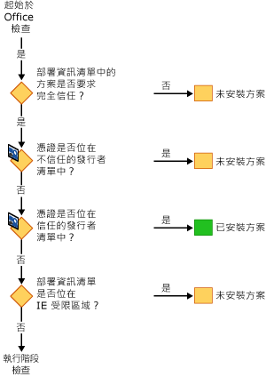

# 保護 Office 方案
  Office 方案的安全性模型牽涉到數種技術： [!INCLUDE[vsto_runtime](../vsto/includes/vsto-runtime-md.md)]， [!INCLUDE[ndptecclick](../vsto/includes/ndptecclick-md.md)]，Microsoft Office 和 Internet Explorer 受限制的網站區域中 信任中心。 下列各節說明不同安全性功能的運作方式：  
  
-   [授與信任給 Office 方案](#GrantingTrustToSolutions)  
  
-   [授與信任給文件](#GrantingTrustToDocuments)  
  
-   [使用 Windows 安裝程式時，授與信任](#GrantingTrustWindowsInstaller)  
  
-   [指定 Office 方案的安全性考量](#Security)  
  
-   [在開發期間的安全性](#SecurityDuringDeployment)  
  
-   [Visual Studio Tools for Office Runtime](#VisualStudioToolsForOfficeRuntime)  
  
 [!INCLUDE[appliesto_all](../vsto/includes/appliesto-all-md.md)]  
  
##  授與信任給 Office 方案  
 授與信任給 Office 方案表示修改每位終端使用者的安全性原則，以根據下列的辨識項信任 Office 方案：  
  
-   用來簽署部署資訊清單的憑證。  
  
-   部署資訊清單的 URL。  
  
 如需詳細資訊，請參閱[授與信任給 Office 方案](../vsto/granting-trust-to-office-solutions.md)。  
  
##  授與信任給文件  
 文件層級自訂要求文件必須在指定為信任位置的目錄中。 如需詳細資訊，請參閱 [Granting Trust to Documents](../vsto/granting-trust-to-documents.md)。  
  
##  使用 Windows 安裝程式時，授與信任  
 您可以使用 Windows 安裝程式建立 MSI 檔案，將 Office 方案安裝到 Program Files 目錄中，這需要系統管理權限。 對於 Program Files 目錄中的 Office 方案，Visual Studio 2010 Tools for Office Runtime 會考慮要信任這些 Office 方案，並不會顯示 ClickOnce 信任提示。  
  
##  指定 Office 方案的安全性考量  
 [!INCLUDE[net_v40_short](../sharepoint/includes/net-v40-short-md.md)]、[!INCLUDE[net_v45](../vsto/includes/net-v45-md.md)] 和 Microsoft Office 所提供的安全性功能，有助於在 Office 方案中防範各種可能的安全性威脅。 如需詳細資訊，請參閱 [Specific Security Considerations for Office Solutions](../vsto/specific-security-considerations-for-office-solutions.md)。  
  
##  在開發期間的安全性  
 為了簡化您的開發程序，Visual Studio 每次建置專案時都會在您的電腦上設定執行和偵錯方案所需的安全性原則。 在某些情況下，您可能需要採取額外的安全性步驟來開發專案。  
  
### 文件層級方案  
 如果您正在開發下列類型的專案，文件的完整路徑必須加入至 Microsoft Office 應用程式中的信任位置清單：  
  
-   文件層級，例如位於網路檔案共用解決方案 *\\\servername\sharename*。  
  
-   使用 .doc 或 .docm 檔案的 Word 文件層級方案。  
  
 當您將文件位置加入至信任的位置清單中時請包含子目錄，或明確地包含偵錯及建置資料夾。 如需詳細資訊，請參閱 Microsoft Office 線上說明文章[建立、 移除或變更檔案的信任位置](https://support.office.com/en-au/article/Create-remove-or-change-a-trusted-location-for-your-files-f5151879-25ea-4998-80a5-4208b3540a62)。  
  
### 暫時憑證  
 如果簽章的憑證不存在，Visual Studio 會建立暫時憑證。 您應該只在開發期間使用這個暫時憑證，並購買正式憑證以進行部署。  
  
 第一次建置 Office 專案之後，會產生暫時憑證。 下一次按下 F5 時，因為在憑證加入時專案標示為已變更，因此會重建專案。  
  
 一段時間之後可能有許多的暫時憑證，因此您應該偶爾清除暫時憑證。  
  
##  Visual Studio Tools for Office Runtime  
 [!INCLUDE[vsto_runtime](../vsto/includes/vsto-runtime-md.md)]功能可驗證的 「 發行者 」 與的權限授與給自訂身分識別。 它會透過一系列的安全性驗證這些權限。  
  
### 載入自訂時的安全性  
 載入的文件層級自訂時，[!INCLUDE[vsto_runtime](../vsto/includes/vsto-runtime-md.md)]一定會檢查文件是否位於信任的位置清單。 此外，執行階段會檢查方案是否要求 FullTrust，應用程式資訊清單中。 載入自訂時，它不會執行額外的安全性檢查。  
  
### 在安裝期間的安全性檢查順序  
 當 Office 方案安裝或更新時，[!INCLUDE[vsto_runtime](../vsto/includes/vsto-runtime-md.md)] 會以特定的順序執行一組安全性檢查來進行信任決策。 只有在執行階段判斷方案受信任時才會安裝或更新方案。  
  
 您可以用四種方式之一開始安裝程序：執行安裝程式、開啟部署資訊清單、開啟 Microsoft Office 應用程式主機，或執行 VSTOInstaller.exe。  
  
 第一次的安全性檢查只適用於文件層級方案。 文件層級方案的文件必須位於信任位置。 如果文件是在遠端網路檔案共用上，或是副檔名為 .doc 或 .docm，文件的位置必須加入至信任位置清單。 如需詳細資訊，請參閱 [Granting Trust to Documents](../vsto/granting-trust-to-documents.md)。  
  
   
  
 下一組安全性檢查會從 [!INCLUDE[vsto_runtime](../vsto/includes/vsto-runtime-md.md)] 和 ClickOnce。 若要通過這些檢查，Office 方案必須要求 FullTrust 權限、 使用在不受信任的發行者清單中，未列出的憑證來簽署且為不在 Internet Explorer 受限制區域的位置。 如果憑證是受信任的發行者清單中，則會立即安裝方案。 否則，如果它未通過檢查，方案會繼續到最終組的檢查。  
  
   
  
 如果[!INCLUDE[ndptecclick](../vsto/includes/ndptecclick-md.md)]信任提示允許與方案有尚未被授與信任，則執行階段會讓終端使用者進行信任決策。 如果使用者授與信任給方案，使用者內含清單中會加入項目。 使用者內含清單中的所有方案具有完全信任，可以安裝並執行。  
  
 從 Visual Studio 2010 開始，如果 Office 方案是使用 Windows Installer (MSI) 安裝到 Program Files 目錄中，便會略過內含清單。 如需詳細資訊，請參閱[使用內含清單信任 Office 方案](../vsto/trusting-office-solutions-by-using-inclusion-lists.md)。  
  
   
  
## 請參閱  
 [授與信任給 Office 方案](../vsto/granting-trust-to-office-solutions.md)   
 [授與信任給文件](../vsto/granting-trust-to-documents.md)   
 [使用內含清單信任 Office 方案](../vsto/trusting-office-solutions-by-using-inclusion-lists.md)   
 [如何： 設定內含清單的安全性](../vsto/how-to-configure-inclusion-list-security.md)   
 [如何： 簽署 Office 方案](../vsto/how-to-sign-office-solutions.md)   
 [Office 方案安全性疑難排解](../vsto/troubleshooting-office-solution-security.md)   
 [Application Manifests for Office Solutions](../vsto/application-manifests-for-office-solutions.md)   
 [Office 方案的部署資訊清單](../vsto/deployment-manifests-for-office-solutions.md)   
 [ClickOnce 參考](/visualstudio/deployment/clickonce-reference)   
 [部署 Office 方案](../vsto/deploying-an-office-solution.md)  
  
  