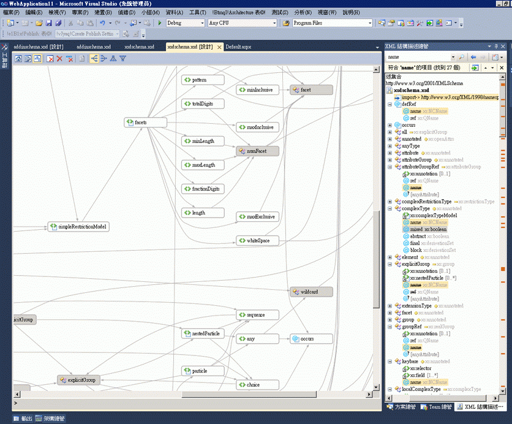

# 圖形檢視
[!INCLUDE[vs2017banner](../code-quality/includes/vs2017banner.md)]

圖表檢視會以圖形表示全域結構描述節點以及節點之間的關聯性。請注意，圖表檢視無法讓您在設計介面上改變結構描述集的配置。圖表檢視還包含 XML 結構描述設計工具工具列和階層連結列。  
  
 下圖顯示的設計介面中包含六個全域節點的圖表檢視。  
  
   
  
## 設計介面  
 圖表檢視的設計介面會顯示 [XML 結構描述設計工具工作空間](../xml-tools/xml-schema-designer-workspace.md)的內容。如果工作空間包含結構描述集中的任何全域節點，則這些節點會顯示在圖表檢視的設計介面中，並在具有關聯性的節點之間畫上箭號。  
  
 按兩下圖表檢視中的節點，就會顯示 XML 編輯器。  
  
 若要自工作空間刪除選取的節點，請使用 XSD 設計工具工具列或 DELETE 鍵。  
  
 如果設計介面空白，則會顯示 XML 編輯器、XML 結構描述總管和浮水印。「*浮水印*」\(Watermark\) 是所有 XSD 設計工具檢視連結的清單。  
  
   
  
 如果結構描述集發生錯誤，清單結尾會顯示以下文字：「使用錯誤清單檢視及修正結構描述集中的錯誤」。  
  
## 階層連結列  
 圖表檢視底部的階層連結列會顯示所選節點在結構描述集的位置。如果選取多個項目，階層連結列會是空白的。  
  
## 內容功能表  
 下表描述圖表檢視設計介面上所有節點的可用選項。  
  
|選項|描述|  
|--------|--------|  
|**在 XML 結構描述總管中顯示**|將焦點放在 XML 結構描述總管，然後反白顯示結構描述集節點。|  
|**在圖表檢視中顯示**|切換至圖表檢視 \(呈現淡灰色\)。|  
|**產生範例 XML**|僅適用於全域項目。針對全域項目產生範例 XML 檔案。|  
|**清除工作空間**|清除工作空間和設計介面。|  
|**由工作空間移除**|從工作空間和設計介面移除選取的節點。|  
|**由工作空間移除選取範圍以外的所有項目**|從工作空間和設計介面移除未選取的節點。|  
|**將圖表匯出為影像...**|將設計介面儲存至 XPS 檔案。|  
|**全選**|選取設計介面上的所有節點。|  
|**檢視程式碼**|在 XML 編輯器中開啟包含所選節點的檔案。在 XML 結構描述總管中選取的項目也會在 XML 編輯器中選取。|  
|**屬性視窗**|開啟 \[**屬性**\] 視窗 \(如果尚未開啟\)。這個視窗會顯示與節點有關的資訊。|  
  
 除了上述的通用選項外，全域項目的內容功能表還包含下列選項：  
  
|選項|描述|  
|--------|--------|  
|**加入型別定義**|將基底型別加入至圖表。|  
|**加入所有參考**|加入所有參考項目的節點，並且畫出箭號代表兩者之間的關聯性。|  
|**加入替代群組成員**|加入所有替代群組成員。如果項目是替代群組的標頭或成員，此選項將會出現在檢視中。|  
|**產生範例 XML**|針對全域項目產生範例 XML 檔案。|  
  
 除了上述的通用選項外，全域簡單型別和全域複雜型別的內容功能表還包含下列選項：  
  
|選項|描述|  
|--------|--------|  
|**加入基底型別**|如果選取的型別衍生自全域型別，則加入所選取型別的基底型別。|  
|**加入所有參考**|加入所選取型別的所有參考。包括選取的型別以及衍生自所選型別之型別的項目和屬性。|  
|**加入所有衍生型別**|加入直接和間接衍生自所選型別的所有型別。|  
|**加入所有祖系**|加入所有父 \(基底\) 型別。|  
  
 除了上述的通用選項外，全域群組和屬性群組的內容功能表還包含下列選項：  
  
|選項|描述|  
|--------|--------|  
|**加入所有參考**|加入所有參考群組的節點，並且畫出箭號代表兩者之間的關聯性。|  
|**加入所有成員**|加入群組的所有成員，並且畫出箭號代表兩者之間的關聯性。|  
  
 除了上述的通用選項外，全域屬性的內容功能表還包含下列選項：  
  
|選項|描述|  
|--------|--------|  
|**加入所有參考**|加入所有參考群組的節點，並且畫出箭號代表兩者之間的關聯性。|  
  
## 屬性視窗  
 使用內容功能表初次開啟 \[**屬性**\] 視窗。根據預設，\[**屬性**\] 視窗會出現在 Visual Studio 的右下角。當您按一下在內容模型檢視中轉譯的節點時，該節點的屬性會顯示在 \[**屬性**\] 視窗中。  
  
## XSD 工具列  
 圖表檢視作用中時，會啟用下列 XSD 工具列按鈕。  
  
   
  
|選項|描述|  
|--------|--------|  
|**顯示開始檢視**|切換至[開始檢視](../xml-tools/start-view.md)。這個檢視可以使用鍵盤快速鍵存取：**CTRL \+ 1**。|  
|**顯示內容模型檢視**|切換至[內容模型檢視](../xml-tools/content-model-view.md)。這個檢視可以使用鍵盤快速鍵存取：**CTRL \+ 2**。|  
|**顯示圖表檢視**|切換至[圖表檢視](../xml-tools/graph-view.md)。這個檢視可以使用鍵盤快速鍵存取：**CTRL \+ 3**。|  
|**清除工作空間**|清除工作空間和設計介面。|  
|**由工作空間移除**|從工作空間和設計介面移除選取的節點。|  
|**由工作空間移除選取範圍以外的所有項目**|從工作空間和設計介面移除未選取的節點。內容模型檢視和圖表檢視會啟用此選項。|  
|**由左至右**|將圖表檢視中的配置變更為從左至右以階層表示節點。這個選項可以使用鍵盤快速鍵存取：**Alt \+ 向右鍵**。|  
|**由右至左**|將圖表檢視中的配置變更為從右至左以階層表示節點。這個選項可以使用鍵盤快速鍵存取：**Alt \+ 向左鍵**。|  
|**從上至下**|將圖表檢視中的配置變更為從上至下以階層表示節點。這個選項可以使用鍵盤快速鍵存取：**Alt \+ 向下鍵**。|  
|**從下至上**|將圖表檢視中的配置變更為從下至上以階層表示節點。這個選項可以使用鍵盤快速鍵存取：**Alt \+ 向上鍵**。|  
  
## 移動瀏覽\/捲動  
 您可以使用捲軸，或是在按一下並拖曳滑鼠時按住 CTRL 鍵不放，移動瀏覽設計介面。您當使用按一下並拖曳方式移動瀏覽設計介面時，游標將變更成 4 個交叉的箭頭指向 4 個方向。  
  
## 復原\/取消復原  
 在圖表檢視中啟用的復原\/取消復原功能可執行下列動作：  
  
-   透過拖放方式加入單一節點。  
  
-   從結構描述總管或開始檢視查詢中的搜尋結果加入多個節點。  
  
-   刪除單一或多個節點。  
  
## 縮放  
 縮放位於圖表模型檢視的右下角。  
  
 您可以使用下列方式控制縮放：  
  
-   當滑鼠停留在圖表檢視介面上時，按住 CTRL 鍵同時轉動滑鼠滾輪。  
  
-   使用滑桿控制項。滑桿會顯示目前的縮放層級。  
  
 當您選取縮放滑桿、將滑鼠停留於滑桿上方、或使用 CTRL 搭配滑鼠滾輪進行縮放時，滑桿會呈不透明狀，其他所有時間則呈透明狀。  
  
## XML 編輯器整合  
 您可以按一下節點並使用 \[檢視程式碼\] 內容功能表，在圖表檢視和 XML 編輯器之間來回切換。  
  
 如果您在 XML 編輯器中變更結構描述集，圖表檢視也會同步進行變更。如需詳細資訊，請參閱[與 XML 編輯器整合](../xml-tools/integration-with-xml-editor.md)。  
  
## 請參閱  
 [設計介面](../xml-tools/xml-schema-designer-workspace.md)