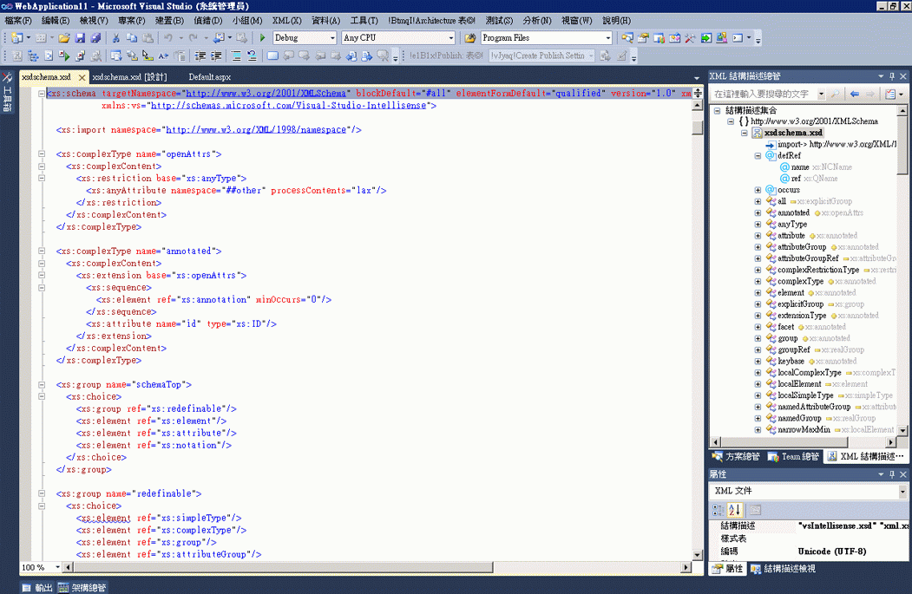

# 整合 XML 常值與 XML 結構描述總管
Visual Basic 支援 XML 常值，這表示您可以將 XML 片段直接合併 Visual Basic 程式碼。 如需詳細資訊，請參閱[XML 常值概觀](http://go.microsoft.com/fwlink/?LinkId=140325)。  
  
 如果 Visual Basic 專案中的 XSD 檔包含 XML 常值，您就可以在 XML 結構描述總管中檢視 XML 結構描述集。 若要檢視與 XML 常值相關聯的結構描述集，以滑鼠右鍵按一下 XML 常值或 XML 命名空間匯入中的 XML 節點，然後選取**在結構描述總管中顯示**。  
  
   
  
 這樣會在 Visual Basic 檔案旁以並排方式開啟 XML 結構描述總管。  
  
 
  
## 請參閱  
[如何：搭配使用 XML 結構描述設計工具和 XML 常值](../xml-tools/how-to-use-the-xml-schema-designer-with-xml-literals.md)